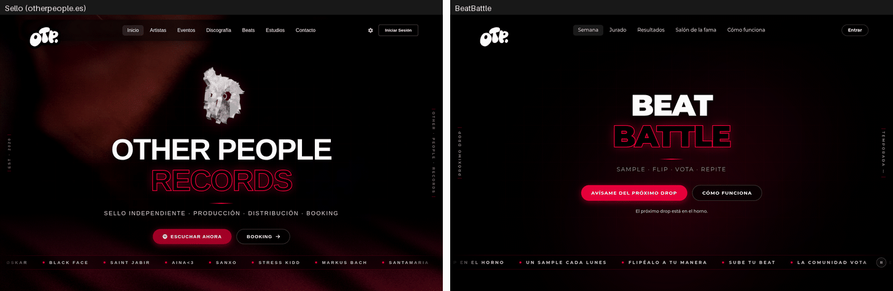

<div align="center">

# BeatBattle

**Un sample cada lunes. Tu flip antes del domingo. Gana el beat, no los amigos.**

[](docs/planning/ROADMAP.md)
[](.nvmrc)
[](#stack)
[](#licencia)

[Una semana de batalla](#una-semana-de-batalla) ·
[Por qué el voto es ciego](#por-qué-el-voto-es-ciego) ·
[La prueba del sello](#la-prueba-del-sello) ·
[Estado real](#estado-fase-0-de-10) ·
[Arrancarlo](#arrancarlo)



<sub>A la izquierda, la web del sello; a la derecha, BeatBattle hoy. Es una de las hojas de la <a href="docs/planning/evidence/f0/ab/README.md">prueba del sello</a>.</sub>

</div>

---

Las batallas de beats suelen vivir en Instagram o en un servidor de Discord: alguien cuelga un
sample, cada uno sube su versión y gana la que más «me gusta» junta. En la práctica gana quien tiene
más seguidores, quien publica primero y suma escuchas toda la semana, o quien masteriza más fuerte.
El beat es lo de menos.

**BeatBattle es esa batalla, con reglas.** Cada lunes cae un sample nuevo; los productores lo
descargan, lo *flipean* y suben su versión antes del domingo; la comunidad escucha y puntúa de 1 a 5
estrellas sin saber de quién es cada beat; el domingo a medianoche la semana se sella, se calcula la
clasificación y se revela el podio con una ceremonia. Vive junto a la web de
[Other People Records](https://www.otherpeople.es), con su misma estética y su mismo sistema de
audio, pero con cuentas propias.

## Una semana de batalla

Todas las horas son de Madrid, con su cambio de horario:

```
LUN 00:00   DROP      cae el sample; se abren los envíos y la votación
DOM 20:00   CIERRE    se acaban los envíos; quedan 4 h solo para escuchar y votar
DOM 23:59   FIN       se acaba la votación
LUN 00:00   SELLADO   clasificación congelada, podio y ceremonia… y el DROP de la siguiente
```

Envíos y votos van a la vez para que lo que se sube se escuche esa misma semana. La desventaja (las
entradas tardías tienen menos tiempo) se compensa con tres piezas: la lista pone primero lo que menos
votos lleva, la puntuación no premia tener pocos votos y las últimas cuatro horas son solo para votar.

Encima va una capa de juego: XP, niveles, rachas, logros, temporadas trimestrales, una carta de
productor en 3D, efectos de sonido sintetizados en la tonalidad del sample de la semana y sorpresas
escondidas. Es cosmética a propósito: **nada de eso cambia la clasificación ni el peso de un voto**.

Lo que BeatBattle no es también está decidido: ni tienda de beats (eso lo hace la web del sello), ni
chat, comentarios o seguidores (la comunidad ya vive en Instagram y Discord), ni batallas en directo.

## Por qué el voto es ciego

La especificación tiene un principio que manda sobre todo lo demás: **juego limpio antes que
espectáculo**. Cuando una animación, un sonido o un número chocan con la integridad del voto, gana la
integridad. Cada regla cierra una forma concreta de ganar sin tener el mejor beat:

| Regla | Lo que evita |
|---|---|
| **Voto ciego.** Hasta el sellado nadie sabe quién hizo qué: cada entrada sale con su título y un alias generado («Tigre Púrpura») | Votar al amigo o al nombre conocido |
| **Umbral de escucha.** Para votar hay que haber oído `min(45 s, 50 %)` de la entrada; el servidor comprueba además el tiempo de reloj | Puntuar sin escuchar |
| **Ningún número antes del sellado.** Ni medias, ni recuentos de votos, ni posiciones provisionales; tampoco en las imágenes para compartir ni en los emails | El voto en manada |
| **Ronda justa.** La lista pone primero lo que aún no has votado y, dentro de eso, lo que menos votos lleva | Que a las entradas tardías no las escuche nadie |
| **Sonoridad igualada** a −14 LUFS, solo atenuando | Que gane el master más fuerte |
| **Media bayesiana** y podio con un mínimo de 3 votos | Que un único 5 gane a veinte votos de 4,6 |

El umbral es fricción contra el voto a ciegas, no una garantía absoluta; el resto sí son reglas
duras que comprueba el servidor.

La puntuación de cada entrada es una media bayesiana:

```
puntuación = (C · m + Σ estrellas) / (C + n)
    n = votos válidos de la entrada    m = media de toda la semana    C = 5
```

Es como si cada entrada empezara con cinco votos «fantasma» de la media de la semana: con pocos votos
su puntuación se queda cerca de la media, y solo se separa cuando lo confirma mucha gente. En una
semana con media 3,6:

| Entrada | Votos | Media | Puntuación |
|---|---|---|---|
| A | un voto de 5 | 5,00 | **3,8333** |
| B | 20 votos | 4,60 | **4,4000** |
| C | 8 votos | 4,25 | **4,0000** |

Gana B, luego C y luego A, que además se queda fuera del podio por tener menos de 3 votos. Es el caso
de prueba del Anexo G de la guía y es, literalmente, un test:
`RF-RES-01: caso del Anexo G con resultado exacto a 4 decimales`. Se eligió frente a la media simple
(premia tener pocos votos) y al intervalo de Wilson (pensado para votos de sí o no) porque se explica
en una frase y se ajusta con una sola constante.

Estas reglas viven en `packages/rules`, un núcleo puro y determinista: sin reloj, sin azar, sin red y
sin base de datos (el instante entra como argumento y el azar sale de un generador con semilla), y un
lint lo vigila en cada `pnpm check`. Es lo que permite exigir que sellar dos veces la misma semana dé
el mismo resultado byte a byte, y que corregir una semana ya sellada sea un re-sellado explícito y
auditado, nunca un retoque silencioso. Hoy están programadas y probadas las fórmulas (umbral de
escucha, puntuación, igualación de sonoridad); el voto en sí, con sus comprobaciones en el servidor,
llega en la Fase 5, y el sellado en la 6.

## La prueba del sello

BeatBattle hereda la estética de Other People tal cual: negro puro, el rojo `#ff003c`, el fondo Silk
granate, la isla de navegación flotante, el logo *OTP.* girado −10° y enlazado al sello, y el titular
en dos líneas con la segunda en contorno rojo. No es un guiño: es un requisito (`RD-VIS-02`) que se
puede suspender. **Cualquier pantalla, con la capa de juego apagada, tiene que parecer una sección más
de la web del sello.**

«Parecer» no se deja al ojo de quien lo ha hecho. Se comprueba así:

1. **Se mide el sello.** `tools/shot/otp.mjs` abre `otherpeople.es` en producción con el Chrome del
   sistema, a 1440×900 y a 390×844, y guarda capturas y medidas reales (`getComputedStyle`, cajas en
   pantalla y la fuente con la que se pinta de verdad) en
   [`docs/planning/evidence/f0/otp/`](docs/planning/evidence/f0/otp/README.md).
2. **Se mide BeatBattle igual.** `tools/shot/ab.mjs` captura las mismas piezas (isla, titular, botones,
   chips, fila de entrada, teselas, tarjeta, página interior y pie), mide las mismas propiedades y monta
   hojas lado a lado como la de arriba.
3. **Cada diferencia lleva su motivo.** En la última pasada se compararon 202 propiedades en escritorio
   (122 idénticas) y 178 en móvil (110). Las demás están justificadas una a una. La tipografía, por
   ejemplo: el sello declara Montserrat pero no la carga, así que se ve con la letra del sistema;
   BeatBattle la carga de verdad.
4. **Lo que no se mide lo juzga un jurado** de tres lentes independientes: el ojo («¿parece el
   sello?»), la medida y el sistema de tokens. La primera A/B la suspendieron las tres; se corrigió lo
   que señalaron (página interior, pie, teselas y fila en móvil) y se regeneró.

El veredicto de hoy: las piezas de la Fase 0 pasan, pero el requisito sigue abierto hasta que llegue
el fondo Silk (tarea 1.1), que es justo lo que más delata la diferencia en la hoja de arriba. El
detalle, en el [README de la A/B](docs/planning/evidence/f0/ab/README.md).

Dos reglas lo sostienen en el día a día:

- **Solo tokens.** Ningún color, radio, sombra, duración ni curva se escribe a mano fuera de
  `apps/web/src/styles/tokens.css`: `pnpm lint:tokens` (dentro de `pnpm check`) falla si aparece uno.
  Los tokens se espejan en TypeScript para Motion y el canvas, con un test que impide que diverjan.
- **Accesibilidad antes que copia exacta.** Donde el sello no llega a AA, BeatBattle se aparta lo justo
  y lo documenta: el rojo de los botones es `#e6003a` (4,7:1 con texto blanco) en lugar de `#ff003c`
  (3,9:1). Cada animación tiene variante sin movimiento y nada destella más de tres veces por segundo.

## Cómo se trabaja

BeatBattle se construye con **Spec-Driven Development**: primero se especifica, luego se planifica y
al final se programa contra la especificación.

- **La [guía maestra](docs/guia-maestra.md) es la especificación** (v0.4): comportamiento, diseño
  visual, de movimiento y de sonido, y arquitectura. Cada requisito tiene un id estable y un criterio
  de aceptación redactado para convertirse en un test.
- **El [roadmap](docs/planning/ROADMAP.md) la reparte en 10 fases**, y cada fase tiene su plan en
  [`docs/planning/plans/`](docs/planning/plans/) con tareas que citan la sección y los ids que
  implementan.
- **Los tests llevan el id en el nombre**, así que de un requisito se llega a su prueba con un `grep`.
- **Si la realidad obliga a desviarse, primero se cambia la guía**, con su registro de cambios y en el
  mismo commit que el código. Una fase se cierra cuando todos sus ids tienen un test o una
  verificación manual registrada, y lo que no se ha ejecutado o mirado no se da por hecho.

| Prefijo | Qué es | Ejemplo |
|---|---|---|
| `RF-<ÁREA>-NN` | Comportamiento observable | `RF-VOTE-03` no se vota la propia entrada |
| `RNF-<ÁREA>-NN` | Rendimiento, seguridad, accesibilidad, privacidad | `RNF-PERF-02` LCP < 2,5 s |
| `RD-<ÁREA>-NN` | Diseño visual, de movimiento o de sonido | `RD-VIS-02` la prueba del sello |

```bash
git grep -n "RF-RES-01"                                    # la guía, el código y los tests de un requisito
pnpm --filter @beatbattle/rules test -- -t 'RF-RES-01'    # y solo sus tests
```

## Estado: Fase 0 de 10

**Todavía no se puede jugar.** No hay cuentas, ni semanas, ni samples, ni subida, ni reproductor, ni
votos. Lo que hay son los cimientos de la Fase 0, en la rama `feat/f0-fundaciones`:

| | Qué funciona hoy |
|---|---|
| **Web** | La home en su estado de «calendario vacío» (titular BEAT / BATTLE, teletipo con botón de pausa, isla de navegación, logo y pie del sello) y todas las rutas del mapa de pantallas como páginas provisionales con su título, más la 404 |
| **Sistema de diseño** | Tokens, Montserrat y JetBrains Mono alojadas en el proyecto y 12 componentes base con sus estados y su variante sin movimiento, a la vista en la galería `/dev/galeria` (solo en desarrollo) |
| **API** | Fastify con `GET /api/health` y las bases de todos los módulos: sobre `{ data } \| { error }`, configuración validada, rechazo de orígenes ajenos y de lo que no sea JSON en escrituras, y un reloj de prueba que impide arrancar si se activa en producción |
| **Datos** | libSQL + Drizzle con migraciones al arrancar, ids uuid v7 y un rate limit genérico |
| **Reglas** | `packages/rules` con el umbral de escucha, la puntuación bayesiana, la igualación de sonoridad, los niveles y las temporadas, probados con los casos exactos de la guía y con propiedades (fast-check) |
| **Calidad** | Biome, lints de tokens y de pureza, tipos, Vitest y Playwright + axe: WCAG 2.2 AA, teclado, «reducir movimiento», objetivos táctiles de 44 px y LCP de la home |

Y lo que falta, además del juego en sí:

- **El fondo Silk y el Escenario 3D** son la Fase 1, un *spike* de sensación y audio con puerta
  GO/NO-GO: 60 fps en escritorio y al menos 45 en un Android medio, efectos con menos de 30 ms de
  latencia, y Cloudinary + ffmpeg midiendo sonoridad en Vercel. No ha empezado.
- **No está desplegado** ni hay recursos en la nube: ni proyecto en Vercel, ni Turso, ni Cloudinary,
  ni dominio.
- **La CI** ([`.github/workflows/ci.yml`](.github/workflows/ci.yml)) está escrita y sus pasos pasan en
  local, pero todavía no se ha ejecutado en GitHub Actions.
- `packages/audio`, `packages/covers`, `packages/emails` y `tools/seed` son esqueletos vacíos que se
  llenan en su fase.

| Fase | Qué deja |
|---|---|
| **0 · Fundaciones** (en curso) | Monorepo, calidad automática, sistema de diseño del sello y bases del servidor |
| 1 · Spike de sensación y audio | El Escenario y el audio en la nube, medidos; decide si se sigue (GO/NO-GO) |
| 2 · Cuentas y base de email | Registro con verificación, Google y Discord, perfil; cola de emails con preferencias y bajas |
| 3 · Semanas y samples | Calendario, drop del lunes y descarga con aceptación de las bases |
| 4 · Participar | Subida por trozos con BPM, tonalidad y sonoridad medida en servidor |
| 5 · Escuchar y votar | Reproductor, Modo Jurado con teclado y todas las reglas del voto |
| 6 · Cierre y resultados | Sellado, podio y ceremonia: con esto empieza la **beta cerrada** |
| 7 · Capa de juego | XP, niveles, rachas, logros, temporadas y carta de productor |
| 8 · Sorpresas | Easter eggs, kit de la semana con trozos del sample y música de sala |
| 9 · Other People y marketing | Widget de la batalla en la web del sello y campañas con consentimiento |
| 10 · Lanzamiento | Moderación, legal, auditorías y despliegue |

## Arrancarlo

Hace falta **Node 22** (`.nvmrc`) y **pnpm 9** (lo fija `packageManager` en `package.json`). No hace
falta ninguna cuenta ni servicio externo.

```bash
pnpm install
pnpm dev          # solo la web: http://localhost:5173
pnpm dev:all      # web + API (Fastify en :3000; Vite reenvía /api)
```

Con `pnpm dev:all` en marcha, la API responde a través de la web:

```bash
curl http://localhost:5173/api/health
# {"data":{"status":"ok","db":"up","time":1790967849754}}
```

y la galería del sistema de diseño está en <http://localhost:5173/dev/galeria>, con interruptores para
«reducir movimiento» y para apagar el cristal. Con `pnpm dev` a secas la web funciona igual, pero
`/api` responde 502 porque no hay API detrás.

**Configuración.** La API arranca sin `.env`, con los valores de desarrollo. Para cambiar alguno:

```bash
cp apps/server/.env.example apps/server/.env
```

[`.env.example`](apps/server/.env.example) documenta todas las variables del proyecto, agrupadas por
la fase que las estrena; hoy el servidor solo lee las de la Fase 0 (puerto, orígenes permitidos, base
de datos, reloj de prueba y registro). La base de datos local es un fichero
(`apps/server/data/local.db`) y las migraciones se aplican al arrancar. El `.env` y la base de datos
están en `.gitignore`. [`docker-compose.yml`](docker-compose.yml) trae Mailpit para cuando haya
emails (Fase 2); hoy nada lo usa.

### Comprobar

```bash
pnpm check        # Biome + lint de tokens + pureza de packages/rules
pnpm typecheck    # TypeScript en todos los paquetes
pnpm test         # Vitest en todos los paquetes
pnpm build        # web y API empaquetada para Vercel, con una prueba de humo del paquete
pnpm e2e          # Playwright + axe contra su propia web (:5174) y API (:3101), con BD temporal
```

En local, `pnpm e2e` usa el Chrome del sistema con la GPU real; la CI usa el Chromium de Playwright
(`CI=1`). Sus puertos son otros para no chocar con `pnpm dev:all`. Para mirar, no solo compilar:

```bash
node tools/shot/shot.mjs http://localhost:5173/dev/galeria galeria.png   # captura con el Chrome del sistema
node tools/shot/ab.mjs                                                   # rehace la A/B de la prueba del sello
```

### Dónde está cada cosa

| Carpeta | Qué hay |
|---|---|
| `apps/web` | La web: rutas, pantallas por funcionalidad, componentes base y galería, tokens e i18n en castellano |
| `apps/server` | La API: Fastify por módulos (`routes`, `service`, `repo`, `schema`), configuración, reloj, errores, seguridad y base de datos |
| `api/` | La función de Vercel, que carga la API empaquetada |
| `packages/rules` | Las reglas del juego, puras y deterministas |
| `packages/shared` | Los contratos entre web y API (Zod) y los tokens en TypeScript |
| `tools/shot` · `tools/lint` | Capturas, bancos y la A/B contra el sello · el lint de tokens |
| `tests/e2e` | Los recorridos de Playwright |

- Especificación → [`docs/guia-maestra.md`](docs/guia-maestra.md)
- Fases y decisiones, tomadas y abiertas → [`docs/planning/ROADMAP.md`](docs/planning/ROADMAP.md)
- Plan de la Fase 0 → [`docs/planning/plans/00-fundaciones.md`](docs/planning/plans/00-fundaciones.md)
- Plan de la Fase 1 → [`docs/planning/plans/01-spike-sensacion-audio.md`](docs/planning/plans/01-spike-sensacion-audio.md)
- Prueba del sello → [`docs/planning/evidence/f0/ab/`](docs/planning/evidence/f0/ab/README.md)
- Medidas del sello → [`docs/planning/evidence/f0/otp/`](docs/planning/evidence/f0/otp/README.md)
- Convenciones de código → [`CLAUDE.md`](CLAUDE.md)

## Stack

**TypeScript** estricto en un monorepo **pnpm** · **Vite** + **React 19** + **React Router 7**, con
**TanStack Query**, **Zustand** y **Motion** · **Fastify 5** + **Drizzle** sobre **libSQL** · **Zod 4**
· **Vitest**, **fast-check**, **Testing Library** y **Playwright** + **axe** · **Biome** · **Vercel**
(`fra1`).

Eso es lo instalado hoy. Con su fase llegan **three.js**, **React Three Fiber** y **drei** para el
Escenario y el Silk; **Web Audio** y **Tone.js**; **Cloudinary** y **ffmpeg** para el audio; **Better
Auth** para las cuentas; **nodemailer** con **Gmail** y **React Email**; y **Turso** en producción.

Dos decisiones explican buena parte del resto. **El audio nunca atraviesa la API:** el navegador sube
directo a Cloudinary con una firma del servidor, que fija el nombre del fichero sin el id del usuario
(para que ni la URL delate al autor durante el voto ciego) y después mide la sonoridad él mismo, sin
fiarse de lo que diga el cliente. Y **las cuentas son independientes del sello:** Other People usa
Auth0; BeatBattle usa Better Auth porque necesita verificación por email, recuperación, Google y
Discord, roles y bloqueo, sin coste por usuario y sin compartir cookies con `otherpeople.es`.

## Licencia

Todavía no hay licencia: el repositorio no tiene fichero `LICENSE`. Mientras no lo tenga, el código
se puede leer, pero no se concede ningún permiso para reutilizarlo. La marca y el logo de Other People
Records son del sello.
