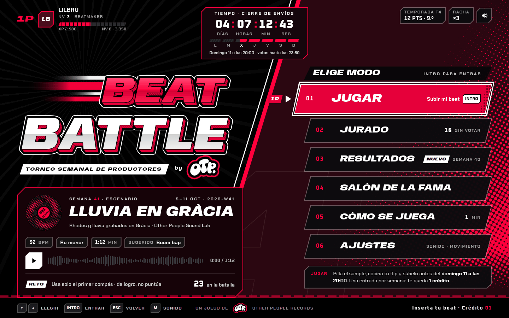
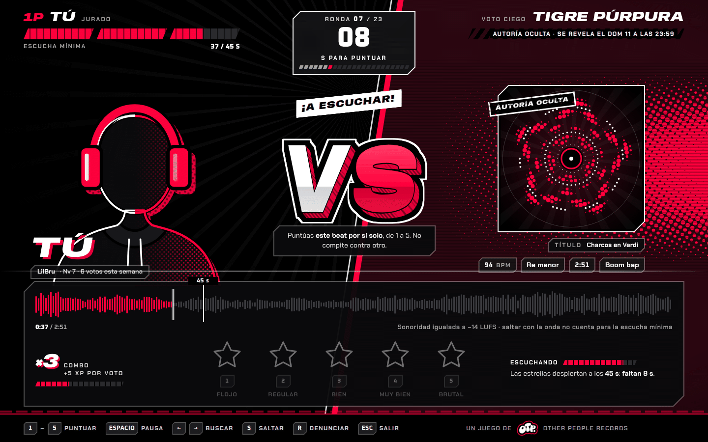

<div align="center">

# BeatBattle

**Un sample cada lunes. Tu flip antes del domingo. Gana el beat, no los amigos.**

[](docs/planning/ROADMAP.md)
[](.nvmrc)
[](#stack)
[](#licencia)

[Una semana de batalla](#una-semana-de-batalla) ·
[Por qué el voto es ciego](#por-qué-el-voto-es-ciego) ·
[Por qué parece un juego de lucha](#por-qué-parece-un-juego-de-lucha) ·
[Estado real](#estado-fase-0-de-10) ·
[Arrancarlo](#arrancarlo)



<sub>El menú principal hoy: una captura de la app en <code>/dev/menu</code>, con los datos de ejemplo de las <a href="docs/planning/evidence/f0/arena/README.md">maquetas aprobadas</a>.</sub>

</div>

---

Las batallas de beats suelen vivir en Instagram o en un servidor de Discord: alguien cuelga un
sample, cada uno sube su versión y gana la que más «me gusta» junta. En la práctica gana quien tiene
más seguidores, quien publica primero y suma escuchas toda la semana, o quien masteriza más fuerte.
El beat es lo de menos.

**BeatBattle es esa batalla, con reglas.** Cada lunes cae un sample nuevo; los productores lo
descargan, lo *flipean* y suben su versión antes del domingo; la comunidad escucha y puntúa de 1 a 5
estrellas sin saber de quién es cada beat; el domingo a medianoche la semana se sella, se calcula la
clasificación y se revela el podio con una ceremonia. Es la batalla de
[Other People Records](https://www.otherpeople.es): lleva sus colores y su logo como firma y guarda
el audio con el mismo sistema que el sello, pero es una web aparte, con cuentas propias y con aspecto
de **menú de recreativa de lucha**.

## Una semana de batalla

Todas las horas son de Madrid, con su cambio de horario:

```
LUN 00:00   DROP      cae el sample; se abren los envíos y la votación
DOM 20:00   CIERRE    se acaban los envíos; quedan 4 h solo para escuchar y votar
DOM 23:59   FIN       se acaba la votación
LUN 00:00   SELLADO   clasificación congelada, podio y ceremonia… y el DROP de la siguiente
```

Envíos y votos van a la vez para que lo que se sube se escuche esa misma semana. La desventaja (las
entradas tardías tienen menos tiempo) se compensa con tres piezas: la lista pone primero lo que menos
votos lleva, la puntuación no premia tener pocos votos y las últimas cuatro horas son solo para votar.

Encima va una capa de juego: XP, niveles, rachas, logros, temporadas trimestrales, una carta de
luchador en 3D, efectos de sonido sintetizados en la tonalidad del sample de la semana y sorpresas
escondidas. Es cosmética a propósito: **nada de eso cambia la clasificación ni el peso de un voto**.

Lo que BeatBattle no es también está decidido: ni tienda de beats (eso lo hace la web del sello), ni
chat, comentarios o seguidores (la comunidad ya vive en Instagram y Discord), ni batallas en directo.

## Por qué el voto es ciego

La especificación tiene un principio que manda sobre todo lo demás: **juego limpio antes que
espectáculo**. Cuando una animación, un sonido o un número chocan con la integridad del voto, gana la
integridad. Cada regla cierra una forma concreta de ganar sin tener el mejor beat:

| Regla | Lo que evita |
|---|---|
| **Voto ciego.** Hasta el sellado nadie sabe quién hizo qué: cada entrada sale con su título y un alias generado («Tigre Púrpura») | Votar al amigo o al nombre conocido |
| **Umbral de escucha.** Para votar hay que haber oído `min(45 s, 50 %)` de la entrada (saltar con la onda no cuenta); el servidor comprueba además el tiempo de reloj | Puntuar sin escuchar |
| **Ningún número antes del sellado.** Ni medias, ni recuentos de votos, ni posiciones provisionales; tampoco en las imágenes para compartir ni en los emails | El voto en manada |
| **Ronda justa.** La lista pone primero lo que aún no has votado y, dentro de eso, lo que menos votos lleva | Que a las entradas tardías no las escuche nadie |
| **Sonoridad igualada** a −14 LUFS, solo atenuando | Que gane el master más fuerte |
| **Media bayesiana** y podio con un mínimo de 3 votos | Que un único 5 gane a veinte votos de 4,6 |
| **El XP no puntúa.** Un jurado de nivel 20 pesa lo mismo que uno de nivel 1, y ninguna sorpresa toca la clasificación | Que la capa de juego compre posiciones |

El umbral es fricción contra el voto a ciegas, no una garantía absoluta; el resto sí son reglas
duras que comprueba el servidor.

La puntuación de cada entrada es una media bayesiana:

```
puntuación = (C · m + Σ estrellas) / (C + n)
    n = votos válidos de la entrada    m = media de toda la semana    C = 5
```

Es como si cada entrada empezara con cinco votos «fantasma» de la media de la semana: con pocos votos
su puntuación se queda cerca de la media, y solo se separa cuando lo confirma mucha gente. En una
semana con media 3,6:

| Entrada | Votos | Media | Puntuación |
|---|---|---|---|
| A | un voto de 5 | 5,00 | **3,8333** |
| B | 20 votos | 4,60 | **4,4000** |
| C | 8 votos | 4,25 | **4,0000** |

Gana B, luego C y luego A, que además se queda fuera del podio por tener menos de 3 votos. Es el caso
de prueba del Anexo G de la guía y es, literalmente, un test:
`RF-RES-01: caso del Anexo G con resultado exacto a 4 decimales`. Se eligió frente a la media simple
(premia tener pocos votos) y al intervalo de Wilson (pensado para votos de sí o no) porque se explica
en una frase y se ajusta con una sola constante.

Estas reglas viven en `packages/rules`, un núcleo puro y determinista: sin reloj, sin azar, sin red y
sin base de datos (el instante entra como argumento y el azar sale de un generador con semilla), y un
lint lo vigila en cada `pnpm check`. Es lo que permite exigir que sellar dos veces la misma semana dé
el mismo resultado byte a byte, y que corregir una semana ya sellada sea un re-sellado explícito y
auditado, nunca un retoque silencioso. Hoy están programadas y probadas las fórmulas (umbral de
escucha, puntuación, igualación de sonoridad, niveles y temporadas); el voto en sí, con sus
comprobaciones en el servidor, llega en la Fase 5, y el sellado en la 6.

## Por qué parece un juego de lucha

La primera versión copiaba la web del sello: su isla de navegación, su titular en contorno, su fondo
Silk, su tipografía. Hasta tenía una «prueba del sello» que medía `otherpeople.es` y exigía que cada
pantalla pareciera una sección más. No era la idea. Desde la guía v0.6 (dirección de arte «Arena»,
[§3](docs/guia-maestra.md#3-dirección-de-arte-movimiento-y-sonido)), BeatBattle es **una recreativa
de lucha montada por el sello**: cada semana es un torneo, el sample es el escenario, cada entrada es
un luchador sin rostro (un alias y una portada de trama) y quien vota entra como **1P**.

La metáfora no es decoración: un menú de recreativa está hecho para recorrerse con cuatro teclas y sin
pensar, y votar tiene que ser tan ágil como pasar canciones. Por eso cada pantalla es un menú de
juego: pantalla de título, lista de modos con cursor, rejilla de selección, reloj de ronda, medidores,
anunciador y las teclas siempre a la vista. El foco es el cursor, las flechas van en bucle, Intro entra
y Esc vuelve; el mando se traduce a las mismas teclas.

### En la familia del sello sin copiar su web

Del sello se toman **solo** dos cosas:

| Del sello | En BeatBattle |
|---|---|
| **La paleta**: negro `#000000`, rojo `#ff003c`, blanco `#ffffff` y granate `#4a0d1c` | Los cuatro, en proporción aproximada 70 % negro · 15 % granate · 10 % rojo · 5 % blanco. Los derivados son mezclas de esos cuatro; no hay otros matices |
| **El logo *OTP.*** | Es la **firma**, en **todas** las pantallas: una pegatina troquelada con borde de corte rojo, girada −7°, en la barra de controles («Un juego de [OTP.] Other People Records») y en el lockup del título («Torneo semanal de productores **by** [OTP.]»). Siempre enlaza a `otherpeople.es` |

Todo lo demás es propio: tipografía, composición, piezas, texturas, movimiento y sonido. La familia se
reconoce por el color y por la firma, no por la maqueta. Y hay una lista de lo que **nunca se imita**:

| Pieza de `otherpeople.es` | Lo que hace BeatBattle en su lugar |
|---|---|
| Isla de navegación flotante con cristal | HUD de juego arriba y barra de controles abajo |
| Hero centrado con titular en contorno rojo | Logo del juego a la izquierda, con extrusión y líneas de velocidad, y la pantalla partida por la diagonal |
| Banda de *marquee* | La crónica de la arena: una línea que cambia por fundido en la barra, con botón de pausa |
| Fondo Silk y orbes rojos | La arena: cuña granate con trama, diagonal y rayos |
| Cristal, radios de 16–20 px y píldoras | Marcos de esquina recortada, placas en paralelogramo y paneles opacos |
| Montserrat y JetBrains Mono | Anybody, Chakra Petch y Oxanium |
| Logo blanco girado −10° arriba a la izquierda | La pegatina con borde rojo, junto a la marca del juego |
| Lista de beats (portada y play redondos) | Rejilla de selección de luchador y filas de marcador |

### La prueba de marca y de juego

«Que se note que es del sello sin parecer su web» no se deja al ojo de quien lo ha hecho. Es un
requisito, `RD-VIS-02`, con cinco partes que se pueden suspender:

| | Cada pantalla… | Cómo se comprueba |
|---|---|---|
| **a** | usa solo la paleta, y sobre todo negro | E2E: capturas de cada ruta medidas en el navegador; ≤ 0,1 % de píxeles fuera del triángulo negro–rojo–blanco y ≥ 60 % con luminancia relativa < 0,06 |
| **b** | lleva la firma *OTP.* | E2E: `[data-otp-signature]` visible y enlazado al sello en cada ruta; en móvil, además, dentro de la ventana |
| **c** | no tiene ninguna pieza de la lista de arriba | `pnpm lint:tokens` falla si aparece `GlassSurface`, `MarqueeBand`, `AmbientOrbs`, la isla, Montserrat o JetBrains Mono |
| **d** | se recorre como un menú de juego | E2E de teclado: una parada de tabulación, flechas en bucle, Inicio/Fin, letra inicial, Intro, Esc y cursor = foco |
| **e** | la aprueba un jurado visual | Tres lentes independientes (juego, marca y accesibilidad) miran la app real frente a las maquetas aprobadas y levantan acta |

Las partes a–d corren en cada `pnpm e2e` y `pnpm check`. El primer pase del jurado
([acta](docs/planning/evidence/f0/arena/jurado.md)) aprobó la marca y suspendió el juego y la
accesibilidad: 39 discrepancias en 24 problemas, como placas que cortaban su tecla, tildes recortadas en
los títulos o pantallas interiores que parecían una web con adornos. Después vinieron un segundo pase y
seis rondas de arreglos con el jurado mirando también ventanas reales (un portátil de 1366×768, una
tableta en vertical, un móvil de 320 px, el escritorio al 175 %). Cuando dos pases se contradecían, la
regla se escribió primero en la guía y se juzgó contra ella. La verificación final pasa en las tres
lentes.

Dos reglas lo sostienen en el día a día:

- **Solo tokens.** Ningún color, chaflán, inclinación, trazo, sombra, duración ni curva se escribe a
  mano fuera de `apps/web/src/styles/tokens.css`: `pnpm lint:tokens` (dentro de `pnpm check`) falla si
  aparece uno, y los radios solo pueden ser `0` o `50%`. Los tokens se espejan en TypeScript para
  Motion y el canvas, con un test que impide que diverjan.
- **Accesibilidad antes que espectáculo.** El rojo del sello lleva texto negro (5,3:1); con texto
  blanco se usa `#e6003a` (4,7:1). Cada animación tiene variante sin movimiento, nada destella más de
  tres veces por segundo, el cursor se ve en contraste alto y los atajos de una tecla se apagan en
  Opciones → Accesibilidad.

### El versus es escenografía



<sub>Maqueta aprobada del Modo Jurado. Todavía no está construido: llega con el voto, en la Fase 5.</sub>

En el Modo Jurado siempre eres **TÚ** frente a **una** entrada, y esa entrada se puntúa de 1 a 5
estrellas por sí sola. Nunca hay dos entradas con estrellas en pantalla; la entrada no tiene barra de
vida (en su lugar, una placa rayada avisa de que la autoría se revela al sellar); la nota fija lo dice
con todas las letras («Puntúas este beat por sí solo, de 1 a 5. No compite contra otro.»), y el lector
de pantalla anuncia «Modo Jurado · ronda 7 de 23 · escuchando Tigre Púrpura», sin metáfora de combate.
Las estrellas duermen junto a un medidor de escucha hasta cumplir el umbral. El espectáculo pone el
escenario; las reglas siguen siendo las de arriba.

## Cómo se trabaja

BeatBattle se construye con **Spec-Driven Development**: primero se especifica, luego se planifica y
al final se programa contra la especificación.

- **La [guía maestra](docs/guia-maestra.md) es la especificación** (v0.6.8): comportamiento, diseño
  visual, de movimiento y de sonido, y arquitectura. Cada requisito tiene un id estable y un criterio
  de aceptación redactado para convertirse en un test.
- **El [roadmap](docs/planning/ROADMAP.md) la reparte en 10 fases**, y cada fase tiene su plan en
  [`docs/planning/plans/`](docs/planning/plans/) con tareas que citan la sección y los ids que
  implementan.
- **Los tests llevan el id en el nombre**, así que de un requisito se llega a su prueba con un `grep`.
- **Si la realidad obliga a desviarse, primero se cambia la guía**, con su registro de cambios y en el
  mismo commit que el código. Una fase se cierra cuando todos sus ids tienen un test o una
  verificación manual registrada, y lo que no se ha ejecutado o mirado no se da por hecho.

| Prefijo | Qué es | Ejemplo |
|---|---|---|
| `RF-<ÁREA>-NN` | Comportamiento observable | `RF-VOTE-03` no se vota la propia entrada |
| `RNF-<ÁREA>-NN` | Rendimiento, seguridad, accesibilidad, privacidad | `RNF-PERF-02` LCP < 2,5 s |
| `RD-<ÁREA>-NN` | Diseño visual, de movimiento o de sonido | `RD-VIS-02` la prueba de marca y de juego |

```bash
git grep -n "RF-RES-01"                                    # la guía, el código y los tests de un requisito
pnpm --filter @beatbattle/rules test -- -t 'RF-RES-01'    # y solo sus tests
```

## Estado: Fase 0 de 10

**Todavía no se puede jugar.** No hay cuentas, ni semanas, ni samples, ni subida, ni reproductor, ni
votos. La Fase 0 se reabrió para el cambio de dirección de arte y se cerró el 2026-10-04 en la rama
`feat/f0-fundaciones` (PR #1, pendiente de revisión). Lo que hay:

| | Qué funciona hoy |
|---|---|
| **Marco de juego** | HUD arriba (jugador, placa de la pantalla, reloj de ronda y sonido con M), barra de controles abajo con las teclas de cada pantalla, la firma y la crónica, la arena estática (cuña con trama, diagonal y rayos) y la transición entre pantallas. Teclado en todas partes y mando |
| **Menú principal** | La home en su estado real, «calendario vacío»: Jugar y Resultados deshabilitados con su motivo, porque no hay semanas. `/dev/menu` enseña el mismo menú con la semana 41 de las maquetas |
| **Pantallas** | «Cómo se juega» como lista de movimientos, la 404 «BONUS STAGE», Opciones y los legales con sus pestañas, y la autenticación como pantalla de título, todavía sin formulario. El resto de rutas del mapa de pantallas son provisionales, con el sello «EN OBRAS» |
| **Componentes y galería** | Tokens, Anybody, Chakra Petch y Oxanium alojadas en el proyecto, primitivas (marco de chaflán, tecla, etiqueta, cursor, pegatina *OTP.*) y los componentes base con todos sus estados, con y sin movimiento y en modo serio, en `/dev/galeria` (solo en desarrollo). Faltan las estrellas |
| **API** | Fastify con `GET /api/health` y las bases de todos los módulos: sobre `{ data } \| { error }`, configuración validada, rechazo de orígenes ajenos y de lo que no sea JSON en escrituras, y un reloj de prueba que impide arrancar si se activa en producción |
| **Datos** | libSQL + Drizzle con migraciones al arrancar, ids uuid v7 y un rate limit genérico |
| **Reglas** | `packages/rules` con el umbral de escucha, la puntuación bayesiana, la igualación de sonoridad, los niveles y las temporadas, probados con los casos exactos de la guía y con propiedades (fast-check) |
| **Calidad** | Biome, lints de tokens, de piezas prohibidas y de pureza, tipos, Vitest y Playwright + axe: WCAG 2.2 AA, teclado, contraste alto, «reducir movimiento», objetivos táctiles de 44 px, la prueba de marca y el LCP de la home |

Y lo que falta, además del juego en sí:

- **El Escenario WebGL** (la arena en *shader*, el vinilo-sol en 3D y las partículas), el motor de
  audio y la pantalla de título «PULSA PARA EMPEZAR» son la Fase 1, un *spike* con puerta GO/NO-GO:
  60 fps en escritorio y al menos 45 en un Android medio, efectos con menos de 30 ms de latencia, y
  Cloudinary + ffmpeg midiendo sonoridad en Vercel. No ha empezado; hasta entonces, la arena es su
  versión quieta, la de calidad «Apagada».
- **No está desplegado** ni hay recursos en la nube: ni proyecto en Vercel, ni Turso, ni Cloudinary,
  ni dominio.
- **La CI** ([`.github/workflows/ci.yml`](.github/workflows/ci.yml)) pasó en verde en GitHub Actions
  con la Fase 0 anterior al cambio de dirección; lo de la Arena todavía no ha pasado por ella: está
  comprobado en local.
- `packages/audio`, `packages/emails` y `tools/seed` son esqueletos vacíos, y `packages/covers` solo
  tiene la portada de referencia del voto ciego: se llenan en su fase.

| Fase | Qué deja |
|---|---|
| **0 · Fundaciones** (cerrándose) | Monorepo y calidad automática, la base de la arena (tokens, componentes, marco de juego y menú principal) y las bases del servidor |
| 1 · Spike de sensación y audio | El Escenario y el audio en la nube, medidos; decide si se sigue (GO/NO-GO) |
| 2 · Cuentas y base de email | Registro con verificación, Google y Discord, perfil; cola de emails con preferencias y bajas |
| 3 · Semanas y samples | Calendario, drop del lunes y descarga con aceptación de las bases |
| 4 · Participar | Subida por trozos con BPM, tonalidad y sonoridad medida en servidor |
| 5 · Escuchar y votar | Reproductor, Modo Jurado con teclado y todas las reglas del voto |
| 6 · Cierre y resultados | Sellado, podio y ceremonia: con esto empieza la **beta cerrada** |
| 7 · Capa de juego | XP, niveles, rachas, logros, temporadas y carta de luchador con su pase de torneo |
| 8 · Sorpresas | Easter eggs, kit de la semana con trozos del sample y música de sala |
| 9 · Other People y marketing | Widget de la batalla en la web del sello y campañas con consentimiento |
| 10 · Lanzamiento | Moderación, legal, auditorías y despliegue |

## Arrancarlo

Hace falta **Node 22** (`.nvmrc`) y **pnpm 9** (lo fija `packageManager` en `package.json`). No hace
falta ninguna cuenta ni servicio externo.

```bash
pnpm install
pnpm dev          # solo la web: http://localhost:5173
pnpm dev:all      # web + API (Fastify en :3000; Vite reenvía /api)
```

Con `pnpm dev:all` en marcha, la API responde a través de la web:

```bash
curl http://localhost:5173/api/health
# {"data":{"status":"ok","db":"up","time":1791004538134}}
```

Con `pnpm dev` a secas la web funciona igual, pero `/api` responde 502 porque no hay API detrás. Qué
mirar:

| Ruta | Qué enseña |
|---|---|
| <http://localhost:5173/> | La home de verdad: el menú en «calendario vacío» |
| <http://localhost:5173/dev/menu> | El menú con la semana 41 de las maquetas. Admite `?estado=votacion` o `?estado=vacio`, `?visitante` (sin sesión) y `?subida` (ya has subido tu beat) |
| <http://localhost:5173/dev/galeria> | La galería del sistema de diseño, con interruptores para «reducir movimiento» y el modo serio |

Las rutas `/dev/…` solo existen en desarrollo: la build de producción ni siquiera las lleva.

**Otros puertos.** Si el 5173 o el 3000 están ocupados, `--port` es el de Vite, `PORT` el de la API,
`BB_API` le dice a Vite adónde reenviar `/api` y `ALLOWED_ORIGINS` deja a la web escribir en la API
desde el puerto nuevo:

```bash
PORT=5812 BB_API=http://127.0.0.1:5812 ALLOWED_ORIGINS=http://localhost:5811 pnpm dev:all --port 5811
```

**Configuración.** La API arranca sin `.env`, con los valores de desarrollo. Para cambiar alguno:

```bash
cp apps/server/.env.example apps/server/.env
```

[`.env.example`](apps/server/.env.example) documenta todas las variables del proyecto, agrupadas por
la fase que las estrena; hoy el servidor solo lee las de la Fase 0 (puerto, orígenes permitidos, base
de datos, reloj de prueba y registro). La base de datos local es un fichero
(`apps/server/data/local.db`) y las migraciones se aplican al arrancar. El `.env` y la base de datos
están en `.gitignore`. [`docker-compose.yml`](docker-compose.yml) trae Mailpit para cuando haya
emails (Fase 2); hoy nada lo usa.

### Comprobar

```bash
pnpm check        # Biome + lint de tokens y piezas prohibidas + pureza de packages/rules
pnpm typecheck    # TypeScript en todos los paquetes
pnpm test         # Vitest en todos los paquetes
pnpm build        # web y API empaquetada para Vercel, con una prueba de humo del paquete
pnpm e2e          # Playwright + axe contra su propia web (:5174) y API (:3101), con BD temporal
```

En local, `pnpm e2e` usa el Chrome del sistema con la GPU real; la CI usa el Chromium de Playwright
(`CI=1`). Sus puertos son otros para no chocar con `pnpm dev:all`, y se cambian con `PW_PORT`,
`PW_API_PORT` y `PW_PREVIEW_PORT`. Para mirar, no solo compilar:

```bash
node tools/shot/shot.mjs http://localhost:5173/dev/menu menu.png --reduced-motion   # Chrome del sistema
node tools/shot/shot.mjs http://localhost:5173/dev/menu menu-movil.png --mobile     # a 390×844
```

### Dónde está cada cosa

| Carpeta | Qué hay |
|---|---|
| `apps/web` | La web: el marco de juego y las páginas sin recurso (`app/`), las pantallas por funcionalidad (`features/`), el sistema de diseño de la arena y la galería (`ui/`), los tokens (`styles/`) y los textos en castellano (`i18n/`) |
| `apps/server` | La API: Fastify por módulos (`routes`, `service`, `repo`, `schema`), configuración, reloj, errores, seguridad y base de datos |
| `api/` | La función de Vercel, que carga la API empaquetada |
| `packages/rules` | Las reglas del juego, puras y deterministas |
| `packages/shared` | Los contratos entre web y API (Zod) y los tokens en TypeScript |
| `packages/covers` | Las portadas del voto ciego |
| `tools/shot` · `tools/lint` · `tools/brand` | Capturas y bancos · el lint de tokens y piezas prohibidas · el generador de la pegatina *OTP.* |
| `tests/e2e` | Los recorridos de Playwright |

- Especificación → [`docs/guia-maestra.md`](docs/guia-maestra.md)
- Dirección de arte → [guía §3](docs/guia-maestra.md#3-dirección-de-arte-movimiento-y-sonido)
- Maquetas aprobadas, acta del jurado y capturas de la app → [`docs/planning/evidence/f0/arena/`](docs/planning/evidence/f0/arena/README.md)
- Fases y decisiones, tomadas y abiertas → [`docs/planning/ROADMAP.md`](docs/planning/ROADMAP.md)
- Plan de la Fase 0 → [`docs/planning/plans/00-fundaciones.md`](docs/planning/plans/00-fundaciones.md)
- Plan de la Fase 1 → [`docs/planning/plans/01-spike-sensacion-audio.md`](docs/planning/plans/01-spike-sensacion-audio.md)
- Convenciones de código → [`CLAUDE.md`](CLAUDE.md)
- Histórico: la prueba del sello abandonada, con sus medidas y su A/B
  ([`otp/`](docs/planning/evidence/f0/otp/README.md), [`ab/`](docs/planning/evidence/f0/ab/README.md);
  `tools/shot/otp.mjs` y `ab.mjs` son de entonces)

## Stack

**TypeScript** estricto en un monorepo **pnpm** · **Vite** + **React 19** + **React Router 7**, con
**TanStack Query**, **Zustand** y **Motion** · **Fastify 5** + **Drizzle** sobre **libSQL** · **Zod 4**
· **Vitest**, **fast-check**, **Testing Library** y **Playwright** + **axe** · **Biome** · **Vercel**
(`fra1`). Tipografía propia, alojada con `@fontsource` y con licencia OFL-1.1: **Anybody** en cursiva
para el display, **Chakra Petch** para el texto y **Oxanium** para las cifras, de ancho fijo para que
el reloj no baile. Sin Montserrat.

Eso es lo instalado hoy. Con su fase llegan **three.js**, **React Three Fiber** y **drei** para el
Escenario; **Web Audio** y **Tone.js**; **Cloudinary** y **ffmpeg** para el audio; **Better Auth**
para las cuentas; **nodemailer** con **Gmail** y **React Email**; y **Turso** en producción.

Dos decisiones explican buena parte del resto. **El audio nunca atraviesa la API:** el navegador sube
directo a Cloudinary con una firma del servidor, que fija el nombre del fichero sin el id del usuario
(para que ni la URL delate al autor durante el voto ciego) y después mide la sonoridad él mismo, sin
fiarse de lo que diga el cliente. Y **las cuentas son independientes del sello:** Other People usa
Auth0; BeatBattle usa Better Auth porque necesita verificación por email, recuperación, Google y
Discord, roles y bloqueo, sin coste por usuario y sin compartir cookies con `otherpeople.es`.

## Licencia

Todavía no hay licencia: el repositorio no tiene fichero `LICENSE`. Mientras no lo tenga, el código
se puede leer, pero no se concede ningún permiso para reutilizarlo. La marca y el logo de Other People
Records son del sello; las fuentes tienen su propia licencia, OFL-1.1.
