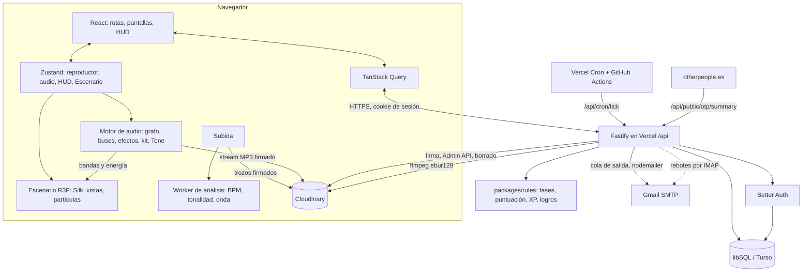

# BeatBattle — Guía maestra (especificación funcional, de diseño y técnica)

> Versión 0.3 · 2026-10-02 · Estado: **borrador para validar** · Es la fuente de verdad del proyecto (SDD)
>
> Competición semanal de beats a partir de un sample, con la estética de Other People Records y
> alma de videojuego.

---

## Índice

0. [Cómo se usa este documento](#0-cómo-se-usa-este-documento)
1. [Visión](#1-visión)
2. [Diseño funcional](#2-diseño-funcional)
3. [Dirección de arte, movimiento y sonido](#3-dirección-de-arte-movimiento-y-sonido)
4. [Arquitectura técnica](#4-arquitectura-técnica)
5. [Hoja de ruta](#5-hoja-de-ruta)
6. [Riesgos y mitigaciones](#6-riesgos-y-mitigaciones)
7. [Decisiones abiertas](#7-decisiones-abiertas)
8. [Anexos](#8-anexos)
9. [Registro de cambios](#registro-de-cambios)

---

## 0. Cómo se usa este documento

El proyecto se desarrolla con **Spec-Driven Development (SDD)**: primero se especifica, después se
planifica y al final se implementa contra la especificación. Este documento es la especificación.

**Identificadores.** Cada requisito lleva un id estable que se cita en los planes, en el código y en
los tests:

| Prefijo | Qué es | Ejemplo |
|---|---|---|
| `RF-<ÁREA>-NN` | Requisito funcional (comportamiento observable) | `RF-VOTE-03` no se vota la propia entrada |
| `RNF-<ÁREA>-NN` | Requisito no funcional (rendimiento, seguridad, accesibilidad, privacidad) | `RNF-PERF-02` LCP < 2,5 s |
| `RD-<ÁREA>-NN` | Requisito de diseño (visual, movimiento o sonido) verificable | `RD-SND-04` cada estrella suena una nota más aguda |

Áreas: `AUTH` cuentas · `PRF` perfil · `DROP` sample semanal · `ENT` entradas · `PLAY` reproducción ·
`VOTE` votación · `RES` resultados · `ARC` archivo y temporadas · `GAME` progresión · `SURP`
sorpresas · `NOTIF` avisos · `MOD` moderación · `ADM` administración · `SHARE` compartir y SEO ·
`OTP` integración con Other People · `STO` almacenamiento · `A11Y` accesibilidad · `SEC` seguridad
· `PRIV` privacidad · `PERF` rendimiento · `VIS` visual · `MOT` movimiento · `SND` sonido.

**Criterios de aceptación.** Las tablas de requisitos llevan una columna *Aceptación* redactada
para que se pueda convertir directamente en un test (Dado / Cuando / Entonces comprimido). Un
requisito sin un criterio verificable es un bug de la especificación.

**Trazabilidad.** Los tests llevan el id en el nombre (`it('RF-VOTE-03: …')`). Cada tarea de un
plan cita los ids y la sección (`§2.7`) que implementa. Al cerrar una fase, todos sus ids tienen al
menos un test o una verificación manual registrada en el plan.

**Cambios.** Si al implementar algo la realidad obliga a desviarse, **se cambia primero este
documento** (sección afectada + entrada en el *Registro de cambios*) en el mismo commit que el
código. Nunca se deja el código diciendo una cosa y la guía otra.

**Jerarquía** cuando dos fuentes discrepan:

1. §1.5 Alcance y §1.3 Principio rector.
2. El resto de esta guía (§2 comportamiento, §3 diseño, §4 técnica).
3. `docs/planning/ROADMAP.md` → *Decisiones tomadas* (lo decidido después; si contradice a la guía,
   se actualiza la guía).
4. `CLAUDE.md` para convenciones de código.

---

## 1. Visión

### 1.1 Resumen

**BeatBattle** es una competición semanal entre productores. Cada lunes cae un **sample nuevo**
(el *drop*). Los productores lo descargan, lo *flipean* en un beat, una instrumental o un tema
completo, y suben el resultado antes del domingo. Durante la semana, cualquiera con cuenta escucha
las entradas y las puntúa de **1 a 5 estrellas**. El domingo a medianoche la semana se **sella**:
se calcula la clasificación, se revela el podio con una ceremonia y empieza la siguiente.

Vive junto a la web de **Other People Records** (`otherpeople.es`): comparte su ADN visual
(negro, rojo `#ff003c`, fondo Silk granate, tipografía pesada con contorno) y su forma de guardar el
audio (Cloudinary), pero tiene **cuentas propias e independientes** (Better Auth).

Por encima de la competición hay una **capa de juego**: niveles, rangos, rachas, logros,
temporadas, una carta de productor en 3D, efectos de sonido sintetizados, animaciones con
intención y un catálogo de sorpresas escondidas.

### 1.2 Pilares de diseño

| Pilar | Qué significa | Cómo se nota |
|---|---|---|
| **Juego limpio** | Gana el mejor beat, no el que más amigos tiene | Voto ciego, umbral de escucha, media bayesiana, orden de escucha justo, no se ven las notas hasta el cierre |
| **Se juega en minutos** | Votar tiene que ser tan ágil como pasar canciones | Modo Jurado: cola automática, teclas 1–5, autoavance |
| **Alma de sello** | Parece una extensión de Other People, no una app genérica | Mismos tokens, tipografía, fondo y tono; el ganador sale en la web del sello |
| **Sorpresa constante** | Cada visita puede esconder algo | Ceremonias, easter eggs, logros ocultos, semanas doradas, la web suena al sample de la semana |
| **Cuidado obsesivo del detalle** | Ninguna interacción queda «a pelo» | Cada acción tiene estado de carga, animación, sonido, variante sin movimiento y copy propio |

### 1.3 Principio rector: «juego limpio antes que espectáculo»

Cuando el espectáculo y la integridad chocan, **gana la integridad**:

- Ninguna animación, sonido u orden de lista puede dar ventaja a una entrada sobre otra. Todas las
  entradas se presentan con el mismo tratamiento hasta el sellado.
- Ningún número que pueda sesgar el voto (media, recuento público de votos, posición provisional)
  se muestra antes del sellado.
- La reproducción iguala la sonoridad de las entradas (§2.6): un master más fuerte no gana por
  sonar más fuerte.
- Las sorpresas son cosméticas o dan XP. **Nunca** cambian la clasificación.

Y cuando la diversión y la claridad chocan, gana la claridad: un efecto que confunde sobre el estado
real (¿he votado? ¿se ha subido?) se quita.

### 1.4 Público, plataforma e idioma

- **Público:** productores de música urbana y electrónica (trap, drill, reggaetón, boom bap, jersey,
  afro, house…), desde aficionados hasta los del entorno del sello. Oyentes que quieren votar.
- **Plataforma:** web responsive. Escritorio y móvil al mismo nivel: la subida se hace sobre todo
  desde escritorio (el DAW está ahí) y el voto sobre todo desde el móvil.
- **Navegadores:** las dos últimas versiones de Chrome, Edge, Firefox y Safari (macOS e iOS).
- **Idioma:** castellano en el lanzamiento, con claves i18n desde el primer día (inglés y catalán
  posibles después).
- **Edad mínima:** 14 años (consentimiento propio según la LOPDGDD, art. 7).

### 1.5 Alcance

**Entra:**

- Cuentas propias (email + contraseña, Google y Discord), perfil público de productor.
- Calendario de semanas con un sample por semana, descarga con aceptación de las bases.
- Subida de entradas (una por productor y semana), con análisis automático de BPM y tonalidad.
- Reproductor global, lista de entradas, ficha de entrada, Modo Jurado.
- Voto de 1 a 5 estrellas, ciego y con umbral de escucha.
- Sellado automático, clasificación, ceremonia de podio, archivo de semanas, salón de la fama,
  temporadas trimestrales.
- Capa de juego: XP, niveles, rangos, rachas, logros, carta de productor.
- Catálogo de sorpresas y easter eggs (Anexo F).
- Emails de servicio (verificación, recibo de entrada…), avisos de la batalla (drop, resultados,
  recordatorios) y email marketing con consentimiento, con preferencias por tipo (§2.12).
- Moderación: denuncias, descalificación, bloqueo de cuentas, detección de votos anómalos.
- Panel de administración: samples, semanas, moderación, uso de la nube.
- Integración con Other People: enlaces cruzados, widget de la batalla en la web del sello,
  «Elección del sello».
- Páginas compartibles con imagen OG y tarjetas para *stories*.

**No entra** (decisión explícita; reabrirlo es decisión de producto y se pregunta):

- Pagos, venta de beats, licencias o marketplace (eso lo hace la web del sello).
- Chat, mensajes privados, comentarios públicos o seguidores (la comunidad vive en Instagram y
  Discord). *Post-lanzamiento posible:* feedback privado del jurado al productor (§2.7, `RF-VOTE-14`).
- Colaboraciones (varias cuentas por entrada) y equipos.
- Batallas cara a cara en directo o en tiempo real.
- App nativa. Sí PWA instalable (manifest e iconos) sin modo offline.
- Inicio de sesión compartido con la web de Other People (las cuentas son independientes).

### 1.6 Glosario rápido

| Término | Significado |
|---|---|
| **Batalla** | La competición en conjunto (y la marca: *Beat Battle*). |
| **Semana** | Un ciclo completo: drop → envíos → votos → sellado. Se numera `#N` desde el lanzamiento y se etiqueta con la semana ISO (`2026-W41`). |
| **Drop** | La publicación del sample de la semana (lunes 00:00, hora de Madrid). |
| **Sample** | El audio de partida que todos deben usar. Puede venir con *stems* en un zip. |
| **Flip** | Transformar el sample en algo nuevo. |
| **Entrada** | El audio que sube un productor a una semana. Una por productor y semana. |
| **Jurado** | Cualquier usuario verificado que vota. |
| **Modo Jurado** | Flujo de escucha y voto en cola, a pantalla completa. |
| **Recibo de escucha** | Prueba (en servidor) de que el usuario ha escuchado lo bastante de una entrada para votarla. |
| **Sellado** | Cierre definitivo de la semana: se congela la clasificación. |
| **Puntuación** | Media bayesiana de las estrellas (§2.8). |
| **Temporada** | Un trimestre natural. Suma puntos por posición semanal. |
| **Semana dorada** | Semana especial sorpresa con XP doble y vinilo dorado (Anexo F). |
| **Alias de batalla** | Nombre generado que identifica una entrada mientras el voto es ciego. |

### 1.7 Relación con Other People

| Aspecto | Other People (`otherpeople.es`) | BeatBattle |
|---|---|---|
| Propósito | Sello: artistas, discografía, eventos, tienda de beats, estudio | Competición semanal de productores |
| Repo | `ReactOtpWeb` (React + Vite, Express 5, MongoDB, Auth0) | `BeatBattle` (stack de Orchard, §4.1) |
| Cuentas | Auth0 | **Better Auth propio, independiente**. No se comparten cookies ni usuarios. |
| Audio | Cloudinary (`resource_type: video`, subida firmada directa, URL de descarga firmada) | **El mismo sistema** y el mismo patrón de integración, bajo el prefijo `beatbattle/…`; se recomienda una cuenta de Cloudinary propia para no gastar la cuota del sello (§4.8.1, decisión abierta) |
| Estética | Negro + rojo `#ff003c`, fondo Silk `#4A0D1C`, Montserrat, isla de navegación flotante | La misma base, con una capa de juego encima (§3) |
| Enlace | Menú «Beat Battle» + widget de la batalla en la home | Logo OTP enlazado al sello, pie compartido, ganador destacado en el sello |
| Dominio | `www.otherpeople.es` | `battle.otherpeople.es` (por confirmar, §7) |

---

## 2. Diseño funcional

### 2.1 El bucle semanal

Todas las horas son de **Europe/Madrid** (con su cambio de horario). En la base de datos se
guardan instantes UTC en milisegundos; las fronteras se calculan al programar la semana (§4.12).

```
LUN 00:00            ·  ·  ·  ·  ·  ·  ·  ·  ·  ·  ·  ·  DOM 20:00          DOM 23:59:59   LUN 00:00
   │  DROP: se publica el sample                          │                     │             │
   │  ├── envíos abiertos ────────────────────────────────┤ cierre de envíos    │             │
   │  ├── votación abierta ───────────────────────────────┴─────────────────────┤ cierre votos │
   │                                                                            │  SELLADO ───┤ resultados visibles
   │                                                                            │             │ + DROP de la siguiente
```

| Fase de la semana | Ventana | Qué se puede hacer |
|---|---|---|
| `scheduled` | Antes del drop | Nada público. El admin la prepara. La home anuncia «Próximo drop en…». |
| `open` | Lunes 00:00 → domingo 20:00 | Descargar el sample, subir y editar la entrada, escuchar y votar. |
| `voting` | Domingo 20:00 → domingo 23:59:59 | Solo escuchar y votar. Las últimas entradas reciben al menos 4 h de votación. |
| `sealing` | Desde el cierre hasta que el sellado termina (segundos) | Solo lectura. |
| `sealed` | Para siempre | Resultados, archivo, ceremonia. Las entradas siguen escuchándose. |

**Por qué envíos y votos van a la vez** (y no «envías esta semana, votas la siguiente»): así lo
pide el producto (ves lo subido y lo votas en la misma semana) y el ritmo es más vivo. La
desventaja (las entradas tardías tienen menos tiempo) se compensa con tres mecanismos: el orden de
escucha justo prioriza las entradas con menos votos (§2.6), la media bayesiana no premia tener
pocos votos (§2.8) y hay 4 h de solo votación al final. Las tres constantes están en la tabla de
equilibrado (Anexo B) y se pueden ajustar sin tocar código.

| Id | Requisito | Aceptación |
|---|---|---|
| `RF-DROP-01` | La fase de una semana se **deriva** de sus instantes y de `now`, nunca de un flag mutable | Dados `starts_at`, `submit_ends_at`, `vote_ends_at` y `now`, `phaseOf()` devuelve la fase de la tabla; test de propiedades sobre fronteras (±1 ms) |
| `RF-DROP-02` | Solo hay una semana `open` o `voting` a la vez | Programar una semana que solape con otra devuelve 409 |
| `RF-DROP-03` | El sellado es **perezoso e idempotente**: lo dispara la primera petición o el cron que llegue tras el cierre | Sellar dos veces produce el mismo snapshot byte a byte; dos sellados concurrentes dejan un único resultado |
| `RF-DROP-04` | Si no hay semana programada para el lunes, la web muestra «Próximo drop pronto» y avisa al admin 72 h antes | Con el calendario vacío, la home muestra el estado vacío; el cron envía un email al admin |
| `RF-DROP-05` | Las fronteras respetan el cambio de horario | La semana del último domingo de marzo dura 167 h y la de octubre 169 h; test con esas fechas |

### 2.2 Roles y permisos

| Rol | Cómo se obtiene | Puede |
|---|---|---|
| **Visitante** | Sin sesión | Ver la semana, el sample, las entradas, escuchar, ver resultados, archivo y perfiles |
| **Productor** | Cuenta creada | Lo anterior + ajustes de perfil. No vota ni sube hasta verificar el email. |
| **Productor verificado** | Email verificado (o cuenta de Google o Discord con email verificado) | Descargar el sample, subir entradas, votar, denunciar |
| **Participante de la semana** | Tiene una entrada activa en la semana | Igual, pero no vota su propia entrada |
| **Admin** | Rol `admin` (plugin admin de Better Auth) | Panel de administración (§2.14) |
| **Bloqueado** | Lo bloquea un admin | Solo leer; sus votos de semanas sin sellar se anulan y sus entradas se ocultan |

| Id | Requisito | Aceptación |
|---|---|---|
| `RF-AUTH-01` | Sin email verificado no se descarga, sube ni vota | Las tres rutas devuelven 403 `EMAIL_NOT_VERIFIED`; la UI muestra el aviso con «Reenviar email» |
| `RF-AUTH-02` | Un usuario bloqueado no puede iniciar sesión y su sesión activa se revoca | Tras el bloqueo, la siguiente petición autenticada devuelve 401 |
| `RF-AUTH-03` | Las rutas `/api/admin/*` exigen rol `admin` | Un productor recibe 403; test por cada ruta de admin |

### 2.3 Cuentas y perfil

**Registro.** Email + contraseña o Google o Discord. En el registro se elige el **nombre de
productor** (`username`: 3–20 caracteres, `[a-z0-9_.]`, único sin distinguir mayúsculas, con lista
de nombres reservados: `admin`, `otp`, `otherpeople`, `beatbattle`, `jurado`, `sello`…). Se puede
mostrar con mayúsculas (`displayUsername`). La contraseña tiene un mínimo de 12 caracteres y un
máximo de 128, sin reglas de composición, con pegado permitido, medidor de fortaleza y comprobación
contra contraseñas filtradas. El formulario muestra los avisos de la batalla que llegarán por email
(con casillas por tipo, marcadas) y dos casillas **desmarcadas** e independientes: novedades y
campañas de Beat Battle, y la newsletter de Other People (§2.12, §2.16).

**Verificación.** Email con enlace (válido 24 h). Al verificar se inicia sesión y se dispara la
animación de bienvenida (§3.8.9). Los dominios de email desechables se rechazan.

**Perfil público** (`/p/:username`): avatar, nombre, rango y nivel, bio (160 caracteres), ciudad,
enlaces (Instagram, SoundCloud, YouTube, Spotify, BeatStars), color de acento (de una paleta de 8
que funcionan sobre negro), la **carta de productor** en 3D, estadísticas, vitrina de logros y el
historial de entradas con su posición.

| Id | Requisito | Aceptación |
|---|---|---|
| `RF-AUTH-04` | Registro con email + contraseña y verificación obligatoria | E2E: registrarse → email capturado → abrir enlace → sesión iniciada y `emailVerified = true` |
| `RF-AUTH-05` | Google y Discord como proveedores sociales; si el email coincide con una cuenta existente verificada, se vinculan | Iniciar con Google con el email de una cuenta existente entra en esa cuenta |
| `RF-AUTH-06` | `username` único sin distinguir mayúsculas, con lista de reservados | `LilBru` y `lilbru` chocan; `admin` se rechaza con `USERNAME_RESERVED` |
| `RF-AUTH-07` | Contraseña de 12 a 128 caracteres, rechazada si aparece en filtraciones | `password123456` → `PASSWORD_COMPROMISED`; 11 caracteres → `PASSWORD_TOO_SHORT` |
| `RF-AUTH-08` | Recuperación de contraseña por email; al usarla se revocan todas las sesiones | Tras restablecerla, una sesión abierta en otro navegador queda revocada |
| `RF-AUTH-09` | Dominios de email desechables rechazados | `x@mailinator.com` → `EMAIL_DISPOSABLE` |
| `RF-AUTH-10` | Lista de sesiones activas con opción de cerrar las demás | Ajustes → Sesiones lista navegador y última actividad; «Cerrar las demás» las revoca |
| `RF-PRF-01` | Perfil público con los campos descritos | `/p/:username` responde 200 con los datos; 404 con la página propia si no existe |
| `RF-PRF-02` | El avatar se sube a Cloudinary con firma, se recorta a cuadrado y se entrega a 256 px | Subir un PNG de 4000 px sirve una imagen de 256×256 en WebP o AVIF |
| `RF-PRF-03` | El cambio de `username` está limitado a una vez cada 30 días y mantiene una redirección desde el anterior durante 30 días | `/p/antiguo` redirige 301 a `/p/nuevo` |
| `RF-PRF-04` | Borrar la cuenta (RGPD) elimina perfil, votos de semanas sin sellar, entradas sin sellar y sus audios; las entradas de semanas selladas pasan a «Productor eliminado» manteniendo la clasificación | Tras el borrado, la clasificación sellada no cambia y no queda ningún dato personal |
| `RF-PRF-05` | Exportar los datos propios en JSON | `/api/me/export` devuelve perfil, entradas, votos, XP y logros |

### 2.4 El sample de la semana

**La ficha del drop** (hero de la home y de `/semana/:slug`): vinilo 3D girando con la portada del
sample en la galleta, título y créditos, chips de **BPM**, **tonalidad**, **duración** y **género
sugerido** (opcional), forma de onda reproducible, cuenta atrás y el **reto extra** opcional de la
semana («usa solo el primer compás», «nada de 808»; no puntúa, da un logro).

**Descarga.** Botón «Pillar el sample». La primera vez de cada semana abre el modal de **bases de
la semana** (resumen de 5 puntos + enlace a las bases completas, Anexo A) con casilla obligatoria.
Aceptadas, se genera una URL firmada de descarga con 1 h de validez (`fl_attachment`, como en Other
People) y empieza la descarga del WAV original; si hay stems, segundo botón para el zip.

**Contenido del sample.** Lo carga el admin (§2.14) con: audio original (WAV o AIFF, ≤ 100 MB), zip
de stems opcional (≤ 10 MB, límite de Cloudinary para ficheros `raw`), portada (≥ 1000 px), título,
créditos y origen, **licencia de uso** (texto obligatorio), BPM, tonalidad, género sugerido, reto
extra y 8 *chops* (marcas de inicio y fin) para el kit sonoro de la semana (§3.7.6).

| Id | Requisito | Aceptación |
|---|---|---|
| `RF-DROP-06` | La descarga exige sesión verificada y aceptar las bases de esa semana | Sin aceptar → 409 `RULES_NOT_ACCEPTED`; tras aceptar → 200 con `downloadUrl` firmada |
| `RF-DROP-07` | La URL de descarga caduca en 1 h y fuerza la descarga como adjunto | La URL contiene firma y `fl_attachment`; pasada 1 h, Cloudinary responde 401 |
| `RF-DROP-08` | Se registra la primera descarga y el número de descargas por usuario y semana | `sample_download` con `first_at` y `count`; el recuento total aparece en el panel de admin |
| `RF-DROP-09` | El sample se puede escuchar sin cuenta (versión de escucha en MP3) | Visitante → el reproductor suena; la descarga pide entrar |
| `RF-DROP-10` | Cuenta atrás hasta el cierre de envíos (fase `open`) o de votos (fase `voting`) | Con el reloj simulado a 1 h del cierre, la cuenta atrás muestra `0d 00:59:59` y pasa a modo «última hora» (§3.6) |
| `RF-DROP-11` | La primera visita de cada usuario a una semana nueva muestra la **revelación del drop** (§3.8.2), una sola vez y repetible desde la ficha | Segunda visita → no se repite; «Ver otra vez» la reproduce |

### 2.5 Participar: subir una entrada

**Flujo** (`/subir`, también desde el botón del hero):

1. **Comprobaciones previas.** Sesión verificada, bases aceptadas, fase `open` y sin entrada activa
   (si ya la tiene, el botón dice «Editar mi entrada»).
2. **Zona de soltar.** Arrastrar o elegir fichero. Formatos: **WAV, AIFF, FLAC o MP3**; hasta
   **100 MB**; duración de **30 s a 6 min**. La validación de formato, tamaño y duración se hace en
   el navegador antes de subir nada.
3. **Análisis local** (Web Worker, motor portado de Other People, §4.6): BPM, tonalidad, forma de
   onda y sonoridad aproximada. Mientras analiza, la UI muestra la onda dibujándose de izquierda a
   derecha y los valores «girando» como una tragaperras hasta fijarse.
4. **Ficha.** Título (obligatorio, 2–60 caracteres), BPM y tonalidad (prerrellenados y editables),
   DAW (lista + «otro»), etiquetas de género (hasta 3, de la misma lista que la web del sello: Trap,
   Jerk, Hoodtrap, Drill, Boom Bap, Crank, Reggaetón, Electronic, Afrobeats, Club, Dancehall, Jersey,
   Amapiano…), descripción (280 caracteres) y portada propia opcional. Sin portada propia se usa la
   **portada generativa** (§3.4.5). Casilla de declaración: «He usado el sample de la semana y el
   resto del material es mío o libre de derechos».
5. **Subida directa a Cloudinary** con parámetros firmados por el servidor (§4.8), con barra de
   progreso real (bytes enviados), velocidad, tiempo restante y opción de cancelar. El progreso suena
   (§3.7, `upload.progress`).
6. **Verificación en servidor.** El servidor consulta el recurso en Cloudinary, comprueba carpeta,
   tamaño, formato y duración, mide la sonoridad y la forma de onda autoritativas (§4.8.4) y crea la
   entrada. Si algo no cuadra, borra el recurso y devuelve el motivo.
7. **Celebración.** Animación de «entrada en la batalla» (§3.8.5), +XP, el posible logro y el
   **recibo por email** con el informe técnico de la medición (§2.12.1).

**Después de subir** el productor puede editar título, descripción, etiquetas, BPM, tonalidad y
portada hasta el cierre de envíos. Puede **sustituir el audio** solo mientras la entrada no tenga
votos, y **retirarla** en cualquier momento hasta el cierre (se borra el audio; si tenía votos,
se pierden).

En semanas con **voto ciego** (por defecto) el título no debe identificar al productor (lo dicen
las bases) y la portada propia queda oculta hasta el sellado: se muestra la generativa.

| Id | Requisito | Aceptación |
|---|---|---|
| `RF-ENT-01` | Una entrada activa por productor y semana | Una segunda subida devuelve 409 `ENTRY_EXISTS`; índice único parcial en la BD |
| `RF-ENT-02` | Solo se sube con la semana en fase `open` | En `voting` → 409 `SUBMISSIONS_CLOSED`, y la UI no ofrece el botón |
| `RF-ENT-03` | Formatos WAV, AIFF, FLAC y MP3; ≤ 100 MB; 30 s – 6 min; validado en cliente **y** en servidor | Un MP3 de 7 min se rechaza en el navegador (`DURATION_OUT_OF_RANGE`); forzando la API, el servidor también lo rechaza y borra el recurso |
| `RF-ENT-04` | El servidor decide el `public_id` y la carpeta; el cliente no puede elegir dónde se escribe. El `public_id` **no contiene el id del usuario** (se vería en la URL de escucha y rompería el voto ciego) | La firma incluye `public_id = beatbattle/entries/<semana>/<uuid>`; subir con otro `public_id` invalida la firma |
| `RF-ENT-05` | Los metadatos de integridad (duración, tamaño, formato, sonoridad, forma de onda) los fija el servidor, no el cliente | Enviar `duration: 60` para un audio de 200 s guarda 200 s |
| `RF-ENT-06` | BPM y tonalidad se sugieren con el análisis local y son editables | Con un audio de prueba a 140 BPM en La menor, el formulario aparece prerrellenado con 140 y `Am` |
| `RF-ENT-07` | Barra de progreso real con cancelación | Cancelar aborta el XHR y no deja entrada; el recurso huérfano lo limpia el cron (`RF-STO-05`) |
| `RF-ENT-08` | El audio solo se sustituye si la entrada no tiene votos | Con un voto → 409 `ENTRY_HAS_VOTES` |
| `RF-ENT-09` | Retirar la entrada borra su audio y sus votos y libera el hueco | Tras retirarla puede subir otra |
| `RF-ENT-10` | En voto ciego, la portada propia y la identidad no se exponen antes del sellado, ni en la UI ni en la API pública | La respuesta pública de una entrada en una semana sin sellar no contiene `userId`, `username`, `avatar` ni `coverUrl` propio |
| `RF-ENT-11` | Detección de audio duplicado por `etag` de Cloudinary | Dos cuentas que suben el mismo fichero → la segunda se crea, pero queda marcada para revisión del admin |
| `RF-ENT-12` | La subida reintenta automáticamente ante cortes de red (3 intentos con espera exponencial) y conserva la ficha rellenada | Cortar la red al 50 % y recuperarla → la subida continúa o se reintenta sin perder el formulario |

### 2.6 Escuchar: reproductor, lista y ficha de entrada

**Reproductor global.** Uno solo para toda la web, anclado abajo (barra fina en escritorio, mini
reproductor en móvil que se expande). Sigue sonando al navegar entre páginas. Muestra la portada
(generativa en voto ciego), el alias o título, la forma de onda con el progreso en rojo, el tiempo,
anterior/siguiente, volumen y un botón «Votar» que se ilumina cuando el umbral de escucha se cumple.
Integra la **Media Session API** (controles del sistema y de la pantalla de bloqueo), como Other
People.

**Igualación de sonoridad.** Cada entrada se reproduce con una ganancia que la lleva a **−14 LUFS
integrados**, medidos en servidor (§4.8.4). La ganancia solo puede **atenuar** (nunca sube más de
0 dB) para no amplificar ruido ni saturar. Se puede desactivar en ajustes («Escuchar el master tal
cual»), pero viene activada y el Modo Jurado siempre la usa.

**Lista de entradas** (home y `/semana/:slug`): filas al estilo de la lista de beats de Other People
(portada, play redondo, título, alias, chips de género, BPM y tonalidad en gris, mini onda con
progreso). Vista de cuadrícula opcional. Durante la semana el orden por defecto es **«Ronda
justa»**:

1. Primero las entradas que el usuario aún no ha votado.
2. Dentro de ellas, las que menos votos tienen (en total; el número no se muestra).
3. A igualdad, un barajado estable por usuario (`hash(userId, weekId, entryId)`); para los
   visitantes, por día.

Otros órdenes: «Recién subidas» y «Aleatorio». No existe el orden «Mejor valoradas» antes del
sellado. Filtros: género, rango de BPM, tonalidad, «solo sin votar».

**Ficha de entrada** (`/e/:id`): portada grande (con inclinación 3D al pasar el ratón, como las
cartas del sello), onda completa clicable para saltar, metadatos, descripción, estrellas de voto,
botón de compartir y de denunciar. Tras el sellado, además: posición, puntuación, número de votos,
distribución de estrellas (histograma de 5 barras) e identidad del productor.

| Id | Requisito | Aceptación |
|---|---|---|
| `RF-PLAY-01` | Reproductor global persistente entre rutas | Navegar de la home a un perfil no corta el audio |
| `RF-PLAY-02` | Media Session con título, artista (alias o productor), portada y acciones play/pause/anterior/siguiente | En Android, la notificación muestra los controles y funcionan |
| `RF-PLAY-03` | Igualación a −14 LUFS que solo atenúa | Una entrada medida a −8 LUFS suena con −6 dB; una a −18 LUFS suena a 0 dB |
| `RF-PLAY-04` | Orden «Ronda justa» por defecto durante la semana | Con 3 entradas (0, 5 y 2 votos), un usuario que no ha votado ninguna las ve en el orden 0, 2, 5 |
| `RF-PLAY-05` | Ninguna respuesta pública de una semana sin sellar incluye media, recuento de votos ni posición | Test de contrato sobre todas las rutas públicas de semana y entrada |
| `RF-PLAY-06` | La forma de onda permite saltar con clic, arrastre y teclado (←/→ 5 s, Inicio/Fin) | Test de componente con teclado |
| `RF-PLAY-07` | Se cuenta una **escucha** cuando alguien oye ≥ 10 s seguidos (estadística, no recibo de voto) | `entry.play_count` sube una vez por sesión de escucha |
| `RF-PLAY-08` | Tras el sellado, la ficha muestra posición, puntuación, votos e histograma | Ficha de semana sellada con esos cuatro elementos |
| `RF-PLAY-09` | Si el audio no carga (red, 404), el reproductor lo dice y salta a la siguiente en el Modo Jurado | Simular 404 → aviso «No hemos podido cargar este beat» y botón de reintentar |

### 2.7 Votar

**Reglas del voto:**

- De **1 a 5 estrellas enteras**. Un voto por usuario y entrada; se puede **cambiar** hasta el
  cierre de votos y cuenta el último.
- No se vota la **propia** entrada.
- Hace falta el **recibo de escucha**: haber escuchado al menos `min(45 s, 50 % de la duración)`
  de esa entrada. El cliente lo controla con el tiempo realmente reproducido (los saltos con la onda
  no cuentan); el servidor comprueba además que entre el inicio de la escucha y el voto ha pasado ese
  tiempo de reloj. Es fricción contra el voto a ciegas, no una garantía absoluta.
- **Voto ciego** (por defecto en todas las semanas, configurable por semana): no se ve quién ha
  hecho cada entrada hasta el sellado. Las entradas se identifican por su título y un **alias de
  batalla** generado (adjetivo + sustantivo, p. ej. «Tigre Púrpura»), estable por entrada.
- Nadie ve medias ni recuentos hasta el sellado (`RF-PLAY-05`). El productor ve en su propia
  entrada cuántos votos lleva y cuántas escuchas, **sin la media**.

**Estrellas con alma.** Las estrellas son el corazón del juego y se tratan como tal (§3.8.4):
pasar el ratón ilumina y hace sonar notas de una escala pentatónica que sube con cada estrella;
votar 5 dispara un acorde, chispas y una vibración corta en móvil. Antes de cumplir el umbral, las
estrellas se ven «dormidas» con un anillo de progreso que se llena con la escucha; al cumplirse se
despiertan con un destello y un sonido (`vote.unlocked`).

**Modo Jurado** (`/jurado`): el bucle de juego del oyente.

- Pantalla completa, sin distracciones: vinilo con la portada, onda grande, alias, título, chips.
- Cola = entradas activas de la semana que el usuario no ha votado y que no son suyas, en orden de
  «Ronda justa».
- Reproducción automática desde el principio; el umbral se ve como un anillo alrededor del vinilo.
- Votar con clic o teclas **1–5**; **S** salta (la entrada pasa al final), **Espacio** pausa,
  **←/→** buscan, **Esc** sale.
- Tras votar, transición de cambio de disco (1,2 s) y siguiente entrada.
- Contador de progreso («7 de 23»), **combo** de votos seguidos en la sesión y XP flotante.
- Al vaciar la cola: pantalla de «Jurado completo» con el logro si procede y un resumen (cuántas
  ha puntuado, su media dada).

**Denunciar** desde la ficha o el Modo Jurado: motivo (no usa el sample · plagio o derechos ·
contenido ofensivo · spam · otro) y detalle opcional. Va a la cola de moderación (§2.13).

| Id | Requisito | Aceptación |
|---|---|---|
| `RF-VOTE-01` | Estrellas enteras de 1 a 5 | `stars: 0`, `6` o `3.5` → 422 |
| `RF-VOTE-02` | Un voto por usuario y entrada; repetirlo lo actualiza | Votar 3 y después 5 deja un único voto de 5 con `updated_at` nuevo |
| `RF-VOTE-03` | No se vota la propia entrada | 403 `OWN_ENTRY`; en la UI, las estrellas no aparecen en la propia entrada |
| `RF-VOTE-04` | Sin recibo de escucha no se vota | Votar sin haber iniciado escucha → 409 `LISTEN_REQUIRED`; a los 20 s de una entrada de 3 min → 409; a los 46 s → 200 |
| `RF-VOTE-05` | Solo se vota en fases `open` y `voting` | Tras el cierre → 409 `VOTING_CLOSED`, aunque el sellado aún no haya terminado |
| `RF-VOTE-06` | Solo votan cuentas verificadas y no bloqueadas | 403 `EMAIL_NOT_VERIFIED` / 401 tras el bloqueo |
| `RF-VOTE-07` | Voto ciego: la API pública de una semana sin sellar no revela la autoría | Ver `RF-ENT-10` |
| `RF-VOTE-08` | Alias de batalla determinista por entrada, sin repetirse en la misma semana | Con 200 entradas no hay dos alias iguales; el mismo id da siempre el mismo alias |
| `RF-VOTE-09` | Modo Jurado con cola, autoavance, teclas 1–5, S, Espacio, ←/→ y Esc | E2E con teclado completo |
| `RF-VOTE-10` | Las estrellas muestran el progreso del umbral y se despiertan al cumplirlo | Test de componente con reloj simulado |
| `RF-VOTE-11` | Límite de 120 votos por hora y usuario | El voto 121 dentro de la hora → 429 |
| `RF-VOTE-12` | Denuncia con motivo, una por usuario y entrada | La segunda denuncia del mismo usuario a la misma entrada → 409 |
| `RF-VOTE-13` | Quitar el voto es posible hasta el cierre | `DELETE` del voto → 204 y la entrada vuelve a la cola del Modo Jurado |
| `RF-VOTE-14` | *(Post-lanzamiento)* Feedback privado opcional del jurado al productor (280 caracteres), visible para el productor tras el sellado | Fuera del MVP; se especifica al abrir la Fase 8 |

### 2.8 Cierre, clasificación y resultados

**Puntuación.** Media bayesiana de las estrellas, para que una entrada con un único 5 no supere a
otra con veinte votos de 4,6:

```
puntuación = (C · m + Σ estrellas) / (C + n)
  n = votos válidos de la entrada
  m = media de todos los votos válidos de la semana
  C = peso del previo (Anexo B: 5)
```

**Votos válidos.** Se excluyen los de cuentas bloqueadas, los anulados por moderación (§2.13) y los
de entradas retiradas o descalificadas.

**Clasificación.** Por puntuación descendente. Desempates, en orden: más votos válidos → mayor
mediana → más votos de 5 estrellas. Si todo empata, **comparten posición** (ex aequo) y la siguiente
posición salta (1, 1, 3). Para el **podio** hacen falta al menos 3 votos válidos; las entradas con
menos aparecen «sin clasificar» al final, en orden de subida.

**Snapshot.** El sellado guarda la clasificación en `result` (posición, puntuación, votos, media,
mediana, histograma, puntos de temporada) y marca la semana `sealed_at`. El snapshot es
**inmutable**: si después un admin descalifica una entrada por plagio, se ejecuta un **re-sellado**
explícito que crea una revisión nueva y queda registrado (auditoría y aviso en la página de
resultados: «Clasificación corregida el …»).

**Página de resultados** (`/semana/:slug/resultados`): podio con los tres primeros (vinilos de
oro, platino y diamante, §3.4.3), tabla completa con posición, alias revelado → productor,
puntuación, votos e histograma en miniatura, «Tu resultado» destacado si participaste, el reparto de
XP y puntos de temporada, la **Elección del sello** (§2.16) si la hay y el botón «Ver la ceremonia».

**Ceremonia** (§3.8.6): la primera vez que un usuario visita la web tras el sellado, la home le
ofrece la ceremonia de revelación. Dura unos 25 s y se puede saltar.

| Id | Requisito | Aceptación |
|---|---|---|
| `RF-RES-01` | Puntuación bayesiana con `C` y `m` de la semana | Caso de prueba del Anexo G con resultado exacto a 4 decimales |
| `RF-RES-02` | Desempates y ex aequo según la regla | Test de propiedades: la clasificación es una función pura, total y estable del conjunto de votos |
| `RF-RES-03` | Podio solo con ≥ 3 votos válidos | Una entrada con 2 votos de 5 no aparece en el podio aunque su puntuación lo permita |
| `RF-RES-04` | Sellado determinista: mismos votos → mismo snapshot | Barajar el orden de los votos no cambia el resultado (fast-check) |
| `RF-RES-05` | El sellado excluye votos no válidos | Bloquear a un votante antes del sellado elimina su efecto |
| `RF-RES-06` | Re-sellado explícito con revisión, auditoría y aviso público | Descalificar tras sellar y re-sellar → `result_revision = 2` y aviso visible |
| `RF-RES-07` | Revelación de identidades en voto ciego al sellar | Tras el sellado, la API pública devuelve el productor de cada entrada |
| `RF-RES-08` | Página de resultados con podio, tabla, «Tu resultado» y reparto de XP | E2E con dos semanas simuladas |
| `RF-RES-09` | Ceremonia ofrecida una vez por usuario y semana, saltable y repetible | `results_seen` por usuario y semana; Esc la salta; «Ver la ceremonia» la repite |
| `RF-RES-10` | Semana sin entradas: «Semana desierta», sin podio ni ceremonia | Sellar una semana vacía da un snapshot vacío y la página lo explica |

### 2.9 Archivo, salón de la fama y temporadas

- **Archivo** (`/semanas`): todas las semanas selladas, de la más reciente a la más antigua, con su
  sample, número de entradas y el podio. Cada semana sellada sigue siendo escuchable entera.
- **Salón de la fama** (`/salon-de-la-fama`): ganadores semana a semana (vinilo de oro con la
  portada), campeones de temporada y récords (más victorias, racha más larga, mejor puntuación de la
  historia, más votos emitidos).
- **Temporadas**: una por **trimestre natural** (T1–T4). Cada semana pertenece a la temporada de su
  lunes. Puntos por posición semanal al estilo F1 (25, 18, 15, 12, 10, 8, 6, 4, 2, 1 del 1.º al 10.º)
  y 1 punto por cada entrada clasificada fuera del top 10. Desempate: más victorias, después más
  podios, después mejor puntuación media. La clasificación de la temporada en curso es pública
  (solo con semanas selladas).

| Id | Requisito | Aceptación |
|---|---|---|
| `RF-ARC-01` | Archivo de semanas selladas, paginado | Con 60 semanas, la página 2 empieza en la 21.ª más reciente |
| `RF-ARC-02` | Salón de la fama con ganadores, campeones y récords | Datos derivados de los snapshots; test con fixtures |
| `RF-ARC-03` | Puntos de temporada según la tabla del Anexo B | Test unitario de la tabla y de los desempates |
| `RF-ARC-04` | Una semana pertenece a la temporada de su lunes | La semana que empieza el 2026-12-28 es de 2026-T4 |
| `RF-ARC-05` | Al sellar la última semana de una temporada se proclama campeón con ceremonia corta y logro | Test de integración con una temporada de 13 semanas simuladas |

### 2.10 Capa de juego: XP, niveles, rangos, rachas y logros

**XP.** Se gana jugando limpio: subir, votar, quedar bien, mantener rachas y acertar (Anexo B).
Se guarda como un **libro de movimientos** idempotente (`xp_event` con clave única por
`usuario + tipo + referencia`): repetir un evento nunca suma dos veces. El nivel es una función
pura del XP total.

**Niveles y rangos.** 20 niveles con curva `150 · (n − 1)^1,6` (Anexo B). Cada pocos niveles cambia
el **rango** (título visible en la carta): *Excavador de cajones* → *Loopero* → *Sampleador* →
*Beatmaker* → *Productor* → *Arquitecto del groove* → *Maestro del bounce* → *Jefe de estudio* →
*Leyenda del barrio* → **Other People** (nivel 20: «eres de la familia»).

**Rachas.** Semanas consecutivas con entrada clasificada. Cada semana de racha a partir de la
segunda suma un +10 % al XP de subir y de resultado, hasta +50 %. Saltarse una semana la rompe. Hay
un **comodín de racha** por temporada (se gasta solo la primera semana que fallas), para que una
semana mala no destroce meses.

**Logros.** Unos 35, en cuatro rarezas (común, raro, épico, legendario), algunos **ocultos** («???»
con una pista críptica). Catálogo completo en el Anexo C. Desbloquear uno lanza el aviso de logro
(§3.8.8).

**Oído de oro.** Al sellar, a cada jurado con ≥ 8 votos en la semana se le calcula la correlación
de Spearman entre sus estrellas y la clasificación final. Con ρ ≥ 0,6 gana XP y cuenta para el logro.
Premia anticipar el criterio del resto del jurado. Para que nadie se dé la razón a sí mismo, la
puntuación de cada entrada se recalcula **sin su propio voto** antes de correlacionar. Como el XP
no influye en la clasificación (`RF-GAME-10`), votar «como la mayoría» no da ventaja a nadie.

**Carta de productor.** La identidad de juego del usuario (§3.4.4): avatar, nombre, rango, nivel,
color de acento, estadísticas y los tres logros elegidos para la vitrina. En el perfil cuelga de un
lanyard físico en 3D (como el del sello) que se puede arrastrar. Los ganadores de alguna semana
tienen la carta **holográfica**.

**HUD.** Con sesión, la isla de navegación muestra avatar con anillo de nivel y una barra de XP
mínima. Cada ganancia de XP sube como «+5 XP» desde el punto de la acción hasta la barra.

| Id | Requisito | Aceptación |
|---|---|---|
| `RF-GAME-01` | Libro de XP idempotente | Reprocesar el sellado de una semana no cambia el XP de nadie |
| `RF-GAME-02` | Nivel y rango como función pura del XP | Tabla del Anexo B testeada en sus fronteras |
| `RF-GAME-03` | Reglas de XP del Anexo B, incluidos topes semanales | 50 votos en una semana dan como máximo 40 × 5 XP |
| `RF-GAME-04` | Rachas con bonus y comodín de temporada | Escenario: 4 semanas, falla la 5.ª (gasta el comodín), falla la 6.ª (se rompe) |
| `RF-GAME-05` | Logros del Anexo C evaluados por eventos, sin duplicados | Cada logro tiene un test de su condición |
| `RF-GAME-06` | Oído de oro con Spearman excluyendo el propio voto | Caso de prueba del Anexo G |
| `RF-GAME-07` | Carta de productor y lanyard 3D en el perfil, con alternativa estática | Con `prefers-reduced-motion` o sin WebGL se ve la carta plana |
| `RF-GAME-08` | HUD con barra de XP y XP flotante | Votar muestra «+5 XP» y la barra se mueve |
| `RF-GAME-09` | Subir de nivel lanza la animación de nivel (§3.8.8) una sola vez | Recargar no la repite (`level_seen`) |
| `RF-GAME-10` | El XP y los logros **nunca** influyen en la clasificación ni en el peso del voto | Revisión de código + test: dos votantes de nivel 1 y 20 pesan igual |

### 2.11 Sorpresas y easter eggs

La web tiene que premiar la curiosidad. Hay tres familias de sorpresas:

1. **Sorpresas de calendario**: la **semana dorada** (una o dos al año, sin anunciar: vinilo dorado,
   XP doble, logro propio), la **sesión nocturna** (de 00:00 a 05:00 en hora local: luz más tenue,
   crujido de vinilo de ambiente y saludo propio), la **hora loca** (la última hora antes de cada
   cierre: la cuenta atrás late, viñeta roja y latido) y **pieles de fecha** (Halloween, Navidad,
   Sant Joan con fuegos artificiales de partículas, aniversario de la batalla).
2. **Secretos activos**: el código Konami (modo *cassette*), siete clics en el logo (*scratch*),
   teclear «otp» en cualquier parte, mantener Espacio sobre el vinilo del sample (*chopped &
   screwed*), *tap tempo* sobre el vinilo para adivinar el BPM, el **beat pad** jugable de la página
   404 y un mensaje para curiosos en la consola del navegador.
3. **Sorpresas de juego**: logros ocultos, la carta holográfica del ganador, el **kit sonoro de la
   semana** (los sonidos de la interfaz son trocitos del sample de esa semana, así que la web suena
   distinta cada lunes) y **«Adivina el productor»** en semanas de voto ciego (apostar quién hizo
   una entrada; se resuelve en el sellado y da XP).

El catálogo exacto, con disparadores y efectos, está en el **Anexo F** y es **información
reservada**: no se documenta en la web ni en el README.

| Id | Requisito | Aceptación |
|---|---|---|
| `RF-SURP-01` | Cada sorpresa del Anexo F tiene disparador, efecto, duración y variante accesible | Test por disparador (teclado o reloj simulado) |
| `RF-SURP-02` | Ninguna sorpresa altera la clasificación ni el peso de un voto | Revisión + test de `RF-GAME-10` |
| `RF-SURP-03` | Las sorpresas respetan «reducir movimiento» y «sin sonido» | Con ambas preferencias, el disparador muestra solo la variante estática |
| `RF-SURP-04` | Ninguna sorpresa bloquea una acción principal ni salta durante el Modo Jurado o una subida | Disparar Konami en el Modo Jurado no hace nada hasta salir |
| `RF-SURP-05` | Las sorpresas se pueden desactivar en ajustes («Modo serio») | Con el modo serio activo, ningún disparador de la familia 2 responde |

### 2.12 Emails: recibos, avisos y marketing

El email es lo que trae a la gente de vuelta cada lunes. Hay **tres familias**, con reglas
distintas:

| Familia | Qué incluye | Base legal | Por defecto | ¿Se puede quitar? |
|---|---|---|---|---|
| **Servicio** | Verificación, recuperación, bienvenida, seguridad, recibos de entrada, fallos de subida, moderación, cambio de bases, borrado de cuenta, confirmación de alerta | Ejecución del servicio | Siempre | No (son necesarios para usar la cuenta) |
| **Avisos de la batalla** | Drop, resultados, recordatorio, última llamada del jurado, primeros votos, Elección del sello, rango y logros, racha en peligro, resumen de temporada | Relación de servicio e interés legítimo: el usuario se apunta a una competición semanal y los avisos tratan de ella (LSSI art. 21.2); se informa en el registro | Activados, con casillas por tipo visibles en el registro | Sí, por tipo, en un clic |
| **Marketing** | Boletín, campañas (nueva temporada, eventos y novedades del sello, colaboraciones), reactivación de inactivos | **Consentimiento expreso** (LSSI art. 21.1, RGPD art. 6.1.a): casilla propia, desmarcada | Desactivado | Sí, en un clic |

**Catálogo** (asuntos, contenido y diseño en el Anexo H):

| Id | Familia | Disparador | Destinatarios | Envío |
|---|---|---|---|---|
| `auth.verify` | Servicio | Registro o cambio de email | El usuario | Inmediato |
| `auth.reset` | Servicio | «He olvidado mi contraseña» | El usuario | Inmediato |
| `auth.welcome` | Servicio | Email verificado | El usuario | Inmediato |
| `auth.security` | Servicio | Cambio de contraseña o de email (a la dirección antigua y a la nueva), cuenta social vinculada, sesiones cerradas | El usuario | Inmediato |
| `alert.confirm` | Servicio | Suscripción a la alerta de drop sin cuenta | El visitante | Inmediato |
| `entry.receipt` | Servicio | **Entrada verificada y aceptada** | El participante | Inmediato (< 1 min) |
| `entry.failed` | Servicio | La verificación o la medición rechazan la subida | El participante | Inmediato |
| `entry.changed` | Servicio | Audio sustituido o entrada retirada | El participante | Inmediato |
| `mod.action` | Servicio | Ocultar, descalificar, restaurar, bloquear, anular votos | El afectado | Inmediato |
| `rules.changed` | Servicio | Nueva versión de las bases | Todas las cuentas | Una vez |
| `account.deleted` | Servicio | Cuenta borrada | La dirección borrada | Inmediato |
| `battle.monday` | Aviso | **Lunes de batalla**: resultados de la semana anterior + nuevo drop en un solo email | Cuentas y suscriptores con el aviso activo | Lunes 08:00 |
| `battle.drop` | Aviso | Nuevo drop (si el usuario prefiere emails separados) | Ídem | Lunes 08:00 |
| `battle.results` | Aviso | Resultados (si prefiere separados) | Participantes y jurados de la semana | Lunes 08:00 o al sellar |
| `battle.reminder` | Aviso | Descargó el sample y no ha subido (si tiene racha ≥ 3, versión «racha en peligro») | Ese usuario | Sábado 18:00 |
| `battle.jury_call` | Aviso | Ha votado esta semana y le quedan ≥ 3 entradas por escuchar | Ese usuario | Domingo 17:00 |
| `battle.first_votes` | Aviso | Su entrada llega a 5 votos (solo el número, nunca la media) | El participante | Inmediato, una vez por semana |
| `battle.label_pick` | Aviso | Su entrada recibe la Elección del sello | El participante | Inmediato |
| `game.progress` | Aviso | Cambio de rango o logro épico o legendario (agrupados en uno al día) | El usuario | Diario a las 19:00 si hay algo |
| `season.wrap` | Aviso | Sellado de la última semana de la temporada: «Tu temporada en cifras» | Quien participó o votó en la temporada | Al sellar |
| `mkt.campaign` | Marketing | Campaña creada en el panel | Segmento elegido ∩ consentimiento | Programado |
| `mkt.reactivation` | Marketing | 4 semanas sin subir ni votar | Ese usuario | Como mucho una vez cada 8 semanas |

#### 2.12.1 El recibo de entrada («verificación de subida»)

Es la prueba de que la entrada ha llegado bien. Se envía cuando el servidor termina la verificación
y la medición (§4.8.4) y tiene forma de **ticket**, como las entradas del sello:

- Número de recibo correlativo por semana (`BB-2026W41-0007`) y QR a la ficha.
- Alias de batalla, título, duración, formato y tamaño del original, BPM y tonalidad.
- **Informe técnico** de la medición: sonoridad integrada y ajuste que se le aplicará al
  reproducirla («−9,2 LUFS: en la batalla sonará 4,8 dB más baja para igualarse al resto»), pico real
  con aviso si supera −0,1 dBTP («tu master clipa») y forma de onda en imagen.
- Hora exacta de recepción (Madrid) y huella abreviada del fichero (`etag`): sirve como prueba de
  entrega en caso de duda.
- Botones: escuchar mi entrada, editar la ficha (hasta el domingo a las 20:00), compartir mi tarjeta.
- Recordatorio corto de las bases (voto ciego: «tu título no debe delatarte»).

Si se sustituye el audio o se retira la entrada, `entry.changed` envía el recibo actualizado o la
confirmación de retirada. Si la subida falla en la verificación, `entry.failed` explica el motivo
con las mismas palabras que la interfaz (§2.19) y enlaza a `/subir` con la ficha conservada.

#### 2.12.2 Lunes de batalla

Los resultados y el drop coinciden el lunes, así que por defecto van **en un solo email** para no
saturar: arriba, el resultado personal (posición, puntuación, XP, tarjeta de resultado) o el podio
para quien solo votó; abajo, el nuevo sample con su portada, chips, reto y una **cuenta atrás
animada**. Quien lo prefiera puede recibirlos por separado (Ajustes → Emails). Si el sellado se
retrasa más allá de las 08:00, el email espera hasta 2 h; si sigue sin sellar, sale solo el drop y
los resultados llegan después. Si el cupo diario de Gmail no alcanza para todos, sale por orden de
prioridad (participantes, jurados, resto de cuentas, suscriptores sin cuenta) y lo que falte, el
martes (§4.17).

#### 2.12.3 Alerta de drop sin cuenta

En la home y en el pie, un formulario «Avísame del próximo drop» deja suscribirse solo con el email,
sin crear cuenta. Usa **doble confirmación** (`alert.confirm`); sin confirmar en 7 días, se borra.
El suscriptor recibe `battle.drop` (o el resumen del lunes sin la parte personal) y cada email le
invita a crear cuenta. Si después se registra con el mismo email, la suscripción se fusiona con su
cuenta y conserva las preferencias.

#### 2.12.4 Preferencias, frecuencia y horas de silencio

- **Ajustes → Emails**: un interruptor por cada aviso, formato del lunes (combinado o separado),
  consentimiento de marketing y la opción de la newsletter del sello (§2.16).
- **Horas de silencio**: nada que no sea de servicio entre las 22:00 y las 08:00 (Madrid); se
  retiene hasta las 08:00.
- **Tope**: como mucho **3 emails no de servicio por usuario y semana** (el del lunes cuenta como
  uno). Prioridad: lunes > recordatorio > jurado > primeros votos > progreso > temporada > marketing.
  Lo que no cabe se descarta (queda registrado como `skipped`).
- **Baja en un clic** en cada email: cabeceras `List-Unsubscribe` y `List-Unsubscribe-Post`
  (RFC 8058; Gmail y Yahoo las exigen a los envíos masivos y aquí van siempre) y enlace visible al
  pie que da de baja solo ese tipo,
  sin pedir sesión, con opción de darse de baja de todo lo no esencial.
- **Supresión**: un rebote duro suprime la dirección para todo salvo el servicio estrictamente
  necesario; nunca se insiste. Gmail no informa de las quejas de spam, así que la baja tiene que
  estar siempre a la vista.
- **Presupuesto diario**: Gmail limita los envíos por día (§4.19.1). Una parte del cupo se reserva
  siempre para los emails de servicio; el resto se reparte por prioridad y lo que no cabe espera al
  día siguiente, sin perderse.

#### 2.12.5 Campañas (email marketing)

Panel de admin (§2.14) para crear campañas sin salir de la estética del sello:

- **Editor por bloques**: cabecera con imagen, texto, botón, tarjeta de sample, tarjeta de ganador,
  lista de entradas destacadas, cita, separador. Asunto y *preheader* con contador de caracteres.
  Vista previa en escritorio y móvil, y simulación de modo oscuro.
- **Segmentos** con recuento en vivo: todos con consentimiento; participantes de las últimas N
  semanas; jurados activos; inactivos desde hace N semanas; por rango; suscriptores sin cuenta;
  productores del sello. El segmento **siempre** se cruza con el consentimiento de marketing.
- Envío de prueba a la dirección del admin, programación con fecha y hora, cancelación hasta el
  momento del envío y duplicar campaña.
- **Ritmo**: las campañas usan solo el cupo diario que dejan libre los avisos, nunca salen en lunes
  (es el día del Lunes de batalla) y el panel estima cuántos días tardará el envío.
- **Estadísticas agregadas**: enviados, rebotes, bajas y clics por enlace
  (contados en una redirección propia, solo en agregado). **Sin píxel de apertura**: medir aperturas
  exige consentimiento y además ya no es fiable.

#### 2.12.6 Lo que un email nunca hace

- Revelar medias, recuentos públicos o posiciones antes del sellado, ni la autoría en voto ciego
  (`battle.first_votes` da el número de votos solo a su dueño).
- Salir sin versión de texto plano, sin enlace de baja (si no es de servicio) o fuera de la familia
  a la que pertenece.
- Llevar la contraseña, tokens de sesión o enlaces de acceso sin caducidad.

| Id | Requisito | Aceptación |
|---|---|---|
| `RF-NOTIF-01` | Tres familias con su base legal: servicio no desactivable, avisos activos con baja por tipo, marketing solo con consentimiento registrado | Una cuenta sin consentimiento de marketing nunca entra en el envío de una campaña, aunque esté en el segmento |
| `RF-NOTIF-02` | Envío idempotente por destinatario, tipo y referencia | Reejecutar el `tick` o reintentar el envío no duplica (`email_outbox.idempotency_key` única) |
| `RF-NOTIF-03` | Plantillas con la estética del sello y versión de texto plano | Captura de cada plantilla en la galería de emails y test de que todas generan texto plano |
| `RF-NOTIF-04` | Los emails de servicio salen aunque el resto esté desactivado | Test de preferencias con todo desactivado: el recibo de entrada sale |
| `RF-NOTIF-05` | Baja en un clic (RFC 8058) y página de baja por tipo, con efecto inmediato | `POST` al enlace de `List-Unsubscribe` sin sesión desactiva ese tipo; el siguiente envío lo omite |
| `RF-NOTIF-06` | Recibo de entrada con todo lo de §2.12.1 en menos de 1 min tras la verificación; `entry.failed` con el motivo | E2E: subir → email capturado con número de recibo, sonoridad y huella |
| `RF-NOTIF-07` | Lunes de batalla combinado por defecto, separado si se elige; espera de hasta 2 h al sellado | Test con reloj simulado de los tres casos |
| `RF-NOTIF-08` | Horas de silencio y tope de 3 por semana con la prioridad indicada | Escenario: 5 avisos en una semana → salen 3 por prioridad y 2 quedan `skipped` |
| `RF-NOTIF-09` | Alerta de drop sin cuenta con doble confirmación, caducidad de 7 días y fusión al registrarse | E2E completo con el email capturado |
| `RF-NOTIF-10` | Supresión por rebote duro, detectado en el buzón de envío por IMAP | Un aviso de rebote permanente en el buzón suprime la dirección; el siguiente envío a ella queda `suppressed` |
| `RF-NOTIF-11` | Campañas con editor por bloques, segmentos con recuento, prueba, programación, cancelación, estimación de días y estadísticas agregadas | E2E de admin con el `Mailer` en memoria; con un segmento de 900 y un cupo libre de 300 al día, estima 3 días |
| `RF-NOTIF-12` | Sin píxeles de seguimiento; clics contados solo en agregado | Ninguna plantilla incluye imágenes de 1×1 ni parámetros por usuario en las URL de imágenes |
| `RF-NOTIF-13` | Ningún email filtra datos sellados antes de tiempo ni rompe el voto ciego | Test de contrato sobre el contenido renderizado de cada plantilla con una semana sin sellar |
| `RF-NOTIF-14` | Cuenta atrás animada en vivo y tarjeta de resultado personal (URL firmada) | La imagen de la cuenta atrás cambia entre dos peticiones separadas un minuto; la tarjeta sin firma → 403 |
| `RF-NOTIF-15` | «Tu temporada en cifras» al cerrar cada temporada | Test con una temporada simulada |
| `RF-NOTIF-16` | Consentimientos registrados (fecha, texto mostrado, origen) y exportados con los datos del usuario | Aparecen en `/api/me/export` |
| `RF-NOTIF-17` | Presupuesto de envío en ventana móvil de 24 h, con reserva para servicio y reparto por prioridad | Con un límite de 10 y 15 en cola (3 de servicio): salen los 3 de servicio y 7 por prioridad; 5 se aplazan con su `not_before` |
| `RF-NOTIF-18` | Conexión con Gmail con TLS verificado y credenciales solo en variables de entorno | El transporte rechaza un servidor SMTP de prueba con certificado autofirmado; ningún secreto en el repo |

### 2.13 Moderación e integridad

**Denuncias** (`RF-VOTE-12`) a una cola con estado `abierta → revisada (acción | sin acción)`.
Acciones del admin sobre una entrada: **ocultar** temporalmente, **descalificar** con motivo
(no usa el sample, plagio, contenido ilegal u ofensivo, voto fraudulento) o **restaurar**.
Sobre una cuenta: **bloquear** (temporal o permanente) con motivo.

**Exposición de motivos.** Toda retirada de contenido o bloqueo envía al afectado un email con el
motivo, la regla de las bases que se aplica y cómo reclamar (Reglamento de Servicios Digitales,
arts. 16 y 17).

**Detección de votos anómalos** (informe para el admin, nunca automática):

- Cuentas creadas en las últimas 48 h que votan con 5 a una sola entrada y nada más.
- Grupos de cuentas que comparten IP (hash con sal, ≤ 7 días) y votan igual a las mismas entradas.
- Patrones de **voto táctico**: un participante que puntúa con 1 a más del 80 % de las entradas que
  vota (con ≥ 5 votos).
- Entradas con una proporción de votos de cuentas nuevas muy por encima de la media de la semana.

El admin puede **anular** votos concretos o todos los de una cuenta en una semana; si la semana ya
estaba sellada, hace falta re-sellar (`RF-RES-06`).

| Id | Requisito | Aceptación |
|---|---|---|
| `RF-MOD-01` | Cola de denuncias con estados y acciones | E2E de admin: denuncia → descalificar → la entrada desaparece de la lista |
| `RF-MOD-02` | Exposición de motivos por email en cada acción | Cada acción de moderación encola un `mod.action` en `email_outbox` |
| `RF-MOD-03` | Informe de votos anómalos con las cuatro heurísticas | Fixtures sintéticos que disparan cada una |
| `RF-MOD-04` | Anular votos con auditoría | `audit_log` con admin, acción, objetivo y motivo |
| `RF-MOD-05` | Una entrada oculta o descalificada no aparece en listas ni colas y no se puede votar | 404 público y 409 al votar |

### 2.14 Administración

Panel en `/admin`, solo para el rol `admin`, con la misma estética pero en un modo más denso
(tablas, sin efectos).

- **Samples**: subir y editar (audio, stems, portada, licencia, metadatos, *chops* con un editor de
  onda para marcar los 8 trozos).
- **Calendario de semanas**: programar semanas futuras con su sample, reto, voto ciego sí/no, semana
  dorada sí/no. Vista de calendario con huecos marcados en rojo.
- **Semana en curso**: entradas, descargas, votos totales, participación por día (gráfica), botón de
  «sellar ahora» (solo tras el cierre) y de re-sellar.
- **Moderación**: denuncias, votos anómalos, entradas duplicadas por `etag`, cuentas.
- **Elección del sello** (§2.16): marcar una entrada de una semana sellada como elegida por el sello,
  con una frase.
- **Nube**: uso de Cloudinary (almacenamiento, ancho de banda y transformaciones del mes contra el
  plan, desde la Admin API) y recursos huérfanos.
- **Emails**: campañas (§2.12.5), estado de la cola (pendientes, fallidos, retenidos por horas de
  silencio o por cupo), uso del cupo diario de Gmail, supresiones y estadísticas agregadas por tipo y
  por campaña.
- **Auditoría**: registro de todas las acciones de admin.

| Id | Requisito | Aceptación |
|---|---|---|
| `RF-ADM-01` | CRUD de samples con subida firmada y editor de chops | E2E: subir sample, marcar 8 chops, guardar |
| `RF-ADM-02` | Programación de semanas sin solapes y con fronteras calculadas en Europe/Madrid | `RF-DROP-02` y `RF-DROP-05` |
| `RF-ADM-03` | Panel de la semana en curso con métricas | Datos coherentes con fixtures |
| `RF-ADM-04` | Panel de uso de Cloudinary con alerta al 80 % de cualquier cuota | Con un uso simulado del 85 %, banner rojo en el panel y email al admin |
| `RF-ADM-05` | Toda acción de admin queda en `audit_log` | Test por acción |

### 2.15 Compartir y SEO

- **Rutas compartibles** con metadatos propios (título, descripción, imagen OG 1200×630): la semana,
  cada entrada, cada resultado y cada perfil. La función de servidor inyecta los metadatos en el HTML
  para que los lean los rastreadores y las previsualizaciones de redes (§4.7.7).
- **Imágenes OG** generadas en servidor con la estética del sello: semana (vinilo + título +
  cuenta atrás congelada), entrada (portada + alias o productor), resultados (podio), perfil (carta).
- **Tarjetas para stories** (1080×1920), generadas en el navegador: «Estoy en la batalla #41»,
  «He quedado 2.º», «Mi carta de productor». Se comparten con la Web Share API (con ficheros) o se
  descargan.
- **SEO**: `sitemap.xml` con semanas selladas y perfiles; datos estructurados (`MusicRecording`
  para entradas selladas, `Event` para cada semana); `robots.txt`; canonical por ruta.
- **Voto ciego y compartir**: compartir una entrada durante la semana enseña su alias y título, no
  su autoría. El productor puede compartir su propia entrada (no se puede impedir), pero la tarjeta
  dice «Escúchala y vota» y no «Vota a X».

| Id | Requisito | Aceptación |
|---|---|---|
| `RF-SHARE-01` | Metadatos OG y Twitter por ruta compartible | El validador de previsualización muestra imagen y título correctos para `/e/:id` |
| `RF-SHARE-02` | Imágenes OG en servidor, con caché | Segunda petición servida desde caché (`Cache-Control` inmutable por versión) |
| `RF-SHARE-03` | Tarjetas de stories generadas en el navegador | Descarga de un PNG de 1080×1920 |
| `RF-SHARE-04` | Las imágenes y metadatos de semanas sin sellar respetan el voto ciego | La imagen OG de una entrada sin sellar no contiene el nombre del productor |
| `RF-SHARE-05` | `sitemap.xml` y datos estructurados | Validados con el validador de datos estructurados |

### 2.16 Integración con Other People

- **Enlaces cruzados.** En BeatBattle, el logo de Other People (el *OTP.* blanco, inclinado −10°
  como en el sello) arriba a la izquierda enlaza a `otherpeople.es`, y el pie es el mismo que el del
  sello. En la web del sello, una entrada **«Beat Battle»** en el menú principal con un punto rojo
  que late cuando hay un drop nuevo.
- **Widget de la batalla** en la home del sello: sample de la semana, cuenta atrás, número de
  productores y el último ganador con su reproductor. Lo alimenta la API pública de BeatBattle
  (`/api/public/otp/summary`, con CORS solo para `otherpeople.es`).
- **Elección del sello.** Además del ganador por votos, el sello puede destacar una entrada por
  semana. Aparece en resultados con su propio distintivo y en el widget del sello.
- **Productor del sello.** Un admin puede marcar una cuenta como productor de Other People: lleva un
  distintivo en la carta. **No** cambia nada en el voto (`RF-GAME-10`).
- **Newsletter del sello.** En el registro y en Ajustes → Emails, casilla opcional y desmarcada
  «Quiero recibir también la newsletter de Other People». Si se marca, BeatBattle registra el
  consentimiento y da de alta el email en la newsletter del sello mediante su API
  (`POST /api/newsletter/subscribe` de `ReactOtpWeb`, con `source: 'beatbattle'`). La baja de esa
  newsletter la gestiona el sello. Fase 9.
- **Tokens compartidos.** La correspondencia de tokens con la web del sello está en §3.1. Si el
  sello cambia su paleta, se actualiza aquí.
- **Cambios en el repo del sello** (`ReactOtpWeb`): se hacen por rama y PR propias en ese repo, desde
  un `git worktree` sobre `origin/main` (su árbol de trabajo suele estar sucio), y los revisa el
  usuario.

| Id | Requisito | Aceptación |
|---|---|---|
| `RF-OTP-01` | Logo del sello y pie compartido en BeatBattle | Revisión visual |
| `RF-OTP-02` | API pública de resumen con CORS restringido a los orígenes del sello | Un `Origin` distinto no recibe la cabecera `Access-Control-Allow-Origin` |
| `RF-OTP-03` | Widget y entrada de menú en la web del sello (PR en `ReactOtpWeb`) | PR abierta con capturas; el widget aguanta que la API no responda (se oculta) |
| `RF-OTP-04` | Elección del sello en resultados y widget | E2E de admin |
| `RF-OTP-05` | Distintivo de productor del sello sin efecto en el voto | Test de `RF-GAME-10` |
| `RF-OTP-06` | Alta opcional en la newsletter del sello con consentimiento registrado | Marcar la casilla crea un `email_consent` (`otp_newsletter`) y una llamada a la API del sello; si falla, se reintenta desde la cola |

### 2.17 Accesibilidad

Objetivo **WCAG 2.2 AA** con extras propios de un juego:

| Id | Requisito | Aceptación |
|---|---|---|
| `RNF-A11Y-01` | Todo se hace con teclado, con foco visible (anillo rojo de 2 px y halo) | Recorrido E2E solo con teclado: registrarse, votar en el Modo Jurado, subir |
| `RNF-A11Y-02` | Contraste AA en texto. El rojo `#ff003c` sobre negro da 5,3:1 y vale para cualquier texto. Sobre `#1a1a1a` baja a 4,4:1: solo texto grande (≥ 24 px, o ≥ 18,7 px en negrita) e iconos. Para texto rojo pequeño sobre tarjeta se usa `--bb-red-text` (§3.2) | Auditoría con axe en CI sin errores |
| `RNF-A11Y-03` | `prefers-reduced-motion` respetado en todo: sin 3D, sin partículas, sin desplazamientos; solo fundidos ≤ 200 ms | Test visual con la preferencia emulada |
| `RNF-A11Y-04` | Ningún destello de más de 3 por segundo (WCAG 2.3.1), tampoco en la reactividad al audio | Medición de luminancia en la ceremonia y con un beat a 160 BPM |
| `RNF-A11Y-05` | Todo sonido con información tiene un equivalente visual; nada depende solo del sonido | Revisión del catálogo del Anexo D |
| `RNF-A11Y-06` | Las estrellas son un grupo de radio accesible («3 de 5 estrellas»), operable con flechas y con 1–5 | Test con lector de pantalla (NVDA y VoiceOver) |
| `RNF-A11Y-07` | Regiones vivas (`aria-live`) para XP, logros, subida y cuenta atrás (esta última, solo en hitos: 24 h, 1 h, 10 min) | Revisión con lector de pantalla |
| `RNF-A11Y-08` | Ajustes de accesibilidad: reducir movimiento (además de la preferencia del sistema), sin sonido, modo serio, tamaño de texto | Persisten en `localStorage` y en el perfil |
| `RNF-A11Y-09` | Objetivos táctiles ≥ 44×44 px en móvil (las estrellas también) | Auditoría en 360 px de ancho |

### 2.18 Mapa de pantallas

| Ruta | Pantalla | Acceso |
|---|---|---|
| `/` | Home: semana en curso (drop, cuenta atrás, entradas, campeón anterior, cómo funciona) | Público |
| `/semana/:slug` | Semana (en curso o pasada): sample, entradas | Público |
| `/semana/:slug/resultados` | Resultados y ceremonia | Público (sellada) |
| `/semanas` | Archivo | Público |
| `/e/:id` | Ficha de entrada | Público |
| `/jurado` | Modo Jurado de la semana en curso | Verificado |
| `/subir` | Subir o editar mi entrada | Verificado |
| `/p/:username` | Perfil público y carta | Público |
| `/salon-de-la-fama` | Ganadores, campeones, récords | Público |
| `/temporada/:id` | Clasificación de temporada | Público |
| `/como-funciona` | Reglas en corto, FAQ, enlace a bases | Público |
| `/ajustes/*` | Cuenta, perfil, sonido y efectos, notificaciones, sesiones, privacidad | Sesión |
| `/entrar`, `/registro`, `/verificar`, `/recuperar` | Autenticación | Público |
| `/admin/*` | Administración | Admin |
| `/legal/{bases,terminos,privacidad,cookies}` | Legal | Público |
| `*` | 404 con beat pad | Público |

### 2.19 Estados vacíos, errores y casos límite

| Situación | Qué ve el usuario | Copy (borrador) |
|---|---|---|
| Semana sin entradas aún | Vinilo girando solo, botón de subir | «Pista libre. Sé el primero en flipear el sample.» |
| Visitante intenta votar | Modal de entrada con la estrella que pulsó «guardada» | «Entra y tu voto queda guardado.» (se aplica al volver si sigue siendo válido) |
| Umbral de escucha sin cumplir | Estrellas dormidas con anillo de progreso | «Escucha un poco más: quedan 18 s.» |
| Intento de votar la propia entrada | No hay estrellas; etiqueta | «Es tu beat. Aquí votan los demás.» |
| Votación cerrada, sellado en curso | Sello girando | «Contando votos…» (si tarda > 10 s: «Esto va lento; recarga en un momento») |
| Semana desierta | Vinilo polvoriento | «Esta semana nadie se atrevió.» |
| Calendario vacío | Cuenta atrás oculta | «El próximo drop está en el horno.» |
| Subida fallida | Error con motivo y reintentar | «Se ha cortado la subida. Tu ficha sigue aquí: reintenta.» |
| Formato no válido | Zona de soltar en rojo con sacudida | «Eso no suena a audio. Prueba con WAV, AIFF, FLAC o MP3.» |
| Duración fuera de rango | Detalle | «Tu beat dura 7:12. El máximo son 6 minutos.» |
| Email sin verificar | Barra fija bajo la navegación | «Verifica tu email para votar y participar. ¿No te ha llegado? Reenviar.» |
| Sin WebGL o equipo lento | Fondo de orbes en CSS (como el sello), carta plana | Sin aviso (degradación silenciosa); en ajustes, «Calidad visual: baja (automática)» |
| Audio bloqueado por el navegador | Puerta «Pulsa para entrar» (§3.8.1) | «Pulsa cualquier tecla para entrar» |
| Error 500 | Pantalla de error con el vinilo rayado | «Se ha rayado el disco. Ya estamos en ello.» + id de error |
| Mantenimiento | Página estática | «Cambiando de aguja. Volvemos enseguida.» |

---

## 3. Dirección de arte, movimiento y sonido

### 3.1 ADN compartido con Other People

Referencia: la web en producción (`otherpeople.es`) y su código (`ReactOtpWeb/frontend`), revisados
el 2026-10-02. Lo que define su estética y BeatBattle **hereda tal cual**:

| Rasgo de Other People | Dónde está en su código | En BeatBattle |
|---|---|---|
| Fondo negro puro desde el primer fotograma (`html { background:#000; color-scheme: dark }`) | `frontend/index.html` | Igual |
| Fondo ambiental **Silk** (WebGL, ReactBits) granate `#4A0D1C`, velocidad 2,5, escala 1,1, ruido 1,2, 30 fps, dpr 0,75; orbes rojos en CSS como alternativa | `components/SilkBackground` | Mismo shader portado al Escenario (§3.5), con los mismos parámetros por defecto y reactivo al audio |
| Rojo de marca `#ff003c` (hover `#e6003a`, pulsado `#cc0030`, halos `rgba(255,0,60,.1–.4)`) | Todo el CSS (290 usos) | Igual, como token |
| Grises de superficie `#0a0a0a`, `#0e0e0e`, `#1a1a1a`, `#1e1e1e`, `#2a2a2a`; líneas `rgba(255,255,255,.05–.12)` | Tarjetas y paneles | Igual, como escala de tokens |
| **Isla de navegación** flotante: `min(1320px, 100% − 2rem)`, radio 20 px, `#2b2b2bce` con `blur(8px)`, sombra `0 8px 32px rgba(0,0,0,.55)`, separada 16 px del borde | `components/Header/Header.css` | Igual, más el HUD de nivel (§3.4.1) |
| Logo *OTP.* blanco, fijo arriba a la izquierda, girado −10° | `Header.css` | Igual (enlaza al sello) |
| Titular gigante en dos líneas: la primera blanca maciza, la segunda en **contorno rojo** con halo («OTHER PEOPLE / RECORDS») | `Landing/Hero.css` | «BEAT / BATTLE» con el mismo tratamiento |
| Subtítulo en mayúsculas espaciadas («SELLO INDEPENDIENTE · PRODUCCIÓN · …») con `letter-spacing` ~0,2 em | `Hero.css` | Igual («SAMPLE · FLIP · VOTA · REPITE») |
| Rótulos verticales laterales («EST · 2020») a 0,7 rem, `letter-spacing: .4em`, entre filetes rojos | `Hero.css` (`.hero-side`) | «SEMANA 41 · 2026» y «TEMPORADA T4» |
| Rejilla roja sutil (60 px, opacidad 0,08) con máscara radial, viñeta cinematográfica y fundido inferior | `Hero.css` | Igual en el hero; la rejilla además «pulsa» con el beat (§3.5) |
| Banda de **marquee** con puntos rojos y palabras espaciadas (RAP · DRILL · BOOKING…) | Home | Igual, pero es un **teletipo vivo** de la batalla (§3.8.3) |
| Botones píldora: relleno rojo con halo / contorno blanco fino | Home y fichas | Igual, más los estados de juego (§3.3) |
| Lista de beats: portada, play redondo, título, «Prod. by», chip de género, BPM y tonalidad en gris, barra de progreso, botón rojo a la derecha | `pages/Beats.css`, `BeatListRow` | Misma anatomía para las entradas |
| Rótulo de sección con barra roja vertical + mayúsculas pequeñas («▌INFORMACIÓN») | Ficha de beat | Igual |
| Teselas de datos (icono rojo, etiqueta diminuta en mayúsculas, valor en negrita) | Ficha de beat | Igual (BPM, tonalidad, duración…) |
| Tarjeta seleccionada con borde rojo de 2 px | Licencias | Igual |
| Inclinación 3D de tarjetas al pasar el ratón (`useTilt`) | `hooks/useTilt.js` | Igual en portadas y cartas |
| Lanyard 3D físico (`@react-three/rapier` + `meshline`) | `components/Lanyard` | Base de la carta de productor (§3.4.4) |
| Superficies de cristal (GlassSurface) con detección de capacidad (`useGlassCapability`) | `components/GlassSurface` | Igual para modales y la isla |
| Montserrat como familia; JetBrains Mono para datos técnicos | CSS | Igual, **pero cargando las fuentes de verdad** (ver abajo) |

> **Hallazgo:** la web del sello declara `font-family: 'Montserrat'` pero **no carga la fuente**
> (ni `@font-face` ni Google Fonts), así que en la mayoría de equipos se ve con la sans del sistema
> (Arial o Helvetica). BeatBattle aloja Montserrat y JetBrains Mono en el propio proyecto. Proponer
> el mismo arreglo en el sello es la tarea `RF-OTP-03` (para que las dos webs se vean iguales).

**Lo que BeatBattle añade** encima de ese ADN: la capa de juego (HUD, XP, medallas, rarezas, cartas),
el Escenario 3D reactivo al audio, las ceremonias, el diseño sonoro y las sorpresas. La regla es que
**cualquier pantalla, con la capa de juego apagada, tiene que parecer una sección más de la web del
sello**.

### 3.2 Tokens

Todos los valores de color, tipo, espaciado, radio, sombra, duración y curva salen de tokens
(`apps/web/src/styles/tokens.css`, espejados en `packages/shared/tokens.ts` para el canvas y los
shaders). No se escribe un color literal fuera de ese fichero (regla de lint).

**Color**

| Token | Valor | Uso |
|---|---|---|
| `--bb-black` | `#000000` | Fondo base |
| `--bb-ink-950` | `#0a0a0a` | Paneles hundidos, reproductor |
| `--bb-ink-900` | `#0e0e0e` | Tarjetas sobre fondo |
| `--bb-ink-800` | `#1a1a1a` | Tarjetas, inputs |
| `--bb-ink-700` | `#1e1e1e` | Hover de tarjeta |
| `--bb-ink-600` | `#2a2a2a` | Bordes fuertes, separadores |
| `--bb-glass` | `#2b2b2bce` | Isla de navegación (con `blur(8px)`) |
| `--bb-line` | `rgba(255,255,255,.08)` | Bordes de tarjeta |
| `--bb-line-strong` | `rgba(255,255,255,.18)` | Bordes de botón de contorno |
| `--bb-text` | `#ffffff` | Texto principal |
| `--bb-text-2` | `#cccccc` | Texto secundario |
| `--bb-text-3` | `#999999` | Metadatos (BPM, tonalidad) |
| `--bb-text-4` | `#666666` | Deshabilitado |
| `--bb-red` | `#ff003c` | Marca, CTA, progreso, foco |
| `--bb-red-hover` | `#e6003a` | Hover de CTA |
| `--bb-red-press` | `#cc0030` | Pulsado |
| `--bb-red-text` | `#ff4d6d` | Texto rojo pequeño sobre tarjetas (5,4:1 sobre `#1a1a1a`) |
| `--bb-red-glow` | `rgba(255,0,60,.4)` | Halos de CTA y de contorno |
| `--bb-red-wash` | `rgba(255,0,60,.1)` | Fondos de chip activo, filas seleccionadas |
| `--bb-wine` | `#4a0d1c` | Color del Silk |
| `--bb-success` | `#22c55e` | Confirmaciones |
| `--bb-danger` | `#ef4444` | Errores (distinto del rojo de marca: más anaranjado y siempre con icono) |
| `--bb-gold` | `#f5c542` | 1.º, nivel máximo, semana dorada |
| `--bb-platinum` | `#d9dee5` | 2.º |
| `--bb-diamond` | `#8fe3ff` | 3.º (ver nota) |

> **Medallas de vinilo, no de metal.** En el mundo del sello no se gana «oro, plata y bronce», se
> gana **disco de oro, de platino y de diamante**. El orden de la industria (diamante > platino >
> oro) se invierte a propósito para que el 1.º sea dorado, que es lo que todo el mundo lee como
> «ganador». Se documenta para que nadie lo «corrija».

**Rareza de logros**

| Rareza | Tratamiento |
|---|---|
| Común | Borde `--bb-line-strong`, icono blanco |
| Rara | Borde y halo rojos |
| Épica | Borde holográfico (gradiente cónico animado, §3.5) |
| Legendaria | Dorado con brillo que recorre la pieza y partículas al mostrarse |

**Tipografía** (alojada en el proyecto, `font-display: swap`, subconjunto latino):

| Token | Familia | Uso |
|---|---|---|
| `--bb-font-display` | Montserrat 800–900, mayúsculas, `letter-spacing: -0.02em` | Titulares, números de posición |
| `--bb-font-body` | Montserrat 400–700 | Texto |
| `--bb-font-mono` | JetBrains Mono 500–700, cifras tabulares | Cuenta atrás, BPM, XP, contadores, tiempos |

Escala (rem, base 16 px, fluida con `clamp`): `xs .75` · `sm .875` · `md 1` · `lg 1.25` · `xl 1.5` ·
`2xl 2` · `3xl 3` · `hero clamp(3.5rem, 11vw, 8.5rem)`. El contorno rojo de los titulares es
`-webkit-text-stroke: 2px var(--bb-red)` con `color: transparent` y `text-shadow` de halo
`0 0 24px var(--bb-red-glow)`.

**Espaciado** en múltiplos de 4 px (`--bb-space-1` = 4 px … `--bb-space-16` = 64 px). **Radios**:
`sm 8` · `md 12` (tarjetas) · `lg 16` (paneles) · `xl 20` (isla) · `pill 999`. **Sombras**: `card`
`0 8px 24px rgba(0,0,0,.45)` · `float` `0 8px 32px rgba(0,0,0,.55)` · `glow-red`
`0 0 24px var(--bb-red-glow)`. **Capas (`z-index`)**: escenario 0 · contenido 10 · isla 15 ·
reproductor 20 · HUD flotante 30 · modales 40 · avisos 50 · ceremonias 60 · puerta de entrada 70.

### 3.3 Componentes base

Cada componente tiene definidos sus estados **reposo, hover, foco, pulsado, cargando, deshabilitado,
éxito y error**, su sonido (Anexo D) y su variante sin movimiento. La galería de componentes
(`/dev/galeria`, solo en desarrollo) los muestra todos con los dos modos.

| Componente | Anatomía y comportamiento |
|---|---|
| **Botón CTA** | Píldora roja, mayúsculas, peso 700, `letter-spacing .12em`, halo. Hover: sube 1 px y el halo crece. Pulsado: escala 0,97 (*squish*) + `ui.press`. Cargando: el texto se sustituye por una onda de 5 barras animadas. Éxito: destello blanco y check. |
| **Botón contorno** | Píldora transparente con borde `--bb-line-strong`; hover rellena de blanco al 6 %. |
| **Botón icono** | Círculo de 36–44 px (como el play de la lista del sello). |
| **Chip** | Píldora con borde fino; activo con `--bb-red-wash` y borde rojo. |
| **Tarjeta** | `--bb-ink-800`, borde `--bb-line`, radio 12, inclinación 3D en hover (máx. 6°) con brillo especular que sigue al cursor. |
| **Tesela de dato** | Icono rojo, etiqueta en mayúsculas de 0,7 rem en `--bb-text-3`, valor en negrita. |
| **Rótulo de sección** | Barra roja de 3×14 px + mayúsculas pequeñas espaciadas. |
| **Fila de entrada** | La de la lista de beats del sello; la mini onda sustituye a la barra de progreso. |
| **Forma de onda** | Barras de 2 px con 1 px de hueco, gris `#3a3a3a` → rojo en lo reproducido, cabeza de lectura blanca con halo, previsualización del punto al pasar el ratón. |
| **Estrellas** | Ver §3.8.4. |
| **Cuenta atrás** | Mono, dígitos con animación de persiana al cambiar, separadores que parpadean a 1 Hz; < 24 h en rojo; última hora con latido. |
| **Modal** | Cristal (GlassSurface) sobre fondo oscurecido al 70 % con desenfoque, entra con escala 0,96 → 1 y `ui.open`. |
| **Aviso (toast)** | Esquina inferior derecha (arriba en móvil), entra desde la derecha con muelle; los de logro tienen su propia pieza (§3.8.8). |
| **Barra de XP** | Pista `--bb-ink-600`, relleno rojo con brillo que la recorre al subir; al llenarse, destello y vuelta a cero con el siguiente nivel. |
| **Esqueleto de carga** | Barrido de brillo diagonal como el del sello; nunca *spinners* genéricos salvo en el sellado (vinilo girando). |

### 3.4 Capa de juego visual

#### 3.4.1 HUD

En la isla de navegación, a la derecha: avatar de 32 px con **anillo de nivel** (arco rojo que marca
el progreso al siguiente nivel) y el número de nivel en una insignia mono. Al pasar el ratón se
despliega una mini ficha (rango, XP, racha con un icono de llama, logros nuevos). La barra de XP de
2 px recorre el borde inferior de la isla.

#### 3.4.2 XP flotante y combos

«+5 XP» en mono, rojo con halo, nace en el punto de la acción, sube 40 px con curva de muelle y
vuela hasta el anillo del HUD, que «traga» el XP con un pulso. Los combos del Modo Jurado muestran
«×3 COMBO» con escala creciente y un tono que sube un semitono por combo (hasta ×8).

#### 3.4.3 Medallas de vinilo

Vinilos 3D (§3.5) con surcos por *normal map* generado por código, galleta con la portada y canto
del color de la medalla. En 2D (listas, perfiles) son SVG con brillo animado en CSS.

#### 3.4.4 Carta de productor

Formato de carta coleccionable (63 × 88, proporción de naipe):

- **Anverso**: avatar con marco del color de acento, nombre en display, rango, nivel en un sello
  circular, tres estadísticas (victorias · podios · semanas), vitrina de tres logros y el número de
  carta («#0042», orden de registro).
- **Reverso**: logo de BeatBattle y del sello, QR del perfil y la fecha de alta.
- **Variantes**: estándar · roja (rango ≥ Productor) · **holográfica** (ha ganado alguna semana:
  lámina iridiscente que reacciona al ángulo de inclinación) · dorada (campeón de temporada).
- En el perfil cuelga del **lanyard** (el del sello portado: cinta con el logo, física con Rapier) y
  se puede arrastrar. La textura de la carta se genera en un canvas con los datos reales.

#### 3.4.5 Portadas generativas

Las entradas sin portada propia, y todas durante el voto ciego, llevan una portada generada de forma
**determinista** a partir de la entrada (semilla = id) y de su audio (forma de onda, BPM,
tonalidad): fondo negro, composición radial con la forma de onda enrollada como un surco, color de
la tonalidad (círculo de quintas → matiz dentro de la gama roja-granate-magenta del sello),
densidad según el BPM y el alias en display. Se dibujan en canvas (cliente) y en el servidor para
las imágenes OG, con el mismo módulo.

### 3.5 El Escenario (WebGL)

Un **único canvas** WebGL a pantalla completa detrás del contenido. Concentrar todo en un contexto
evita el límite de contextos del navegador y comparte recursos.

| Capa | Contenido | Notas |
|---|---|---|
| 0 · Fondo | **Silk** (shader portado de la web del sello) + grano | 30 fps, dpr 0,75. Uniformes `uBass` y `uEnergy` del reproductor: amplitud y brillo suben como mucho un 15 %. |
| 1 · Vistas ancladas | Escenas 3D pegadas a elementos del DOM: vinilo del drop, podio, carta con lanyard, vinilos de medalla | Patrón *View* (tijera por rectángulo del elemento); solo se renderizan si el elemento es visible |
| 2 · Partículas | Confeti, chispas de estrellas, polvo de vinilo, fuegos artificiales, ascuas de la semana dorada | Pantalla completa, aditivas, con presupuesto (§4.17) |
| 3 · Postproceso | Viñeta, aberración cromática leve en ceremonias, filtro VHS del modo cassette | Solo calidad alta |

**Calidad** (automática con una sonda de rendimiento de 2 s al arrancar, como `useGlassCapability`
del sello, y ajustable a mano):

| Nivel | Qué incluye |
|---|---|
| Alta | Todo |
| Media | Silk a dpr 0,5, sin postproceso, partículas a la mitad |
| Baja | Orbes CSS en lugar del Silk, 3D solo en ceremonias, partículas al 25 % |
| Apagada | Sin WebGL: imágenes y CSS. Automática con `prefers-reduced-motion`, sin WebGL o con ahorro de datos |

El render se **pausa** con la pestaña oculta y las vistas fuera de pantalla no dibujan.

**Reactividad al audio.** El analizador del reproductor (FFT de 1024) da cuatro bandas (sub, grave,
medio, agudo) y la energía RMS, suavizadas (ataque 30 ms, relajación 300 ms). Mueven: la ondulación
y el brillo del Silk, el pulso de la rejilla roja del hero, el grosor de la cabeza de lectura y la
vibración del vinilo. **Nunca** producen destellos (`RNF-A11Y-04`): la luminancia del fondo varía
como mucho un 15 % y con filtrado paso bajo a 3 Hz.

### 3.6 Movimiento

**Principios**

1. **Cada animación comunica algo** (estado, causa o recompensa). Si no, sobra.
2. **Rápido para la interfaz, generoso para la recompensa.** Lo que el usuario hace cien veces dura
   poco; lo que gana, se celebra.
3. **Física antes que curvas**: muelles para lo que se mueve por interacción, curvas para fundidos.
4. **Nada bloquea**: toda animación larga se puede saltar y la interfaz responde durante ella.
5. **Coreografía sonido-imagen**: el impacto visual cae en el mismo fotograma que el transitorio del
   sonido (se programa con el reloj de audio, no con `setTimeout`).

**Duraciones**

| Token | Valor | Uso |
|---|---|---|
| `--bb-dur-instant` | 80 ms | Pulsado, cambio de color |
| `--bb-dur-fast` | 150 ms | Hover, chips, tooltips |
| `--bb-dur-base` | 240 ms | Modales, cambios de panel |
| `--bb-dur-slow` | 420 ms | Transición de página, entrada de secciones |
| `--bb-dur-reward` | 900 ms | XP, logro, voto de 5 |
| Ceremonias | 3–25 s | Coreografías propias (§3.8) |

**Curvas**: `--bb-ease-out` `cubic-bezier(.22,1,.36,1)` (por defecto) · `--bb-ease-in-out`
`cubic-bezier(.65,0,.35,1)` (transiciones de página) · `--bb-ease-back` `cubic-bezier(.34,1.56,.64,1)`
(recompensas) · muelle de interacción `{ stiffness: 400, damping: 28 }` · muelle de recompensa
`{ stiffness: 220, damping: 12 }`.

**Transición de página**: una línea roja horizontal barre la pantalla como un cabezal de cinta
(240 ms) mientras el contenido sale hacia arriba con desenfoque y entra el nuevo. Con «reducir
movimiento», fundido de 150 ms.

El catálogo completo de microinteracciones está en el **Anexo E**.

### 3.7 Sonido

#### 3.7.1 Principios

- **El sonido es parte de la interfaz**, no decoración: confirma acciones, anuncia cambios de estado
  y celebra.
- **Generado por código** (como en Orchard): efectos sintetizados en Web Audio a partir de
  definiciones de datos (capas de ruido, tono y FM con filtro y envolvente, estilo *sfxr* pero
  cálido). Sin ficheros de audio de interfaz en el repo, salvo el **kit de la semana**, que se
  construye con el propio sample.
- **Afinado**: todos los efectos tonales están en la tonalidad del sample de la semana (por defecto,
  La menor). Las estrellas, el XP y los combos tocan notas de su escala pentatónica.
- **Nunca tapa la música**: el bus de efectos se atenúa 6 dB mientras suena una entrada y los
  efectos de hover se silencian.
- **Educado**: ningún sonido antes de la primera interacción (política de *autoplay* y puerta de
  entrada, §3.8.1); volumen de efectos por defecto al 50 %; silenciar es un clic en el HUD (tecla
  **M**).

#### 3.7.2 Grafo de audio

```
Reproductor (HTMLAudioElement, crossOrigin) ─► MediaElementSource ─► ganancia de sonoridad (−14 LUFS) ─► bus «música» ─┐
                                                                    └─► Analyser (Escenario)                         │
Efectos (síntesis Web Audio) ─► bus «efectos» (ducking −6 dB si suena música) ─────────────────────────────────────┤
Ambiente y música de sala (Tone.js) ─► bus «ambiente» (ducking −18 dB si suena una entrada) ─────────────────────────┤
                                                                                                                     ▼
                                                                         Compresor maestro ─► Limitador ─► Salida
```

El `crossOrigin="anonymous"` es obligatorio: sin él, el `MediaElementSource` de un audio de
Cloudinary sale **en silencio** por la política de mismo origen. El *spike* de la Fase 1 lo verifica.

#### 3.7.3 Catálogo de efectos

En el **Anexo D**: id, disparador, diseño, duración, nivel y variación. Familias: interfaz
(`ui.*`), voto (`star.*`, `vote.*`), subida (`upload.*`), drop (`drop.*`), cuenta atrás
(`clock.*`), juego (`xp.*`, `level.*`, `ach.*`, `combo.*`), ceremonia (`cer.*`) y secretos
(`egg.*`).

#### 3.7.4 Música de sala

Opcional (apagada por defecto; se enciende con el casete del HUD): un bucle *lo-fi* generado con
Tone.js en la **tonalidad y el tempo del sample de la semana** (batería suave, Rhodes con los acordes
de la escala, bajo), con variaciones por semilla para que no se repita. Se funde a cero en cuanto
suena una entrada.

#### 3.7.5 Ambiente

Capas muy bajas según el contexto: crujido de vinilo en la sesión nocturna, murmullo de sala en la
ceremonia, cinta en el modo cassette. Todo sintetizado.

#### 3.7.6 Kit de la semana

Con los 8 *chops* que marca el admin (§2.14), el cliente construye un kit al cargar la semana
(descarga una sola vez la versión de escucha, la decodifica y recorta): los clics de la interfaz,
el «golpe» de votar y el beat pad del 404 usan esos trocitos (afinados y con envolvente corta). Así
la web **suena al sample de la semana**. Si el kit no ha cargado, se usan los efectos sintetizados.

### 3.8 Pantallas y momentos clave

#### 3.8.1 Puerta de entrada («Pulsa para entrar»)

La primera visita de cada sesión: negro, el logo *OTP.* y «BEAT BATTLE» se ensamblan con un barrido
de luz, la cuenta atrás de la semana late debajo y un texto parpadeante dice **PULSA PARA ENTRAR**
(cualquier tecla, clic o toque). Al pulsar: se desbloquea el `AudioContext`, suena el *sting* de
entrada (`ui.enter`: bombo sintetizado + barrido de filtro) y la puerta se abre en dos mitades.
Hay un enlace discreto «Entrar sin sonido». El contenido de la página ya está en el DOM debajo
(rastreadores y lectores de pantalla no ven la puerta como bloqueo: es un `dialog` con foco). No
aparece en las rutas de autenticación, admin y legales, ni a quien la desactivó en ajustes.

#### 3.8.2 Revelación del drop

Primera visita a una semana nueva: la pantalla se oscurece, cae una funda de vinilo en 3D, el
disco sale deslizándose, gira, la aguja cae (`drop.needle` + crujido) y suenan los primeros
compases del sample mientras aparecen título, BPM y tonalidad con efecto de tragaperras. Termina
en el hero de la semana. 6 s, saltable. En semana dorada, la funda es dorada y brilla.

#### 3.8.3 Home de la semana

De arriba abajo:

1. **Hero**: rótulos verticales (semana y temporada), «BEAT» macizo y «BATTLE» en contorno rojo,
   vinilo 3D del sample a la derecha (escritorio) o debajo (móvil), chips del sample, cuenta atrás,
   botones «Pillar el sample» (rojo) y «Escuchar» (contorno) y el contador «23 productores en la
   batalla».
2. **Teletipo**: la banda de marquee del sello convertida en un teletipo vivo (sondeo cada 30 s):
   «● NUEVA ENTRADA: TIGRE PÚRPURA», «● QUEDAN 2 DÍAS», «● 340 VOTOS ESTA SEMANA», «● SEMANA #41».
   En voto ciego nunca dice quién ha subido.
3. **Entradas de la semana** (Ronda justa), con botón destacado «Entrar en Modo Jurado».
4. **Campeón de la semana pasada**: podio compacto, play del ganador y enlace a resultados.
5. **Cómo funciona**: tres cartas de misión (1 Pilla el sample · 2 Cocina tu flip · 3 Sube y vota)
   que se marcan como completadas para el usuario con sesión. Para visitantes, debajo, el formulario
   «Avísame del próximo drop» (§2.12.3).
6. **Temporada**: top 5 de la temporada en curso.
7. Pie del sello.

#### 3.8.4 Estrellas

- Reposo: 5 estrellas de contorno blanco al 30 %.
- **Dormidas** (umbral sin cumplir): opacidad 40 % y un anillo de progreso alrededor del grupo.
- **Despertar**: destello que recorre las 5 de izquierda a derecha + `vote.unlocked`.
- **Hover**: se rellenan hasta la del cursor con un pequeño salto escalonado (30 ms entre
  estrellas) y suena la nota de esa estrella (pentatónica ascendente, `star.hover.N`, muy bajo).
- **Voto**: la estrella elegida hace un *squish* (0,8 → 1,15 → 1), salen chispas proporcionales a
  la nota (5 → chispas doradas + acorde completo `star.vote.5` + vibración de 15 ms en móvil + un
  levísimo temblor de 2 px de la tarjeta), el voto se «estampa» (`vote.locked`) y aparece «+5 XP».
- **Cambio de voto**: transición de relleno sin celebración.
- Teclado: flechas y 1–5; lector de pantalla: grupo de radio.

#### 3.8.5 Subida

La zona de soltar es un **plato de tocadiscos vacío**. Al arrastrar un fichero encima, el plato se
ilumina y empieza a girar despacio (`upload.hover`); al soltar, el fichero «cae» como un disco. El
análisis dibuja la onda en espiral sobre el disco. La subida es la aguja recorriendo el disco de
fuera adentro (progreso real) con un tono que sube con el porcentaje (`upload.progress`,
cuantizado a la escala). Al terminar: el disco sale volando hacia la lista de la semana, *riser* +
impacto (`upload.done`), confeti rojo y la ficha «Ya estás en la batalla #41».

#### 3.8.6 Ceremonia de resultados (≈ 25 s, saltable con Esc o «Saltar»)

1. **Luces fuera** (0–2 s): el Escenario se oscurece, la viñeta se cierra, empieza el redoble
   (`cer.drumroll`, sintetizado, en crescendo).
2. **Del 10.º al 4.º** (2–7 s): las cartas de esas posiciones cruzan la pantalla en ráfaga con un
   *tick* cada una.
3. **3.º** (7–11 s): baja un vinilo de diamante sobre el podio; la carta gira y revela al productor
   (en voto ciego, con un *glitch* del alias al nombre real); suenan 4 s del **momento más
   enérgico** de su beat (calculado con la forma de onda).
4. **2.º** (11–15 s): igual, vinilo de platino.
5. **1.º** (15–22 s): silencio de suspense con latido (2 s), vinilo de oro con haz de luz, explosión
   de confeti, *crash* + bocina (`cer.airhorn`, sintetizada; el guiño a la música urbana) y 6 s del
   beat ganador.
6. **Tu resultado** (22–25 s, si participaste): tu carta entra con tu posición, el contador de XP
   rueda hasta el total ganado y, si subes de nivel, se encadena la animación de nivel.
7. Cierre: «Dale al play al ganador» · «Compartir» · «Ver la clasificación».

Con «reducir movimiento»: podio estático que aparece por fundidos y los mismos textos; el sonido
sigue la preferencia de sonido.

#### 3.8.7 Modo Jurado

Fondo del Escenario más oscuro y concentrado (Silk lento), vinilo central grande que gira a la
velocidad del BPM de la entrada, anillo de umbral alrededor, onda grande debajo, estrellas grandes
y el atajo de teclado visible la primera vez. Entre entradas, el disco sale por la derecha y entra
el siguiente por la izquierda (`jury.swap`, con un *scratch* corto). Contador «7 de 23» arriba y
combo a la derecha.

#### 3.8.8 Logros y subida de nivel

- **Logro**: pieza que entra desde abajo con muelle, icono con el tratamiento de su rareza, nombre,
  descripción y XP; sonido según rareza (`ach.common` … `ach.legendary`). 4 s, se apilan. Los
  legendarios ocupan el centro con partículas.
- **Nivel**: destello que sale del anillo del HUD, número nuevo que cae con rebote, nombre del rango
  si cambia y fanfarria corta (`level.up`, arpegio en la escala de la semana).

#### 3.8.9 Bienvenida

Tras verificar el email: la carta de productor se imprime (aparece de abajo arriba como saliendo de
una ranura) con el número de carta, «Bienvenido a la batalla» y el primer logro.

#### 3.8.10 Perfil

Cabecera con la carta colgando del lanyard a la izquierda y las estadísticas a la derecha
(teselas), vitrina de logros (los no conseguidos en silueta, los ocultos como «???»), gráfica de
posiciones por semana (línea roja sobre rejilla) e historial de entradas con su medalla.

#### 3.8.11 Página 404: beat pad

«Te has perdido… pero ya que estás.» Un pad de 4×4 jugable con el ratón o con el teclado
(1 2 3 4 / Q W E R / A S D F / Z X C V): la fila de arriba son los *chops* del sample de la semana y
el resto, batería sintetizada. Metrónomo opcional al BPM del sample y grabación de un bucle de 4
compases. Logro oculto al grabar uno.

#### 3.8.12 Emails

Los emails son la parte de la web que vive en la bandeja de entrada y tienen que reconocerse a la
primera como del sello:

- **Estructura**: 600 px de ancho, fondo negro (`bgcolor` además de CSS, porque muchos clientes
  ignoran el CSS de fondo), cabecera con el logo *OTP.* y «BEAT BATTLE» (macizo + contorno rojo,
  como imagen para que sobreviva a cualquier cliente), cuerpo en tarjetas `--bb-ink-800` con borde
  fino, botón CTA rojo en píldora hecho «a prueba de balas» (tabla + VML para Outlook) y el pie del
  sello con la baja.
- **Tipografía**: Montserrat como fuente web con alternativa Arial y Helvetica. Gmail no carga fuentes
  web, así que allí se verá con la alternativa, igual que la web del sello hoy.
- **Modo oscuro**: `color-scheme: light dark` y `supported-color-schemes`. Las imágenes con texto
  llevan fondo propio y margen para que los clientes que invierten colores no las rompan. Se
  revisan en Gmail (web, Android, iOS), Apple Mail y Outlook.
- **Toques de juego**: cabecera animada (GIF del vinilo girando, generado por código en el build; el
  primer fotograma se entiende solo, porque Outlook de escritorio no anima), **cuenta atrás en
  vivo** (GIF que genera el servidor al abrir el email, con 60 fotogramas que corren de segundo en
  segundo), tarjeta de resultado personal con la medalla de vinilo y el recibo de entrada con
  aspecto de ticket.
- **Accesibilidad**: `lang="es"`, tablas con `role="presentation"`, `alt` en todas las imágenes
  (incluida la cuenta atrás: «Quedan 6 días y 14 horas»), texto de 14 px como mínimo, contraste AA y
  versión de texto plano completa.
- **Copys**: asunto ≤ 50 caracteres con el dato clave al principio («2.º en la semana #41»,
  «Nuevo drop: Lluvia en Gràcia · 92 BPM»), *preheader* que complementa y no repite.

### 3.9 Tono de voz y copys

- **Tú**, directo, con la jerga justa del estudio (sample, flip, beat, drop, 808, bounce) y sin
  forzar la de la calle. Mismo registro que la web del sello («¡ÚNETE A NUESTRA COMUNIDAD!»).
- Frases cortas, verbos de acción en los botones: «Pillar el sample», «Subir mi beat», «Entrar en
  Modo Jurado», «Ver la ceremonia».
- Los errores dicen qué ha pasado y qué hacer, sin culpar. Ver §2.19 y el Anexo I.
- Los números importantes en mono; las fechas absolutas y en hora de Madrid («cierra el domingo
  12 a las 20:00»).

### 3.10 Equipos modestos, sin movimiento y sin sonido

La experiencia completa funciona con calidad **Apagada**, sin sonido y con «reducir movimiento»: se
pierde espectáculo, nunca información ni función. Es un criterio de aceptación de cada fase
(`RNF-A11Y-03`, `RNF-A11Y-05`).

| Id | Requisito de diseño | Aceptación |
|---|---|---|
| `RD-VIS-01` | Ningún color, radio, sombra o duración literal fuera de los tokens | Regla de lint |
| `RD-VIS-02` | Cada pantalla, con la capa de juego oculta, pasa la «prueba del sello»: parece una sección de `otherpeople.es` | Revisión visual A/B con capturas del sello en cada fase |
| `RD-VIS-03` | Galería de componentes con todos los estados de §3.3 | `/dev/galeria` |
| `RD-MOT-01` | Toda animación > 400 ms se puede saltar y no bloquea la interfaz | Test por ceremonia |
| `RD-MOT-02` | Impactos visuales sincronizados con el sonido (desfase < 20 ms) | Medición en la ceremonia con el reloj de audio |
| `RD-MOT-03` | Variante de «reducir movimiento» para cada entrada del Anexo E | Revisión del catálogo |
| `RD-SND-01` | Ningún sonido antes de la primera interacción | Test E2E: cargar la página sin interactuar no crea un `AudioContext` en marcha |
| `RD-SND-02` | Efectos generados por código a partir de definiciones de datos | Revisión del paquete `audio` |
| `RD-SND-03` | Bus de efectos con ducking de −6 dB mientras suena una entrada | Test de render *offline* |
| `RD-SND-04` | Las estrellas tocan la pentatónica de la tonalidad de la semana, en orden ascendente | Test: con la semana en Do menor, la 1.ª estrella suena Do y la 5.ª suena Sib |
| `RD-SND-05` | Latencia de un efecto desde el clic < 30 ms en escritorio | Medición con `AudioContext.outputLatency` y marca de tiempo del evento |
| `RD-SND-06` | Silenciar con M y desde el HUD; volúmenes por bus en ajustes | Persisten entre sesiones |

---

## 4. Arquitectura técnica

### 4.1 Stack elegido

La base es **el stack de Orchard** (monorepo pnpm + TypeScript estricto + Vite + three.js + React y
Zustand + Zod + Web Audio y Tone.js + Fastify + libSQL/Turso y Drizzle + Vitest, fast-check y
Playwright + Biome + Vercel). Encima van tres piezas que pide el producto: **Better Auth** para las
cuentas, **Cloudinary** para el audio (como Other People) y **React Three Fiber** para integrar el 3D
con el DOM. Las versiones se fijan en la tarea 0.1, alineadas con las de Orchard a esa fecha.

| Capa | Elección | Motivo |
|---|---|---|
| Lenguaje | **TypeScript** estricto en todo el monorepo | Tipos compartidos entre cliente, servidor y reglas |
| Monorepo | **pnpm workspaces** | Estándar del usuario (Orchard, Ganttero) |
| Build | **Vite** + `vite-plugin-glsl` | HMR, `#include` en shaders |
| UI | **React 19** + CSS (tokens + CSS Modules) + **React Router 7** (modo librería) | React Router es lo que usa la web del sello |
| Estado | **Zustand** (reproductor, audio, HUD, Escenario, interfaz) + **TanStack Query** (datos del servidor) | Query aporta caché, reintentos y actualizaciones optimistas (el voto) que Orchard no necesitaba |
| Animación de UI | **Motion** (`motion`) | Muelles, *layout animations* y secuencias; ya lo usa el sello |
| 3D y efectos | **three.js** + **@react-three/fiber** + **drei** (`View`) + **@react-three/rapier** (lanyard) + **GLSL propio** | Un solo canvas con vistas ancladas al DOM; el Silk y el Lanyard del sello ya son R3F y se portan casi tal cual |
| Audio | **Web Audio nativo** (reproductor, analizador, efectos, kit) + **Tone.js** (música de sala) | Patrón de Orchard: Tone solo para música; lo que suena a menudo, en nodos nativos |
| Análisis de audio | Motor de BPM y tonalidad de **Other People portado a TS** (`packages/audio`) en un Web Worker | Ya está validado con su batería de pistas sintéticas |
| Validación | **Zod 4** | Esquemas compartidos de API y formularios |
| Backend | **Fastify 5** sobre Node 22 LTS | Como Orchard; una función en Vercel |
| Autenticación | **Better Auth** (adaptador Drizzle) con los plugins `username`, `admin` y `haveIBeenPwned` | Decisión del usuario. Aquí sí hay email, así que encaja (Orchard la descartó porque no pedía email) |
| Base de datos | **libSQL**: Turso (UE) en producción, fichero o `sqld` en local; **Drizzle ORM** | Como Orchard; restricciones únicas para votos y entradas |
| Almacenamiento | **Cloudinary** (subida firmada directa, entrega firmada, transformaciones) | Mismo sistema que Other People |
| Medición de audio en servidor | **ffmpeg** (`ffmpeg-static`) con `ebur128` | Sonoridad y forma de onda autoritativas; viabilidad en Vercel a validar en la Fase 1 |
| Email | **nodemailer** + **Gmail** (SMTP con contraseña de aplicación) + **React Email**; **Mailpit** en local | Decisión del usuario: el mismo sistema que el sello y sin coste. Sus límites se gestionan con presupuesto diario y cola (§4.19) |
| Imágenes OG | **satori + resvg** (`@vercel/og`) | Imágenes con la estética del sello en servidor |
| Tests | **Vitest**, **fast-check**, **Testing Library**, **Playwright** | Unitarios, propiedades, componentes y E2E |
| Lint y formato | **Biome** | Estándar del usuario |
| CI | GitHub Actions | Lint, tipos, tests, build, E2E y preview |
| Hosting | **Vercel** (estático + funciones, `fra1`) | Como el sello y Orchard |
| Analítica | **Vercel Web Analytics** (sin cookies) | Como el sello; no requiere banner |
| Errores | Sentry (opcional, sin PII) | Cliente y servidor |

### 4.2 Decisiones y alternativas descartadas

| Decisión | Alternativa | Por qué no |
|---|---|---|
| Better Auth | **Sesiones propias** (Orchard, guía de Lucia + Argon2id) | Orchard las eligió porque no pedía email. BeatBattle necesita verificación por email, recuperación, OAuth de Google y Discord, roles y bloqueo: Better Auth lo trae hecho y probado. Riesgo: la librería evoluciona deprisa → versión fijada y tests de integración de cada flujo. |
| | **Auth0** (lo que usa el sello) | El usuario quiere las cuentas totalmente independientes del sello y sin coste por usuario activo. |
| Cloudinary | **Cloudflare R2** o **Vercel Blob** | R2 no cobra salida (ideal para escuchas) y podría venir después para el archivo, pero no transcodifica ni recorta imágenes y rompe el «mismo sistema que el sello». El almacenamiento va detrás de una interfaz (`AudioStorage`) para poder mover el archivo a R2 si la cuota aprieta (§4.17). |
| R3F + drei | **three.js a pelo** (Orchard) | Orchard necesitaba controlar un pipeline de pixel art a baja resolución. Aquí el 3D son piezas ancladas al DOM de React; `View` resuelve un canvas único con varias escenas y el código del sello se reutiliza. Los shaders siguen siendo GLSL propio. |
| SPA + función de metadatos | **Next.js / SSR** | Solo hacen falta metadatos para compartir y un sitemap; una función que inyecta las etiquetas en el `index.html` cubre eso sin cambiar de stack. |
| libSQL + Drizzle | **MongoDB** (el sello) | Los votos y las entradas necesitan restricciones únicas y transacciones por lotes; el modelo es relacional. |
| Motion | **GSAP** (también en el sello) | Una sola librería de animación; las coreografías largas se programan contra el reloj de audio, no contra la línea de tiempo de GSAP. |
| Envíos y votos a la vez | **Dos fases** (envías esta semana, se vota la siguiente) | Es lo que pide el producto; la desventaja de las entradas tardías se compensa (§2.1). Se puede reconsiderar con datos de la beta. |
| Media bayesiana | **Media simple** · **intervalo de Wilson** | La simple premia tener pocos votos; Wilson está pensado para votos binarios. La bayesiana es sencilla, se explica en una frase y se ajusta con una constante. |
| Gmail con nodemailer + cola propia | **Proveedor de envío** (Resend, Brevo) · **herramienta de marketing** aparte (Mailchimp) | Decisión del usuario: mismo sistema que el sello y sin coste. Se aceptan los límites de Gmail (unos 500 envíos al día, o 2.000 con Workspace, y sin informes de quejas) y se compensan con presupuesto diario, rebotes leídos por IMAP y la interfaz `Mailer`, que permite cambiar de transporte sin tocar el resto. Una herramienta de marketing aparte duplicaría la lista de contactos y no conoce los datos del juego. |
| Sondeo cada 30 s | **WebSockets / tiempo real** | Las funciones de Vercel no mantienen conexiones; el teletipo y los contadores no necesitan tiempo real. |

### 4.3 Vista general



### 4.4 Estructura del monorepo

```
beatbattle/
├─ apps/
│  ├─ web/                    Vite + React + R3F
│  │  └─ src/
│  │     ├─ app/              rutas, layouts, proveedores, puerta de entrada
│  │     ├─ features/         week · drop · entries · upload · player · vote · jury · results ·
│  │     │                    archive · profile · game · settings · auth · admin
│  │     ├─ stage/            canvas único, capas, vistas, partículas, calidad, shaders/
│  │     ├─ audio/            grafo y buses, síntesis de efectos, kit de la semana, música, analizador
│  │     ├─ ui/               componentes base (§3.3) y galería /dev/galeria
│  │     ├─ eggs/             sorpresas (Anexo F), carga diferida
│  │     ├─ styles/           tokens.css, fuentes, globales
│  │     ├─ net/              cliente de API tipado, claves de Query
│  │     └─ i18n/             es.json + t() con Intl.PluralRules
│  └─ server/                 Fastify + Better Auth + Drizzle
│     └─ src/
│        ├─ modules/<recurso>/{routes,service,repo,schema}.ts
│        ├─ auth/             configuración de Better Auth, emails de cuenta
│        ├─ db/               esquema Drizzle, migraciones, cliente
│        ├─ storage/          AudioStorage (Cloudinary), firma, verificación, medición (ffmpeg)
│        ├─ jobs/             tick: sellado, emails, limpieza, alertas
│        ├─ share/            inyección de metadatos y OG
│        └─ lib/              reloj, errores, rate limit, auditoría
├─ api/                       funciones de Vercel: index.ts (Fastify), og.tsx, share.ts
├─ packages/
│  ├─ rules/                  núcleo puro y determinista (§4.5)
│  ├─ audio/                  análisis portado del sello + teoría musical + definiciones de efectos
│  ├─ covers/                 portadas generativas (mismo código en cliente y servidor)
│  ├─ shared/                 esquemas Zod de API, tipos, tokens en TS
│  └─ emails/                 plantillas React Email
├─ tools/
│  ├─ shot/                   capturas, bancos de FPS y de audio (de Orchard)
│  └─ seed/                   semanas, entradas sintéticas y votos para desarrollo y E2E
└─ docs/                      guia-maestra.md, planning/, legal/, security/
```

### 4.5 Núcleo de reglas (`packages/rules`)

TypeScript puro: **no importa** React, three, el DOM, `fetch`, la BD ni Cloudinary (regla de
lint). Sin `Date.now()` ni `Math.random()`: el instante entra como argumento y el azar sale de un
PRNG con semilla derivada de ids (`hash → sfc32`). Todas sus funciones son deterministas y tienen
tests de propiedades.

| Módulo | Funciones principales |
|---|---|
| `calendar` | `scheduleWeek(lunesLocal, tz)` → instantes UTC de las fronteras; `isoWeekLabel`; `seasonOf(semana)` |
| `phase` | `phaseOf(semana, now)`; `canSubmit`, `canVote`, `canDownload` |
| `listen` | `listenThresholdMs(duracionMs)` = `min(45 000, duracion / 2)` |
| `scoring` | `bayes(votos, m, C)`; `median`; `histogram` |
| `ranking` | `rank(entradas, votos) → Result[]` con desempates, ex aequo y elegibilidad de podio |
| `fair` | `fairOrder(entradas, votosPorEntrada, votadasPorUsuario, semilla)` |
| `alias` | `battleAlias(entryId, ocupados)` con listas de adjetivos y sustantivos (Anexo I) |
| `season` | `seasonPoints(posicion, clasificada)`; `seasonStandings(resultados)` |
| `xp` | `xpFor(evento, contexto)`; `levelOf(xp)`; `rankTitle(nivel)`; `streakOf(historial)` |
| `achievements` | Catálogo (Anexo C) como datos + `evaluate(evento, contexto) → logros nuevos` |
| `goldenEar` | `spearman(a, b)`; `goldenEar(votosDelUsuario, resultados)` |
| `balance` | **Todas** las constantes del Anexo B. Ningún número mágico fuera de este fichero. |

### 4.6 Audio compartido (`packages/audio`)

- **Análisis**: port a TS de `ReactOtpWeb/frontend/src/utils/{audioEngine,tempoEngine,keyEngine,dsp,musicTheory,engineConfig}.js`
  y su worker. Su batería de validación (`scripts/validate-audio-engine.mjs` + `synth-tracks.mjs`:
  pistas sintéticas de BPM y tonalidad conocidos, de house a 128 hasta *downtempo* a 70) se convierte
  en tests de Vitest y es el **oráculo**: el port no se da por bueno hasta que pasa la misma batería.
- **Añadidos**: forma de onda (mín/máx por bin, 1000 bins, `Int8`), sonoridad aproximada (filtro K
  de BS.1770, para la vista previa en la subida) y el «momento más enérgico» (ventana de 6 s con más
  energía, para la ceremonia).
- **Teoría**: escalas, pentatónica de una tonalidad, acordes diatónicos, conversión nota ↔
  frecuencia (para afinar efectos y música de sala).
- **Efectos como datos**: `SfxDef` (capas de ruido, tono y FM con filtro, envolvente, retardo y
  variación de tono), el mismo modelo que `orchard/packages/art/src/audio/sfx.ts`. El cliente los
  sintetiza.

### 4.7 Cliente web

#### 4.7.1 Carga y troceado

- Primera pintura sin JavaScript pesado: HTML con el negro de fondo, tokens y fuentes con
  `preload`. React monta la ruta; el **Escenario** (three + R3F, ~150 kB gz) se carga en un trozo
  aparte tras la primera pintura (`requestIdleCallback`), con los orbes CSS mientras tanto (como el
  sello).
- Trozos diferidos: Escenario, Rapier (solo en el perfil), Tone.js (solo al encender la música),
  sorpresas, panel de admin, editor de chops.

#### 4.7.2 Estado y datos

- **TanStack Query** para todo lo que viene del servidor. Claves por recurso (`['week','current']`,
  `['entries', slug, order]`…). El voto es una mutación **optimista** con reversión y sonido de
  error si falla.
- **Zustand** con almacenes pequeños: `player` (cola, pista, posición, escucha acumulada), `audio`
  (volúmenes, silencio, kit), `hud` (cola de XP flotante, avisos de logro), `stage` (calidad,
  uniformes, vistas activas), `ui` (modales, puerta de entrada).
- Cliente de API tipado con los esquemas de `@beatbattle/shared`; sobre de respuesta
  `{ data } | { error: { code, message, details? } }`, como Orchard.

#### 4.7.3 Reproductor y recibo de escucha

- Un único `HTMLAudioElement` con `crossOrigin="anonymous"` y `preload="none"`; al mostrar
  intención (hover o foco de 150 ms) pasa a `preload="metadata"`. En el Modo Jurado se precarga la
  siguiente entrada.
- La **escucha acumulada** sale de `audio.played` (los `TimeRanges` realmente reproducidos): saltar
  con la onda no suma. Al empezar a sonar una entrada se llama a `POST /listen` (inicio en
  servidor); cuando lo acumulado supera el umbral, a `POST /listen/qualify`, y el servidor
  comprueba que ha pasado ese tiempo de reloj desde el inicio.
- Ganancia de sonoridad aplicada con una rampa de 50 ms al cambiar de pista.

#### 4.7.4 Subida

Subida directa a Cloudinary **por trozos de 6 MB** (cabeceras `X-Unique-Upload-Id` y
`Content-Range`), con los parámetros firmados por el servidor, `XMLHttpRequest` para tener progreso
y reintento por trozo (3 intentos, espera exponencial). El análisis local corre en paralelo en el
worker y no bloquea la subida.

#### 4.7.5 Escenario

Un `<Canvas>` de R3F fijo detrás del contenido, con `eventSource` en el `body` y `View` de drei para
las escenas ancladas. Bucle de render propio: el fondo a 30 fps, las vistas a 60 cuando hay algo
animándose y nada cuando no. Pausa con `visibilitychange`. Shaders en `apps/web/src/stage/shaders/`,
un fichero por material o pase.

#### 4.7.6 Audio del cliente

Un `AudioContext` creado en la primera interacción (puerta de entrada). Buses, compresor y limitador
de §3.7.2. Los efectos se programan con `ctx.currentTime` y un pequeño margen de antelación, y las
coreografías visuales se sincronizan con ese reloj (`RD-MOT-02`).

#### 4.7.7 Metadatos para compartir

`vercel.json` reescribe `/e/:id`, `/semana/:slug`, `/semana/:slug/resultados` y `/p/:username` a la
función `api/share`, que lee el `index.html` construido (incluido en la función), consulta lo mínimo
en la BD, inyecta `<title>`, descripción, Open Graph, Twitter, canonical y JSON-LD, y responde con
`Cache-Control: s-maxage=60, stale-while-revalidate=600`. El resto de rutas son estáticas con
*fallback* a `index.html`.

#### 4.7.8 i18n y PWA

`t('clave', vars)` propio con `Intl.PluralRules` y `Intl.DateTimeFormat('es-ES', { timeZone:
'Europe/Madrid' })`; textos en `i18n/es.json`. Manifest con iconos y `theme-color: #000000`; sin
service worker de caché en el lanzamiento.

### 4.8 Almacenamiento de audio (Cloudinary)

#### 4.8.1 Cuenta y carpetas

Mismas variables que el sello (`CLOUDINARY_CLOUD_NAME`, `CLOUDINARY_API_KEY`,
`CLOUDINARY_API_SECRET`) más `BB_CLOUDINARY_PREFIX` (`beatbattle` en producción, `beatbattle-dev`
y `beatbattle-preview-<pr>` fuera de ella, para no mezclar nunca entornos).

> **Recomendación: una cuenta (o entorno de producto) de Cloudinary propia de BeatBattle.** Las
> escuchas consumen ancho de banda y las entradas almacenamiento; en la cuenta del sello, una semana
> con mucha actividad podría agotar la cuota y **romper las descargas de la tienda de beats**. El
> sistema y el código son los mismos; solo cambian las credenciales. Hasta que el usuario lo
> confirme (§7), el código no asume ninguna de las dos opciones.

| Recurso | `resource_type` / `type` | `public_id` |
|---|---|---|
| Sample original | `video` / `authenticated` | `<prefijo>/samples/<sampleId>/original` |
| Stems del sample | `raw` / `authenticated` | `<prefijo>/samples/<sampleId>/stems` (≤ 10 MB) |
| Portada del sample | `image` / `upload` | `<prefijo>/samples/<sampleId>/cover` |
| Entrada | `video` / `authenticated` | `<prefijo>/entries/<semana>/<uuid>` (**sin id de usuario**, `RF-ENT-04`) |
| Portada de entrada | `image` / `authenticated` | `<prefijo>/covers/<entryId>` (firmada para poder ocultarla en voto ciego) |
| Avatar | `image` / `upload` | `<prefijo>/avatars/<userId>/<version>` |

El audio va como `authenticated`: solo se entrega con **URL firmada** generada por el servidor para
una transformación concreta. Así nadie puede quitar la transformación de la URL y descargarse el WAV
original (que además gastaría 10 veces más ancho de banda).

#### 4.8.2 Subida firmada

1. `POST /api/uploads/sign` con `{ kind, weekSlug?, bytes, mime, durationMs }`. El servidor
   comprueba permisos y precondiciones (fase, entrada existente, bases aceptadas, tamaño y duración
   declarados), crea un `upload_intent` (caduca en 1 h) y devuelve los parámetros firmados:
   `public_id`, `timestamp`, `type=authenticated`, `allowed_formats` y `eager` (derivado de escucha,
   asíncrono), más `tags` (`bb`, `intent:<id>`).
2. El navegador sube por trozos a `https://api.cloudinary.com/v1_1/<cloud>/video/upload`.
3. El navegador llama a `POST /api/weeks/:slug/entries` con `{ intentId, …ficha }`.

La firma caduca a la hora (regla de Cloudinary), igual que el `upload_intent`.

#### 4.8.3 Entrega

- **Escucha**: derivado `f_mp3,br_192k` (MP3 a 192 kb/s), generado en la subida (`eager`) y
  entregado con URL firmada. Las respuestas públicas de la API incluyen esa URL, nunca el
  `public_id` en crudo.
- **Descarga del sample**: URL firmada con `fl_attachment` y caducidad de 1 h (como
  `getDownloadUrl` del sello).
- **Imágenes**: `c_fill,g_auto` + `f_auto,q_auto` a los tamaños de la interfaz (64, 256, 512, 1024).

#### 4.8.4 Verificación y medición en servidor

Al registrar la entrada:

1. Se carga el `upload_intent` (del usuario, pendiente, no caducado).
2. **Admin API** `resource(public_id)` → existe, está en la carpeta esperada, `bytes ≤ 100 MB`,
   formato permitido, `30 s ≤ duration ≤ 360 s`, creado después del *intent*. Se guarda el `etag`
   para detectar duplicados (`RF-ENT-11`).
3. **Medición**: ffmpeg lee el original por HTTPS (URL firmada temporal) y calcula sonoridad
   integrada, pico real y la forma de onda de 1000 bins.
4. Entrada, XP y logros se escriben en un único `batch`.
5. Si cualquier paso falla, se borra el recurso y se devuelve el motivo.

Si la medición tarda más que el límite de la función, la entrada se crea en estado `processing`
(visible solo para su dueño) y el siguiente `tick` la completa.

**Plan B** si ffmpeg no cabe o no rinde en Vercel (lo decide el *spike* 1.8): el cliente mide la
sonoridad en la subida y los primeros clientes que escuchan cada entrada miden el derivado y
envían su medición; el servidor usa la mediana cuando hay 3 y marca las discrepancias de más de
2 LU para revisión.

#### 4.8.5 Limpieza

- `upload_intent` caducados → se borra su recurso si existe.
- Entradas retiradas y cuentas borradas → se borran sus recursos.
- Barrido diario por prefijo (Admin API `resources`, paginado): recursos de más de 24 h sin fila en
  la BD → se borran.
- Todo respeta el límite de la Admin API (500 peticiones por hora en el plan gratuito): el barrido
  se trocea entre varios `tick`.

#### 4.8.6 Interfaz `AudioStorage`

`sign(intent)`, `verify(publicId)`, `streamUrl(publicId)`, `downloadUrl(publicId, ttl)`,
`measure(publicId)`, `remove(publicId)`, `listByPrefix(prefix, cursor)`, `usage()`. La implementación
de Cloudinary es la única del lanzamiento. Los E2E usan una implementación falsa en disco que expone
la misma API, para no depender de la red.

| Id | Requisito | Aceptación |
|---|---|---|
| `RF-STO-01` | El audio se sube directo a Cloudinary con parámetros firmados; nunca pasa por la API | El cuerpo máximo de la API es 64 kB; test de la ruta de firma |
| `RF-STO-02` | Entradas y samples como `authenticated`; solo se entregan con URL firmada de una transformación concreta | Pedir el original sin firma → 401 de Cloudinary |
| `RF-STO-03` | Verificación con la Admin API antes de aceptar un recurso | Un `public_id` inexistente o de otra carpeta → 422 y no se crea nada |
| `RF-STO-04` | Sonoridad, pico y forma de onda medidos en servidor (o plan B) | Una pista de prueba a −10 LUFS se mide entre −10,5 y −9,5 |
| `RF-STO-05` | Limpieza de *intents* caducados, retiradas, cuentas borradas y huérfanos | Tras el `tick`, un recurso huérfano de más de 24 h ya no existe |
| `RF-STO-06` | Prefijo de Cloudinary por entorno; preview y desarrollo nunca escriben en producción | Arrancar con `BB_CLOUDINARY_PREFIX=beatbattle` fuera de producción falla |
| `RF-STO-07` | Retención: a las 8 semanas del sellado el original se sustituye por el derivado (salvo top 3) | Test con reloj simulado y almacenamiento falso |

### 4.9 Autenticación (Better Auth)

Configuración de referencia (se verifica contra la documentación de la versión fijada en la tarea
2.1, porque la API de la librería cambia a menudo):

```ts
export const auth = betterAuth({
  appName: 'Beat Battle',
  baseURL: env.BB_PUBLIC_URL,                      // https://battle.otherpeople.es
  basePath: '/api/auth',
  secret: env.BETTER_AUTH_SECRET,
  trustedOrigins: [env.BB_PUBLIC_URL],
  database: drizzleAdapter(db, { provider: 'sqlite', schema }),
  emailAndPassword: {
    enabled: true,
    requireEmailVerification: true,
    minPasswordLength: 12,
    maxPasswordLength: 128,
    revokeSessionsOnPasswordReset: true,
    sendResetPassword: ({ user, url }) => mail.resetPassword(user, url),
  },
  emailVerification: {
    sendOnSignUp: true,
    autoSignInAfterVerification: true,
    expiresIn: 60 * 60 * 24,
    sendVerificationEmail: ({ user, url }) => mail.verify(user, url),
  },
  socialProviders: {
    google: { clientId: env.GOOGLE_CLIENT_ID, clientSecret: env.GOOGLE_CLIENT_SECRET },
    discord: { clientId: env.DISCORD_CLIENT_ID, clientSecret: env.DISCORD_CLIENT_SECRET },
  },
  account: { accountLinking: { enabled: true, trustedProviders: ['google', 'discord'] } },
  session: { expiresIn: 60 * 60 * 24 * 30, updateAge: 60 * 60 * 24 },
  rateLimit: { enabled: true, storage: 'database', customRules: { /* §4.13 */ } },
  advanced: { useSecureCookies: true, cookiePrefix: 'bb' },
  plugins: [
    username({ minUsernameLength: 3, maxUsernameLength: 20, usernameValidator: isAllowedUsername }),
    admin(),
    haveIBeenPwned(),
  ],
  databaseHooks: { user: { create: { before: rejectDisposableEmail, after: createProducerProfile } } },
})
```

- **Fastify**: una ruta comodín `/api/auth/*` convierte la petición de Fastify en un `Request` de
  Fetch y la pasa a `auth.handler`. El resto de rutas obtienen la sesión con
  `auth.api.getSession({ headers })` en un `preHandler` que decora `request.user`.
- **Tablas** generadas con la CLI de Better Auth para Drizzle: `user` (+ `username`,
  `displayUsername`, `role`, `banned`, `banReason`, `banExpires`), `session` (+ `impersonatedBy`),
  `account`, `verification` y `rateLimit`. Los datos de juego van en tablas propias (§4.11), no en
  `user`.
- **Cookies** solo del host (`battle.otherpeople.es`), **sin** `crossSubDomainCookies`: así no se
  comparten con `otherpeople.es` y las cuentas son independientes de verdad.
- **Cliente**: `createAuthClient` de `better-auth/react` con `usernameClient()` y `adminClient()`.

### 4.10 API

Todas bajo `/api`, JSON, sobre de respuesta uniforme. **Pública** = sin sesión;
**Verif.** = sesión con email verificado; **Admin** = rol admin.

| Método | Ruta | Acceso | Descripción |
|---|---|---|---|
| * | `/api/auth/*` | — | Better Auth (registro, entrada, salida, verificación, recuperación, OAuth, sesiones, admin) |
| GET | `/api/weeks/current` | Pública | Semana en curso: sample, fase, fronteras, reto, nº de participantes, flags (ciega, dorada) |
| GET | `/api/weeks/:slug` | Pública | Una semana |
| GET | `/api/weeks?cursor=` | Pública | Archivo de semanas selladas |
| GET | `/api/weeks/:slug/entries?order=fair\|new\|random&genre=&bpm=&key=&unvoted=` | Pública | Entradas (sin autoría ni notas si no está sellada); con sesión incluye `myVote` |
| GET | `/api/weeks/:slug/ticker?since=` | Pública | Eventos del teletipo |
| GET | `/api/weeks/:slug/results` | Pública | Snapshot de resultados (404 si no está sellada) |
| POST | `/api/weeks/:slug/rules` | Verif. | Aceptar las bases de la semana |
| POST | `/api/weeks/:slug/sample/download` | Verif. | URL firmada de descarga (`kind: audio\|stems`) |
| POST | `/api/uploads/sign` | Verif. | Parámetros firmados (`kind: entry\|entryCover\|avatar\|sample*`) |
| POST | `/api/weeks/:slug/entries` | Verif. | Registrar la entrada tras la subida |
| GET | `/api/entries/:id` | Pública | Ficha (respeta el voto ciego) |
| PATCH | `/api/entries/:id` | Dueño | Editar la ficha (hasta el cierre de envíos) |
| PUT | `/api/entries/:id/audio` | Dueño | Sustituir el audio (sin votos) |
| DELETE | `/api/entries/:id` | Dueño | Retirar |
| GET | `/api/entries/:id/stats` | Dueño | Votos y escuchas propios (sin media) |
| POST | `/api/entries/:id/listen` | Verif. | Inicio de escucha → `{ listenId, thresholdMs }` |
| POST | `/api/entries/:id/listen/qualify` | Verif. | Cumplir el umbral |
| POST | `/api/entries/:id/play` | Pública | Contar una escucha (≥ 10 s), con límite por IP y entrada |
| PUT · DELETE | `/api/entries/:id/vote` | Verif. | Votar `{ stars }` o quitar el voto |
| POST | `/api/entries/:id/report` | Verif. | Denunciar |
| POST | `/api/entries/:id/guess` | Verif. | «Adivina el productor» (Fase 8) |
| GET | `/api/jury/queue?week=` | Verif. | Siguientes entradas del Modo Jurado |
| GET | `/api/me` | Sesión | Perfil, XP, nivel, racha, logros nuevos, flags de ceremonias vistas |
| PATCH | `/api/me/profile` | Sesión | Editar perfil |
| POST | `/api/me/seen` | Sesión | Marcar vistos (logros, nivel, ceremonia, drop) |
| GET · PUT | `/api/me/notifications` | Sesión | Preferencias de aviso |
| GET | `/api/me/votes?week=` | Sesión | Mis votos |
| GET | `/api/me/export` | Sesión | Exportación RGPD |
| DELETE | `/api/me` | Sesión | Borrar la cuenta (pide contraseña o reautenticación reciente) |
| GET | `/api/producers/:username` | Pública | Perfil público, carta, estadísticas, historial |
| GET | `/api/hall-of-fame` | Pública | Ganadores, campeones, récords |
| GET | `/api/seasons/:id/standings` | Pública | Clasificación de temporada |
| GET | `/api/public/otp/summary` | Pública + CORS sello | Resumen para el widget del sello |
| POST | `/api/subscribe` | Pública | Alerta de drop sin cuenta (doble confirmación; 3/h por IP) |
| GET | `/api/subscribe/confirm?token=` | Pública | Confirmar la alerta |
| GET · POST | `/api/unsubscribe?token=` · `/api/unsubscribe/one-click?token=` | Pública | Página de baja y baja en un clic (RFC 8058) |
| GET | `/api/email/countdown/:slug.gif` | Pública | Cuenta atrás animada para emails |
| GET | `/r/:linkId` | Pública | Redirección de enlaces de campaña (clics en agregado) |
| * | `/api/admin/samples`, `/weeks`, `/reports`, `/votes/anomalies`, `/entries/:id/{hide,disqualify,restore}`, `/weeks/:id/{seal,reseal}`, `/label-pick`, `/usage`, `/audit`, `/campaigns` (CRUD, `/test`, `/schedule`, `/cancel`, `/segment-count`), `/email/{queue,suppressions,stats}` | Admin | Administración (§2.14) |
| GET | `/api/cron/tick` | `CRON_SECRET` | Tareas programadas (§4.12) |
| GET | `/api/health` | Pública | Salud (BD y Cloudinary) |
| GET | `/api/og/:kind/:id` | Pública | Imagen OG |

Reglas comunes: Zod en la frontera, cuerpo máximo de 64 kB (el audio nunca pasa por la API),
`Content-Type: application/json` obligatorio en escrituras, comprobación de `Origin` en escrituras,
paginación por cursor.

### 4.11 Modelo de datos

Instantes en **ms Unix (UTC)**, ids **uuid v7**, dinero inexistente. Tablas de Better Auth aparte
(§4.9). Borrados explícitos en `batch` (libSQL por HTTP no mantiene `PRAGMA foreign_keys`, como
aprendió Orchard).

```sql
CREATE TABLE producer_profile (
  user_id        TEXT PRIMARY KEY REFERENCES user(id),
  card_number    INTEGER NOT NULL UNIQUE,              -- orden de alta, «#0042»
  bio            TEXT, city TEXT,
  links          TEXT NOT NULL DEFAULT '{}',           -- JSON: instagram, soundcloud, youtube, spotify, beatstars
  accent         TEXT NOT NULL DEFAULT 'red',          -- una de las 8 claves de acento
  avatar_public_id TEXT,
  showcase       TEXT NOT NULL DEFAULT '[]',           -- JSON: hasta 3 ids de logro
  otp_affiliate  INTEGER NOT NULL DEFAULT 0,
  xp             INTEGER NOT NULL DEFAULT 0,           -- caché de la suma de xp_event
  level_seen     INTEGER NOT NULL DEFAULT 1,
  serious_mode   INTEGER NOT NULL DEFAULT 0,
  username_changed_at INTEGER,
  created_at     INTEGER NOT NULL
);

CREATE TABLE username_redirect (old TEXT PRIMARY KEY, user_id TEXT NOT NULL, expires_at INTEGER NOT NULL);

CREATE TABLE sample (
  id TEXT PRIMARY KEY,
  title TEXT NOT NULL, credits TEXT NOT NULL, origin TEXT, license_text TEXT NOT NULL,
  bpm REAL, musical_key TEXT, genre_hint TEXT,
  duration_ms INTEGER NOT NULL, bytes INTEGER NOT NULL, format TEXT NOT NULL,
  audio_public_id TEXT NOT NULL, stems_public_id TEXT, cover_public_id TEXT NOT NULL,
  peaks BLOB NOT NULL,                                 -- 1000 bins mín/máx Int8
  loudness_lufs REAL,
  chops TEXT NOT NULL DEFAULT '[]',                    -- JSON: 8 × { startMs, endMs }
  created_by TEXT NOT NULL, created_at INTEGER NOT NULL
);

CREATE TABLE week (
  id TEXT PRIMARY KEY,
  number INTEGER NOT NULL UNIQUE,                      -- #N desde el lanzamiento
  slug TEXT NOT NULL UNIQUE,                           -- '2026-w41'
  season_id TEXT NOT NULL,                             -- '2026-T4'
  sample_id TEXT NOT NULL REFERENCES sample(id),
  challenge TEXT,                                      -- reto extra opcional
  blind INTEGER NOT NULL DEFAULT 1,
  golden INTEGER NOT NULL DEFAULT 0,
  rules_version INTEGER NOT NULL,
  starts_at INTEGER NOT NULL, submit_ends_at INTEGER NOT NULL, vote_ends_at INTEGER NOT NULL,
  sealed_at INTEGER, result_revision INTEGER NOT NULL DEFAULT 0,
  created_by TEXT NOT NULL, created_at INTEGER NOT NULL,
  CHECK (starts_at < submit_ends_at AND submit_ends_at <= vote_ends_at)
);

CREATE TABLE rules_acceptance (user_id TEXT, week_id TEXT, rules_version INTEGER NOT NULL,
  accepted_at INTEGER NOT NULL, PRIMARY KEY (user_id, week_id));

CREATE TABLE sample_download (user_id TEXT, week_id TEXT, kind TEXT NOT NULL,
  count INTEGER NOT NULL, first_at INTEGER NOT NULL, last_at INTEGER NOT NULL,
  PRIMARY KEY (user_id, week_id, kind));

CREATE TABLE upload_intent (
  id TEXT PRIMARY KEY, user_id TEXT NOT NULL, kind TEXT NOT NULL, week_id TEXT,
  public_id TEXT NOT NULL UNIQUE, status TEXT NOT NULL,  -- pending | done | expired | failed
  declared_bytes INTEGER, declared_duration_ms INTEGER,
  expires_at INTEGER NOT NULL, created_at INTEGER NOT NULL
);

CREATE TABLE entry (
  id TEXT PRIMARY KEY,
  week_id TEXT NOT NULL REFERENCES week(id),
  user_id TEXT NOT NULL,
  alias TEXT NOT NULL,                                 -- alias de batalla
  title TEXT NOT NULL, description TEXT,
  bpm REAL, musical_key TEXT, daw TEXT, tags TEXT NOT NULL DEFAULT '[]',
  audio_public_id TEXT NOT NULL UNIQUE, etag TEXT NOT NULL,
  format TEXT NOT NULL, bytes INTEGER NOT NULL, duration_ms INTEGER NOT NULL,
  peaks BLOB, loudness_lufs REAL, true_peak_db REAL, hot_start_ms INTEGER,
  cover_public_id TEXT, cover_seed INTEGER NOT NULL,
  status TEXT NOT NULL,                                -- processing | active | hidden | withdrawn | disqualified
  status_reason TEXT,
  play_count INTEGER NOT NULL DEFAULT 0,
  duplicate_of TEXT,                                   -- marcado por etag
  submitted_at INTEGER NOT NULL, updated_at INTEGER NOT NULL
);
CREATE UNIQUE INDEX entry_one_per_week ON entry(week_id, user_id)
  WHERE status IN ('processing','active','hidden');
CREATE UNIQUE INDEX entry_alias_week ON entry(week_id, alias);

CREATE TABLE listen (
  id TEXT PRIMARY KEY, user_id TEXT NOT NULL, entry_id TEXT NOT NULL,
  started_at INTEGER NOT NULL, qualified_at INTEGER
);
CREATE INDEX listen_user_entry ON listen(user_id, entry_id);

CREATE TABLE vote (
  user_id TEXT NOT NULL, entry_id TEXT NOT NULL, week_id TEXT NOT NULL,
  stars INTEGER NOT NULL CHECK (stars BETWEEN 1 AND 5),
  voided INTEGER NOT NULL DEFAULT 0, voided_reason TEXT,
  created_at INTEGER NOT NULL, updated_at INTEGER NOT NULL,
  PRIMARY KEY (user_id, entry_id)
);
CREATE INDEX vote_week ON vote(week_id);

CREATE TABLE result (
  week_id TEXT NOT NULL, revision INTEGER NOT NULL, entry_id TEXT NOT NULL,
  position INTEGER,                                    -- NULL = sin clasificar
  score_milli INTEGER NOT NULL,                        -- puntuación × 1000
  votes INTEGER NOT NULL, mean_milli INTEGER NOT NULL, median_half INTEGER NOT NULL,
  histogram TEXT NOT NULL,                             -- JSON [n1..n5]
  season_points INTEGER NOT NULL,
  PRIMARY KEY (week_id, revision, entry_id)
);

CREATE TABLE label_pick (week_id TEXT PRIMARY KEY, entry_id TEXT NOT NULL, note TEXT,
  picked_by TEXT NOT NULL, picked_at INTEGER NOT NULL);

CREATE TABLE xp_event (
  id TEXT PRIMARY KEY, user_id TEXT NOT NULL, kind TEXT NOT NULL, ref TEXT NOT NULL,
  amount INTEGER NOT NULL, created_at INTEGER NOT NULL,
  UNIQUE (user_id, kind, ref)
);

CREATE TABLE achievement_unlock (user_id TEXT, achievement_id TEXT, ref TEXT,
  unlocked_at INTEGER NOT NULL, seen_at INTEGER, PRIMARY KEY (user_id, achievement_id));

CREATE TABLE streak_state (user_id TEXT PRIMARY KEY, current INTEGER NOT NULL, best INTEGER NOT NULL,
  last_week_number INTEGER, joker_season TEXT);       -- temporada en la que gastó el comodín

CREATE TABLE guess (user_id TEXT, entry_id TEXT, guessed_user_id TEXT NOT NULL,
  created_at INTEGER NOT NULL, correct INTEGER, PRIMARY KEY (user_id, entry_id));

CREATE TABLE seen_flag (user_id TEXT, kind TEXT, ref TEXT, seen_at INTEGER NOT NULL,
  PRIMARY KEY (user_id, kind, ref));                  -- drop, ceremonia, campeón de temporada

CREATE TABLE report (
  id TEXT PRIMARY KEY, reporter_id TEXT NOT NULL, entry_id TEXT NOT NULL,
  reason TEXT NOT NULL, details TEXT, status TEXT NOT NULL,   -- open | actioned | dismissed
  resolved_by TEXT, resolved_at INTEGER, created_at INTEGER NOT NULL,
  UNIQUE (reporter_id, entry_id)
);

-- Preferencias, consentimientos, suscriptores, cola, supresiones y campañas de email: §4.19.3

CREATE TABLE app_rate_limit (key TEXT PRIMARY KEY, count INTEGER NOT NULL, reset_at INTEGER NOT NULL);

CREATE TABLE ip_signal (user_id TEXT, ip_hash TEXT, seen_at INTEGER NOT NULL,
  PRIMARY KEY (user_id, ip_hash));                    -- hash con sal rotatoria; se purga a los 7 días

CREATE TABLE job_lease (name TEXT PRIMARY KEY, holder TEXT NOT NULL, expires_at INTEGER NOT NULL);

CREATE TABLE audit_log (id TEXT PRIMARY KEY, actor_id TEXT NOT NULL, action TEXT NOT NULL,
  target TEXT NOT NULL, reason TEXT, payload TEXT, created_at INTEGER NOT NULL);
```

**Voto** (`PUT /vote`) en un solo `batch` condicionado: comprueba fase, entrada activa y ajena, y
recibo cualificado; después hace un `INSERT … ON CONFLICT(user_id, entry_id) DO UPDATE`.

### 4.12 Tiempo, calendario y tareas programadas

- **Reloj inyectable** (`Clock`) en el servidor. En tests y E2E se fija con la cabecera
  `x-bb-test-now`, que solo existe si `BB_TEST_CLOCK=1` (nunca en producción: el arranque falla si
  ambas cosas coinciden con `NODE_ENV=production`).
- **Programar una semana** calcula las fronteras con `Intl` en `Europe/Madrid` y guarda los
  instantes UTC. La lógica de fases nunca hace aritmética de zonas horarias.
- **`/api/cron/tick`**, idempotente y con *lease* (`job_lease`) para que dos ejecuciones no se pisen:

| Tarea | Cuándo hace algo |
|---|---|
| `sealWeeks` | Semanas con `vote_ends_at` pasado y sin `sealed_at` (también se dispara de forma perezosa en las lecturas) |
| `finishProcessing` | Entradas en `processing` |
| `emailSchedule` | Encola los avisos programados del catálogo (§2.12): lunes 08:00, sábado 18:00, domingo 17:00, resumen diario de progreso a las 19:00, resumen de temporada al sellar, reactivación, campañas programadas |
| `emailDrain` | Envía lo pendiente de `email_outbox` (hasta 40 por ejecución, a 1 por segundo) dentro del cupo diario, con horas de silencio, tope semanal, preferencias, supresiones y reintentos |
| `bounceScan` | Lee por IMAP los avisos de rebote del buzón de envío y suprime las direcciones con fallo permanente |
| `cleanup` | *Intents* caducados, huérfanos de Cloudinary (troceado), `ip_signal` > 7 días, redirecciones caducadas, suscripciones sin confirmar > 7 días |
| `adminAlerts` | Hueco en el calendario a 72 h, cuota de Cloudinary ≥ 80 % |

- **Disparadores**: Vercel Cron (en el plan Hobby, como mucho una vez al día y sin precisión de
  minuto) **y** un flujo programado de GitHub Actions cada 15 minutos que llama a la misma ruta con
  el secreto. La corrección no depende de ninguno de los dos: el sellado es perezoso y el resto de
  tareas tolera retrasos.

### 4.13 Seguridad

Referencias: OWASP ASVS nivel 2 y las chuletas de autenticación, sesiones y subida de ficheros.

| Área | Requisito |
|---|---|
| Contraseñas | Las gestiona Better Auth (hash *scrypt* por defecto). Mínimo 12, máximo 128, comprobación de filtradas (`haveIBeenPwned`), medidor `zxcvbn-ts` en el cliente. |
| Sesiones | Cookie `__Secure-bb.session_token`, `HttpOnly`, `Secure`, `SameSite=Lax`, solo del host. 30 días deslizantes. Revocación al cambiar o restablecer la contraseña y al bloquear. |
| CSRF | `SameSite=Lax` + comprobación de origen de Better Auth (`trustedOrigins`) + comprobación de `Origin` propia en `/api/*` + solo JSON. |
| Fuerza bruta y abuso | Better Auth: entrar 5/min por IP, registrarse 3/h por IP, recuperación 3/h. App: votos 120/h, inicio de escucha 300/h, firmas de subida 10/h, denuncias 20/día, cambios de perfil 30/h, escuchas públicas 1 por IP y entrada cada 10 min. Contadores en BD (en serverless no hay memoria compartida). |
| Bots y cuentas falsas | Verificación de email obligatoria, dominios desechables bloqueados, informe de votos anómalos (§2.13). Plugin de captcha (Turnstile) preparado y **desactivado**; se activa si aparecen registros masivos. |
| Autorización | Toda consulta de recursos propios se filtra por el `user.id` de la sesión; nunca se acepta un id de usuario del cliente. Test E2E: A no puede editar, retirar ni ver las estadísticas de la entrada de B. |
| Subidas | El servidor fija `public_id`, carpeta, tipo y formatos permitidos en la firma; verifica el recurso con la Admin API antes de aceptarlo; el audio nunca atraviesa la API. |
| Voto ciego | Ninguna respuesta pública, URL de audio, imagen OG ni metadato filtra la autoría antes del sellado. Test de contrato sobre todas las rutas públicas. |
| Cabeceras | CSP: `default-src 'self'; script-src 'self'; style-src 'self' 'unsafe-inline'; img-src 'self' data: blob: https://res.cloudinary.com; media-src 'self' blob: https://res.cloudinary.com; connect-src 'self' https://api.cloudinary.com https://res.cloudinary.com; font-src 'self'; worker-src 'self' blob:; frame-ancestors 'none'; base-uri 'self'; form-action 'self'`. HSTS, `nosniff`, `Referrer-Policy: strict-origin-when-cross-origin`, `Permissions-Policy` mínima. |
| Email | Conexión con Gmail con TLS verificado (no se copia el `rejectUnauthorized: false` del sello); contraseña de aplicación solo en variables de entorno; tokens de baja con HMAC; alta sin cuenta con doble confirmación y 3/h por IP; enlaces de verificación y recuperación de un solo uso y con caducidad; nunca credenciales en un email. |
| Secretos | Variables de entorno; hook que bloquea `.env` y ficheros de BD en commits (como Orchard). |
| Registros | Eventos de autenticación y de moderación sin contraseñas, tokens ni emails completos; errores de BD sin parámetros. |
| Dependencias | Lockfile, Dependabot, `pnpm audit` en CI. |

| Id | Requisito | Aceptación |
|---|---|---|
| `RNF-SEC-01` | Cabeceras de seguridad y CSP de la tabla | Test de humo sobre la respuesta de `/` y de `/api/health` |
| `RNF-SEC-02` | Rate limits de la tabla, con almacenamiento en BD | Un test por límite |
| `RNF-SEC-03` | Autorización por sesión en todos los recursos propios | E2E «A contra B» |
| `RNF-SEC-04` | Contrato de voto ciego en todas las rutas públicas | Test que recorre las rutas públicas con una semana sin sellar y busca ids, nombres y avatares |
| `RNF-SEC-05` | Comprobación de `Origin` y solo JSON en escrituras | `Origin` ajeno → 403; `text/plain` → 415 |
| `RNF-SEC-06` | Sin secretos ni BD en commits | Hook `guard-secrets` |
| `RNF-SEC-07` | Revisión de seguridad antes del lanzamiento sin hallazgos altos | Informe en `docs/security/` |

### 4.14 Privacidad (RGPD)

- **Datos**: email, nombre de productor, perfil público que el usuario decide rellenar, votos (no
  públicos individualmente), entradas, hash de IP con sal rotatoria (7 días, solo contra el abuso),
  *user agent* de las sesiones.
- **Base legal**: ejecución del servicio (cuenta, competición) e interés legítimo (seguridad y
  prevención del fraude en el voto). Los emails de drop, recordatorio y resultados se aceptan en el
  registro y se pueden quitar en un clic.
- **Región UE**: Turso en la UE, Vercel `fra1`. Cloudinary es un encargado con transferencias
  cubiertas por su DPA (se cita en la política de privacidad).
- **Derechos**: exportación (`/api/me/export`) y borrado (`RF-PRF-04`) desde Ajustes.
- **Cookies**: solo técnicas (sesión, preferencias); analítica sin cookies → sin banner.
- **Votos**: nunca se publican individualmente; solo agregados tras el sellado.
- **Email**: consentimientos de marketing con historial (fecha, texto, origen); sin píxeles de
  seguimiento; estadísticas solo agregadas; Google (Gmail) transporta los emails y figura como
  encargado en la política de privacidad; la lista de supresión guarda solo el hash del email y se conserva tras borrar la
  cuenta para respetar bajas y rebotes.

| Id | Requisito | Aceptación |
|---|---|---|
| `RNF-PRIV-01` | Exportación y borrado de cuenta | `RF-PRF-04`, `RF-PRF-05` |
| `RNF-PRIV-02` | Hash de IP con sal rotatoria y purga a los 7 días | Test del `tick` de limpieza |
| `RNF-PRIV-03` | Solo cookies técnicas; analítica sin cookies | Auditoría de cookies en E2E |
| `RNF-PRIV-04` | Los votos individuales nunca se publican | Test de contrato sobre resultados y perfiles |
| `RNF-PRIV-05` | Política de privacidad publicada antes de la beta | `/legal/privacidad` |

### 4.15 Despliegue e infraestructura

- **Vercel**: `apps/web/dist` estático + funciones `api/index.ts` (Fastify), `api/share.ts` y
  `api/og.tsx`, región `fra1`. *Preview* por PR con su base de datos (rama de Turso) y su prefijo de
  Cloudinary.
- **Turso** (UE), copias del proveedor + exportación semanal propia.
- **Dominio**: `battle.otherpeople.es` (CNAME a Vercel). Email desde una cuenta de Gmail propia de
  BeatBattle (§4.19.1); si `otherpeople.es` está en Google Workspace, desde una dirección del dominio
  con SPF, DKIM y DMARC de Google.
- **Variables**: `BB_PUBLIC_URL`, `DATABASE_URL`, `DATABASE_AUTH_TOKEN`, `BETTER_AUTH_SECRET`,
  `GOOGLE_CLIENT_ID/SECRET`, `DISCORD_CLIENT_ID/SECRET`, `CLOUDINARY_*`, `BB_CLOUDINARY_PREFIX`,
  `GMAIL_USER`, `GMAIL_APP_PASSWORD`, `EMAIL_FROM_NAME`, `EMAIL_FROM_ADDRESS` (mismos nombres que
  el sello), `MAIL_REPLY_TO`, `MAIL_DAILY_LIMIT`, `UNSUBSCRIBE_SECRET`, `SMTP_URL` (solo local, Mailpit), `OTP_NEWSLETTER_API`, `CRON_SECRET`,
  `IP_HASH_SALT`, `OTP_ORIGINS`, `SENTRY_DSN` (opcional).
- **Migraciones** con `drizzle-kit`, aplicadas en CI antes de promover a producción.
- **Alternativa autoalojada**: Docker Compose (Caddy + Node + `sqld`), como Orchard y Ganttero.

### 4.16 Calidad: tests, CI y observabilidad

| Nivel | Qué se prueba | Herramienta |
|---|---|---|
| Reglas (unitario y propiedades) | Fases y fronteras (incluido el cambio de hora), puntuación, clasificación (determinismo, invariancia al orden, ex aequo), puntos de temporada, XP idempotente, niveles, rachas, logros, Spearman, alias únicos, orden justo | Vitest + fast-check |
| Audio | Batería del sello (BPM y tonalidad con pistas sintéticas), forma de onda, sonoridad contra referencias, efectos renderizados *offline* (no saturan, duran lo previsto) | Vitest + `OfflineAudioContext` (o equivalente en Node) |
| Servidor | Flujos de Better Auth, permisos por rol, voto (todas las reglas `RF-VOTE-*`), subida con almacenamiento falso, sellado concurrente, rate limits, contrato de voto ciego, emails idempotentes | Vitest + libSQL en memoria |
| Componentes | Estrellas, forma de onda, cuenta atrás, reproductor, formularios | Vitest + Testing Library |
| E2E | Registro → verificación → descarga → subida → otro usuario escucha y vota → reloj al cierre → sellado → resultados y ceremonia; Modo Jurado solo con teclado; moderación; borrado de cuenta | Playwright (almacenamiento falso, reloj de prueba, `Mailer` en memoria) |
| Visual | Capturas de referencia de cada pantalla en 1440 y 390 px, con calidad alta y apagada | Playwright + `tools/shot` |
| Accesibilidad | axe en cada pantalla | Playwright + axe |
| Email | Cada plantilla renderiza HTML y texto plano con sus *fixtures*; reglas de familia, preferencias, horas de silencio, tope, presupuesto diario e idempotencia; lectura de rebotes; contrato de voto ciego sobre el contenido; capturas de la galería de emails | Vitest + `Mailer` en memoria + Playwright sobre el visor |
| Rendimiento | FPS del Escenario, Lighthouse en la home y en una ficha | `tools/shot/bench` + Lighthouse CI |

**CI** (GitHub Actions): Biome → tipos → Vitest → build → Playwright (E2E, axe, capturas) → preview.

**Observabilidad**: Sentry sin PII (opcional), registros estructurados de la API, métricas de
negocio en el panel de admin (participantes, votos, escuchas por semana) y Vercel Web Analytics.

### 4.17 Presupuestos de rendimiento y de nube

| Métrica | Objetivo |
|---|---|
| LCP (home, 4G, móvil medio) | < 2,5 s |
| INP | < 200 ms |
| CLS | < 0,05 |
| JS inicial (sin Escenario) | < 200 kB gz |
| Escenario (trozo diferido) | < 250 kB gz |
| FPS | 60 en escritorio con GPU integrada; ≥ 45 en un Android de gama media con calidad automática |
| Inicio de reproducción tras el clic | < 600 ms en 4G |
| Latencia de efectos | < 30 ms (`RD-SND-05`) |
| Partículas simultáneas | ≤ 4.000 (alta), ≤ 1.500 (media) |
| Llamadas de dibujo del Escenario | < 120 |

| Id | Requisito | Aceptación |
|---|---|---|
| `RNF-PERF-01` | Presupuestos de la tabla en la home y en la ficha de entrada | Lighthouse CI en móvil simulado |
| `RNF-PERF-02` | LCP < 2,5 s | Lighthouse CI |
| `RNF-PERF-03` | FPS del Escenario según la tabla | `tools/shot/bench.mjs` en escritorio y en un Android real (Fase 1) |
| `RNF-PERF-04` | El Escenario no se descarga antes de la primera pintura | Traza de red: el trozo del Escenario empieza después de FCP |
| `RNF-PERF-05` | Render pausado con la pestaña oculta | Test: `visibilitychange` detiene el bucle |

**Nube (estimación por semana).** Escucha a 192 kb/s ≈ 4,3 MB por entrada de 3 min; original medio
≈ 25 MB.

| Escenario | Entradas | Escuchas | Almacenamiento nuevo | Ancho de banda | Encaja en |
|---|---|---|---|---|---|
| Arranque | 20 | 400 | ~0,6 GB | ~1,8 GB | Plan gratuito de Cloudinary |
| Medio | 60 | 1.800 | ~1,8 GB | ~7,7 GB | Plan de pago (o archivo en R2) |
| Alto | 150 | 6.000 | ~4,5 GB | ~26 GB | Plan de pago + archivo en R2 |

**Email (estimación).** Con 500 cuentas: ~500 del lunes + ~150 recordatorios y llamadas al jurado
+ ~100 de servicio ≈ 750 por semana, con el pico del lunes. Con una cuenta de Gmail normal (cupo
práctico de 450 al día, 25 % reservado para servicio), el Lunes de batalla llega el mismo día a unos
330 destinatarios; el resto, en orden de prioridad (participantes → jurados → resto → suscriptores sin
cuenta), el martes. Con Google Workspace (≈ 1.900 al día) llega a unos 1.400. El panel avisa al 80 %
del cupo y cuando el envío del lunes no ha terminado a las 12:00: es la señal para pasar a Workspace
o cambiar de transporte (la interfaz `Mailer` lo permite sin tocar lo demás).

**Política de retención** para contener el almacenamiento: a las 8 semanas del sellado, el original
de cada entrada se sustituye por su derivado MP3 (se sube el derivado como recurso nuevo y se borra
el original); el top 3 conserva el original. El panel de uso (`RF-ADM-04`) avisa al 80 %.

### 4.18 Convenciones

- Identificadores en inglés; textos de UI en castellano por claves i18n; documentación en castellano.
- `packages/rules` puro y determinista (regla de lint); constantes de juego solo en `balance.ts`.
- Colores, medidas, duraciones y curvas solo desde tokens.
- Un módulo por recurso en el servidor (`routes`, `service`, `repo`, `schema`), como Orchard.
- Cada test que cubre un requisito lleva su id en el nombre.
- Cada fase se planifica en `docs/planning/plans/NN-nombre.md`; la skill `beatbattle-plan` gobierna
  el flujo.
- Commits limpios **sin atribución a la IA**; una rama por tarea o grupo de tareas y PR a `main`
  que revisa el usuario.

### 4.19 Sistema de email

#### 4.19.1 Transporte: nodemailer + Gmail

Decisión del usuario: **el mismo sistema que la web del sello** (`ReactOtpWeb/backend/services/emailService.js`),
nodemailer con Gmail y contraseña de aplicación, con estas mejoras:

- **Cuenta propia de BeatBattle**, no la del sello: comparten límite diario por cuenta y un lunes con
  mucha actividad dejaría sin cupo las entradas y licencias del sello. Requiere verificación en dos
  pasos para generar la contraseña de aplicación. Si `otherpeople.es` está en Google Workspace, una
  dirección del dominio (p. ej. `batalla@otherpeople.es`) da más cupo y mejor entrega.
- **TLS verificado**: conexión a `smtp.gmail.com:465` con `secure: true` y **sin**
  `rejectUnauthorized: false` (el código del sello lo desactiva; aquí no se copia).
- **Remitente coherente con la cuenta**: con Gmail normal, `From` es la propia dirección de Gmail con
  nombre visible «Beat Battle · Other People»; con Workspace, la dirección del dominio. Nunca un
  `From` de un dominio que la cuenta no controla (el sello usa `noreply@otherpeople.com`, que Gmail
  reescribe o manda a spam). `Reply-To` a un buzón real del sello.
- **Ritmo**: un destinatario por mensaje (nunca CCO masiva), transporte en *pool* con una conexión y
  1 mensaje por segundo (`pool`, `maxConnections: 1`, `rateDelta`, `rateLimit` de nodemailer). En
  Vercel, cada `tick` envía como mucho 40 y cierra la conexión.
- **Cupo diario** (`MAIL_DAILY_LIMIT`, por defecto 450 con Gmail normal y 1.900 con Workspace) en
  **ventana móvil de 24 h**, como la cuenta Gmail, calculado sobre `email_outbox.sent_at`. El 25 %
  queda reservado para servicio. Lo que no cabe se aplaza moviendo su `not_before`
  (`RF-NOTIF-17`).
- **Cabeceras**: `List-Unsubscribe` (opción `list` de nodemailer) y `List-Unsubscribe-Post`, más un
  `Message-ID` propio por `email_outbox.id`.
- Si Google restringiera las contraseñas de aplicación, nodemailer admite OAuth2 (XOAUTH2) con la
  misma cuenta sin cambiar nada más.
- Interfaz `Mailer` en `apps/server/src/email` (`send`, `remainingQuota`) con tres
  implementaciones: **Gmail** (producción y preview), **SMTP** contra **Mailpit** en local (bandeja
  web en `localhost:8025`) y **memoria** en tests y E2E. La preview **nunca** envía a direcciones
  reales: solo a una lista blanca.
- Las campañas se componen y segmentan **en nuestro panel**; Gmail solo transporta.

#### 4.19.2 Entregabilidad con Gmail

- Volumen bajo y destinatarios que han verificado su email: la mejor defensa contra el spam.
- Lunes combinado, tope de 3 por semana y baja en un clic siempre visible: Gmail no informa de
  quejas, así que hay que evitar que se produzcan.
- **Rebotes**: Gmail devuelve los fallos de entrega como emails al propio buzón. La tarea
  `bounceScan` los lee por IMAP (`imap.gmail.com`, misma contraseña de aplicación, librería
  `imapflow`), toma el destinatario de la cabecera `X-Failed-Recipients` o del informe de entrega
  (`Final-Recipient`) y, si el fallo es permanente (5.x.x), lo suprime. Después mueve el aviso a una
  etiqueta `beatbattle/rebotes`.
- Con Workspace en el dominio del sello: DKIM de Google activado, SPF con `include:_spf.google.com` y
  DMARC empezando en `p=none`.
- Antes del lanzamiento, cada plantilla pasa una prueba de spam (p. ej. mail-tester) con nota ≥ 9/10.

#### 4.19.3 Cola de salida (patrón *outbox*)

Todo email nace como una fila de `email_outbox` escrita **en el mismo `batch`** que el hecho que lo
provoca (entrada creada, semana sellada, campaña programada): si la operación falla, no hay email;
si el envío falla, la operación no se pierde.

- **Servicio**: tras confirmar el `batch`, se intenta enviar en la misma petición; si falla, lo
  recoge el siguiente `tick`.
- **Avisos y marketing**: los genera `emailSchedule` en sus horas y los envía `emailDrain` a 1 por
  segundo dentro del cupo diario, respetando horas de silencio, tope semanal, preferencias y
  supresiones **en el momento de enviar** (no al encolar).
- Reintentos con espera exponencial (1 min, 5 min, 30 min, 2 h); después, `failed` y alerta en el
  panel.
- La plantilla se renderiza al enviar a partir del `payload` guardado (los datos del momento del
  hecho) y de las preferencias actuales.

```sql
CREATE TABLE email_pref (
  user_id TEXT PRIMARY KEY,
  monday_format TEXT NOT NULL DEFAULT 'combined',      -- combined | separate
  drop_on INTEGER NOT NULL DEFAULT 1, results_on INTEGER NOT NULL DEFAULT 1,
  reminder_on INTEGER NOT NULL DEFAULT 1, jury_call_on INTEGER NOT NULL DEFAULT 1,
  first_votes_on INTEGER NOT NULL DEFAULT 1, progress_on INTEGER NOT NULL DEFAULT 1,
  season_on INTEGER NOT NULL DEFAULT 1,
  marketing_on INTEGER NOT NULL DEFAULT 0,             -- espejo del último consentimiento
  updated_at INTEGER NOT NULL
);

CREATE TABLE email_consent (                            -- historial, nunca se sobrescribe
  id TEXT PRIMARY KEY, user_id TEXT, subscriber_id TEXT,
  purpose TEXT NOT NULL,                                -- marketing | otp_newsletter
  granted INTEGER NOT NULL, text_version TEXT NOT NULL, source TEXT NOT NULL,  -- registro, ajustes, baja, formulario
  ip_hash TEXT, created_at INTEGER NOT NULL
);

CREATE TABLE email_subscriber (                         -- alerta de drop sin cuenta
  id TEXT PRIMARY KEY, email TEXT NOT NULL UNIQUE COLLATE NOCASE,
  status TEXT NOT NULL,                                 -- pending | confirmed | unsubscribed
  confirm_token_hash TEXT, merged_user_id TEXT,
  created_at INTEGER NOT NULL, confirmed_at INTEGER
);

CREATE TABLE email_outbox (
  id TEXT PRIMARY KEY,
  idempotency_key TEXT NOT NULL UNIQUE,                 -- p. ej. 'battle.monday:<user>:2026-w41'
  user_id TEXT, subscriber_id TEXT, campaign_id TEXT,
  kind TEXT NOT NULL, family TEXT NOT NULL,             -- service | battle | marketing
  priority INTEGER NOT NULL, payload TEXT NOT NULL,     -- JSON con los datos del hecho
  status TEXT NOT NULL,                                 -- queued | sending | sent | failed | skipped | suppressed (sin cupo: queued con not_before aplazado)
  skip_reason TEXT, attempts INTEGER NOT NULL DEFAULT 0,
  not_before INTEGER NOT NULL, provider_id TEXT,
  created_at INTEGER NOT NULL, sent_at INTEGER
);
CREATE INDEX email_outbox_due ON email_outbox(status, not_before);
CREATE INDEX email_outbox_sent ON email_outbox(sent_at);   -- cupo en ventana móvil de 24 h

CREATE TABLE email_suppression (                        -- se conserva tras borrar la cuenta (hash)
  email_hash TEXT PRIMARY KEY, reason TEXT NOT NULL,    -- hard_bounce | unsubscribed_all | manual
  created_at INTEGER NOT NULL
);

CREATE TABLE email_campaign (
  id TEXT PRIMARY KEY, name TEXT NOT NULL, subject TEXT NOT NULL, preheader TEXT,
  blocks TEXT NOT NULL,                                 -- JSON del editor por bloques
  segment TEXT NOT NULL,                                -- JSON con la definición del segmento
  status TEXT NOT NULL,                                 -- draft | scheduled | sending | sent | cancelled
  scheduled_at INTEGER, created_by TEXT NOT NULL, created_at INTEGER NOT NULL, sent_at INTEGER
);

CREATE TABLE email_stat (                               -- solo agregados, sin datos por persona
  scope TEXT NOT NULL,                                  -- 'kind:battle.monday' | 'campaign:<id>'
  day TEXT NOT NULL, metric TEXT NOT NULL,              -- sent | deferred | bounced | unsubscribed | click:<enlace>
  count INTEGER NOT NULL, PRIMARY KEY (scope, day, metric)
);

CREATE TABLE entry_receipt_seq (week_id TEXT PRIMARY KEY, last INTEGER NOT NULL);
```

#### 4.19.4 Plantillas

- `packages/emails`: una plantilla de React Email por id del catálogo (§2.12), con componentes
  compartidos (cabecera, tarjeta, botón a prueba de balas, ticket, cuenta atrás, pie con baja).
  Cada una exporta `subject(payload)`, `preheader(payload)`, el HTML y el texto plano.
- `pnpm emails:dev` abre el visor de React Email con *fixtures* de cada plantilla; las capturas de
  la galería de emails entran en las pruebas visuales.
- Enlaces con UTM (`utm_source=email&utm_campaign=<id>`) y, en campañas, a través de
  `/r/:linkId` para contar clics en agregado.

#### 4.19.5 Imágenes dinámicas

- **Cuenta atrás**: `GET /api/email/countdown/:slug.gif` dibuja 60 fotogramas (un minuto) desde el
  instante de la petición, con la estética del sello. Caché de 30 s por semana. `alt` con el tiempo
  restante.
- **Tarjeta de resultado**: `GET /api/og/result/:slug/:userId?sig=` con firma HMAC (es personal);
  sin firma válida, 403.
- **Forma de onda del recibo**: PNG generado con la onda medida de la entrada.

#### 4.19.6 Bajas

- Tokens de baja firmados con HMAC (`UNSUBSCRIBE_SECRET`) sobre `destinatario + tipo`, sin
  caducidad: `GET /api/unsubscribe?token=` muestra la página (baja de ese tipo o de todo lo no
  esencial) y `POST /api/unsubscribe/one-click?token=` atiende el RFC 8058.
- Los rebotes los gestiona `bounceScan` (§4.19.2).

---

## 5. Hoja de ruta

**Riesgo primero.** Lo que puede tumbar el proyecto se valida con un *spike* barato antes de
construir lo caro: que la **sensación de juego** (Escenario, audio reactivo, efectos con latencia
baja) funcione en un móvil normal, y que **Cloudinary + ffmpeg** sirvan para escuchar con
igualación de sonoridad y analizador desde otro origen. Después se construye de fundaciones hacia
arriba, siguiendo el recorrido del usuario: cuenta → sample → subir → votar → resultados.

| # | Fase | Hito verificable | Requisitos principales |
|---|---|---|---|
| 0 | **Fundaciones** | CI verde; la galería de componentes muestra los tokens y componentes base con la estética del sello | `RD-VIS-*`, §4.4, §4.18 |
| 1 | **Spike de sensación y audio** (GO/NO-GO) | Silk + vista 3D + partículas a 60 fps en escritorio y ≥ 45 en Android medio; efectos con < 30 ms; analizador funcionando sobre un MP3 firmado de Cloudinary; ffmpeg mide sonoridad en Vercel en < 8 s | `RD-SND-*`, `RD-MOT-*`, `RNF-PERF-*`, §3.5, §4.8 |
| 2 | **Cuentas y base de email** | E2E: registro → verificación → entrar con Google → perfil → borrar cuenta; cola de salida, preferencias, consentimientos y bajas funcionando | `RF-AUTH-*`, `RF-PRF-*`, `RF-NOTIF-01..05`, `RF-NOTIF-10`, `RF-NOTIF-16` |
| 3 | **Semanas y samples** | El admin programa 3 semanas; con el reloj simulado, la home cambia de semana en la frontera, la descarga exige las bases y sale el email del drop (también a suscriptores sin cuenta) | `RF-DROP-*`, `RF-ADM-01/02`, `RF-NOTIF-09`, `RF-NOTIF-14` |
| 4 | **Participar** | Subir un WAV de 60 MB por trozos, con BPM y tonalidad sugeridos, sonoridad medida en servidor y recibo por email | `RF-ENT-*`, `RF-STO-*`, `RF-NOTIF-06` |
| 5 | **Escuchar y votar** | Dos usuarios se votan; todas las reglas `RF-VOTE-*` en verde; Modo Jurado completo con teclado; recordatorio, llamada al jurado y primeros votos | `RF-PLAY-*`, `RF-VOTE-*`, `RF-NOTIF-08`, `RF-NOTIF-13` |
| 6 | **Cierre, resultados y ceremonia** | Una semana simulada se sella, la ceremonia se reproduce, re-sellar da el mismo snapshot y sale el Lunes de batalla | `RF-RES-*`, `RF-ARC-01`, `RF-SHARE-*`, `RF-NOTIF-07` |
| — | **Beta cerrada** (MVP = F0–F6) | 15–25 productores invitados durante 3 semanas reales | — |
| 7 | **Capa de juego** | XP, niveles, rachas, logros, temporadas y carta con lanyard en producción; reprocesar no duplica XP; emails de progreso y de temporada | `RF-GAME-*`, `RF-ARC-02..05`, `RF-NOTIF-15` |
| 8 | **Sorpresas y pulido audiovisual** | Todo el Anexo F implementado con sus variantes accesibles; kit de la semana sonando | `RF-SURP-*`, §3.7.4–3.7.6 |
| 9 | **Integración con Other People y email marketing** | PR del widget y del menú abierta en `ReactOtpWeb`; una campaña real enviada a un segmento con consentimiento; alta opcional en la newsletter del sello | `RF-OTP-*`, `RF-NOTIF-11`, `RF-NOTIF-12` |
| 10 | **Moderación, legal y lanzamiento** | Bases, términos y privacidad publicados; auditoría de seguridad y accesibilidad sin hallazgos altos; presupuestos cumplidos | `RF-MOD-*`, `RNF-*` |

```
0.1 scaffold ─┬─► F0 fundaciones ─────────────┐
              └─► F1 spike (GO/NO-GO) ────GO──┴─► F2 cuentas ─► F3 semanas ─► F4 participar ─► F5 votar ─► F6 resultados
                                                                                                          │
                                       BETA CERRADA ◄─────────────────────────────────────────────────────┘
                                            │
                     F7 capa de juego ◄─────┼─────► F9 integración OTP y email marketing
                            │               │
                     F8 sorpresas           └─────► F10 moderación, legal y lanzamiento
```

F0 y F1 van en paralelo tras el scaffold. F7 y F9 pueden ir en paralelo tras la beta; F8 necesita la
F7 (logros); F10 cierra.

## 6. Riesgos y mitigaciones

| Riesgo | Prob. | Impacto | Mitigación |
|---|---|---|---|
| Poca participación las primeras semanas (sin entradas no hay juego) | Alta | Alto | Beta cerrada con productores del entorno del sello; semanas de arranque con samples muy «flipeables»; widget en la web del sello; emails de drop |
| Voto en manada o brigadas de amigos | Alta | Alto | Voto ciego, umbral de escucha, verificación de email, bayesiana, informe de anomalías, anulación de votos |
| Coste de Cloudinary al crecer, o gastar la cuota del sello | Media | Alto | Cuenta propia, derivado a 192 kb/s, retención a 8 semanas, alerta al 80 %, interfaz `AudioStorage` para mover el archivo a R2 |
| ffmpeg no cabe o es lento en Vercel | Media | Medio | *Spike* 1.8 con criterio claro; plan B de medición en cliente con mediana (§4.8.4) |
| El 3D y los efectos van mal en móviles modestos | Media | Medio | *Spike* de la Fase 1, calidad automática, alternativa CSS del sello, presupuestos |
| Problemas de derechos con un sample | Media | Alto | Licencia escrita obligatoria por sample, bases claras, retirada rápida (§2.13) |
| Plagio o entradas que no usan el sample | Media | Medio | Declaración en la subida, denuncias, duplicados por `etag`, descalificación con re-sellado |
| Los emails acaban en spam, se agota el cupo de Gmail o se percibe saturación | Media | Alto | Cuenta propia de BeatBattle, TLS verificado y remitente coherente; cupo diario con reserva de servicio y aplazamiento por prioridad; rebotes por IMAP; baja en un clic; tope de 3 por semana; lunes combinado; alerta al 80 % del cupo; Workspace o cambio de transporte detrás de `Mailer` si el volumen crece |
| Better Auth cambia su API entre versiones | Media | Bajo | Versión fijada, tests de integración de cada flujo, actualizaciones deliberadas |
| Demasiados efectos cansan o distraen | Media | Medio | Sonido de hover muy bajo y con límite de frecuencia, «modo serio», revisión con usuarios en la beta |
| Desfase entre la estética del sello y la de la batalla | Baja | Medio | Tokens espejados (§3.1), «prueba del sello» (`RD-VIS-02`), el arreglo de fuentes en el sello |

## 7. Decisiones abiertas

Valores por defecto que la guía ya asume; se confirman o se cambian (y se registran en el roadmap).

| Decisión | Por defecto | Se cierra en |
|---|---|---|
| Dominio | `battle.otherpeople.es` | Antes de la Fase 2 (afecta a OAuth y cookies) |
| Cuenta de Cloudinary | **Propia de BeatBattle**, mismo sistema que el sello | Antes de la Fase 4 |
| Cuenta de Gmail para enviar | Cuenta propia de BeatBattle (no la del sello); una dirección de `otherpeople.es` si el dominio está en Google Workspace | Antes de la Fase 2 |
| Newsletter del sello desde BeatBattle | Casilla opcional en el registro que da de alta en la newsletter del sello | Fase 9 |
| Proveedores sociales | Google y Discord | Fase 2 |
| Premios | Sin premio material; visibilidad en el sello y Elección del sello. Si hay premios, revisar bases y fiscalidad (Anexo A) | Antes de la beta |
| Origen y licencia de los samples | Samples propios del sello o de sus productores con licencia escrita para la competición | Antes de la Fase 3 |
| Nombre de marca | «Beat Battle by Other People» | Fase 0 (afecta al logo y a los textos) |
| Modelo de semana | Envíos y votos a la vez (§2.1) | Revisable tras la beta |
| Fecha de lanzamiento y primera temporada | Primera semana completa tras cerrar la Fase 10 | Fase 10 |

---

## 8. Anexos

### Anexo A — Bases de la competición (borrador)

> Borrador funcional para la beta. Antes del lanzamiento público lo revisa alguien con criterio
> legal. Las bases están versionadas (`rules_version`) y cada semana guarda la versión aceptada.

1. **Organiza** Other People Records (datos del sello) a través de BeatBattle.
2. **Participan** personas mayores de 14 años con cuenta verificada. Una entrada por persona y
   semana.
3. **Material**: la entrada debe usar de forma reconocible el sample de la semana. El resto del
   material debe ser propio o libre de derechos. Prohibido usar obra ajena sin licencia.
4. **Licencia del sample**: se puede usar dentro de la competición y para difundir la entrada sin
   ánimo de lucro. Cualquier explotación comercial requiere la autorización del titular del sample
   (indicado en su ficha).
5. **Titularidad**: el productor conserva todos sus derechos. Concede a Other People Records una
   licencia no exclusiva, gratuita y mundial para alojar, reproducir en streaming y promocionar la
   entrada (web, redes del sello, widget), mientras la entrada siga publicada y, para la
   promoción ya hecha, sin obligación de retirarla.
6. **Anonimato**: en semanas de voto ciego el título no debe identificar al autor.
7. **Votación**: de 1 a 5 estrellas por cuentas verificadas, sin votar la propia entrada y tras
   escuchar lo suficiente. Se prohíben las cuentas múltiples y los acuerdos de voto.
8. **Clasificación**: media bayesiana con los desempates publicados en `/como-funciona`.
9. **Moderación**: la organización puede descalificar entradas o anular votos que incumplan estas
   bases, con exposición de motivos y vía de reclamación.
10. **Premios**: si los hay, se describen en la ficha de la semana; los premios por encima de 300 €
    tienen obligaciones fiscales (retención o ingreso a cuenta del IRPF) que se detallan en ese
    momento.
11. **Datos**: según la política de privacidad.

### Anexo B — Tabla de equilibrado (`packages/rules/balance.ts`)

**Semana y voto**

| Constante | Valor |
|---|---|
| Cierre de envíos | Domingo 20:00 (Madrid) |
| Cierre de votos | Domingo 23:59:59 (Madrid) |
| Umbral de escucha | `min(45 s, 50 % de la duración)` |
| Peso del previo bayesiano `C` | 5 |
| Votos mínimos para el podio | 3 |
| Votos por hora y usuario | 120 |
| Duración de la entrada | 30 s – 6 min |
| Tamaño máximo | 100 MB |
| Sonoridad objetivo | −14 LUFS (solo atenúa) |
| Bitrate de escucha | 192 kb/s |
| Retención del original | 8 semanas tras el sellado (salvo top 3) |

**XP**

| Evento | XP | Notas |
|---|---|---|
| Subir entrada | 100 | × bonus de racha |
| Primera entrada de la semana | +25 | — |
| Votar (primer voto a cada entrada) | 5 | Tope: 40 votos con XP por semana |
| Jurado completo (todas las entradas, mín. 5) | 50 | — |
| Clasificar | 25 | × bonus de racha |
| Top 10 / 3.º / 2.º / 1.º | 100 / 250 / 350 / 500 | × bonus de racha; sustituyen a «clasificar» |
| Oído de oro | 75 | — |
| Acertar productor (Fase 8) | 15 | Tope: 5 por semana |
| Logro | Según rareza: 25 / 75 / 150 / 300 | — |
| Semana dorada | × 2 a todo lo de esa semana | — |
| Bonus de racha | +10 % por semana desde la 2.ª, máx. +50 % | Un comodín por temporada |

**Niveles**: XP acumulado para el nivel `n` = `round50(150 · (n − 1)^1,6)`.

| Nivel | XP | Rango | Nivel | XP | Rango |
|---|---|---|---|---|---|
| 1 | 0 | Excavador de cajones | 11 | 5.950 | Arquitecto del groove |
| 2 | 150 | Excavador de cajones | 12 | 6.950 | Arquitecto del groove |
| 3 | 450 | Loopero | 13 | 8.000 | Maestro del bounce |
| 4 | 850 | Loopero | 14 | 9.100 | Maestro del bounce |
| 5 | 1.400 | Sampleador | 15 | 10.250 | Jefe de estudio |
| 6 | 1.950 | Sampleador | 16 | 11.400 | Jefe de estudio |
| 7 | 2.650 | Beatmaker | 17 | 12.650 | Leyenda del barrio |
| 8 | 3.350 | Beatmaker | 18 | 13.950 | Leyenda del barrio |
| 9 | 4.200 | Productor | 19 | 15.300 | Leyenda del barrio |
| 10 | 5.050 | Productor | 20 | 16.700 | **Other People** |

Un participante constante gana unos 275–400 XP por semana: nivel 10 en 3–4 meses y nivel 20 en
unos 11–14 meses. El test de `RF-GAME-02` recalcula la tabla con la fórmula (Anexo G) y
comprueba que coincide.

**Puntos de temporada**: 25, 18, 15, 12, 10, 8, 6, 4, 2, 1 (1.º–10.º) y 1 por entrada clasificada
fuera del top 10.

### Anexo C — Catálogo de logros

Rareza: **C** común · **R** rara · **E** épica · **L** legendaria. 🔒 = oculto (se muestra «???»
con la pista).

| Id | Nombre | Condición | Rareza |
|---|---|---|---|
| `first_drop` | Primer sample | Descargar tu primer sample | C |
| `first_entry` | Primera piedra | Subir tu primera entrada | C |
| `profile_done` | Carta de presentación | Perfil completo (avatar, bio, un enlace) | C |
| `first_vote` | Primer veredicto | Emitir tu primer voto | C |
| `share_card` | Altavoz | Compartir una tarjeta | C |
| `early_bird` | Madrugador | Primera entrada de una semana | R |
| `streak_3` | En racha | 3 semanas seguidas clasificado | R |
| `entries_10` | Diez de diez | 10 entradas | R |
| `jury_full` | Jurado completo | Votar todas las entradas de una semana (mín. 5) | R |
| `votes_100` | Oído fino | 100 votos | R |
| `podium` | Al podio | Primer top 3 | R |
| `challenge` | Reto aceptado | Marcar que cumples el reto extra de una semana y quedar en el top 10 | R |
| `streak_8` | Imparable | 8 semanas seguidas | E |
| `entries_50` | Catálogo | 50 entradas | E |
| `win` | Disco de oro | Ganar una semana | E |
| `unanimous` | Unanimidad | Media ≥ 4,8 con ≥ 10 votos | E |
| `votes_1000` | Juez supremo | 1.000 votos | E |
| `golden_ear` | Oído de oro | ρ ≥ 0,6 en una semana | E |
| `label_pick` | Elegido por el sello | Recibir la Elección del sello | E |
| `streak_26` | Medio año sin fallar | 26 semanas seguidas | L |
| `win_3` | Platino | 3 victorias | L |
| `season_champ` | Campeón de temporada | Ganar una temporada | L |
| `level_20` | De la familia | Llegar al nivel 20 | L |
| `last_minute` 🔒 | Al límite | Subir en los últimos 10 min antes del cierre de envíos | R |
| `night_owl` 🔒 | Búho | Votar 10 entradas entre las 03:00 y las 05:00 | R |
| `scratch` 🔒 | Scratcher | Siete clics seguidos en el logo | R |
| `konami` 🔒 | Rebobinado | Activar el modo cassette | R |
| `pad_404` 🔒 | Perdido con flow | Grabar un bucle en el beat pad del 404 | R |
| `screwed` 🔒 | Chopped & screwed | Mantener Espacio sobre el vinilo del sample 5 s | R |
| `human_metronome` 🔒 | Metrónomo humano | Acertar el BPM del sample (±1) con *tap tempo* | E |
| `detective` 🔒 | Detective | Acertar 5 productores en «Adivina el productor» | E |
| `comeback` 🔒 | Remontada | De la mitad baja a top 3 en semanas consecutivas | E |
| `golden_week` 🔒 | Cajón dorado | Participar en una semana dorada | E |
| `double` 🔒 | Doblete | Ganar dos semanas seguidas | L |
| `oracle` 🔒 | Oráculo | Oído de oro 3 semanas seguidas | L |
| `revetlla` 🔒 | Revetlla | Visitar la web la noche del 23 de junio | R |

### Anexo D — Catálogo de efectos de sonido

Todos sintetizados (salvo los que usan el kit de la semana). Niveles en dBFS de pico en el bus de
efectos al 100 %; variación = desafinación aleatoria por disparo.

| Id | Disparador | Diseño | Dur. | Nivel | Var. |
|---|---|---|---|---|---|
| `ui.enter` | Abrir la puerta de entrada | Bombo sintético (seno 55→40 Hz) + barrido de ruido rosa paso bajo 200→8.000 Hz | 1,2 s | −6 | 0 |
| `ui.hover` | Hover en elementos interactivos (máx. 8/s) | *Tick* de ruido blanco paso banda 3 kHz, Q 8 | 25 ms | −30 | ±1 st |
| `ui.press` | Pulsar un botón | Clic de vinilo: ruido + seno 1,2 kHz muy corto (o *chop* 1 del kit) | 40 ms | −18 | ±1 st |
| `ui.open` / `ui.close` | Modal | Soplo de ruido filtrado ascendente / descendente | 220 ms | −20 | 0 |
| `ui.toggle` | Interruptor | Dos clics a una quinta | 60 ms | −20 | 0 |
| `ui.error` | Error | Dos notas graves en segunda menor, onda triangular con filtro | 280 ms | −14 | 0 |
| `ui.success` | Confirmación | Tercera mayor ascendente, campanita FM | 300 ms | −16 | 0 |
| `nav.page` | Cambio de página | Barrido de cinta: ruido paso banda que sube | 240 ms | −24 | 0 |
| `star.hover.1–5` | Hover de estrellas | Pulsación de la pentatónica (grado 1–5), FM suave | 120 ms | −26 | 0 |
| `star.vote.1–4` | Votar 1–4 | La nota + su octava | 250 ms | −14 | 0 |
| `star.vote.5` | Votar 5 | Acorde de la tónica arpegiado rápido + brillo de ruido agudo | 600 ms | −10 | 0 |
| `vote.locked` | Voto confirmado por el servidor | Golpe sordo de sello (seno 90 Hz + ruido marrón) | 120 ms | −12 | ±0,5 st |
| `vote.unlocked` | Umbral cumplido | Barrido ascendente con tres notas de la escala | 450 ms | −16 | 0 |
| `upload.hover` | Fichero sobre la zona | Zumbido de motor de plato (seno 33 Hz modulado) en bucle | bucle | −24 | 0 |
| `upload.drop` | Soltar el fichero | Disco cayendo: golpe + resonancia | 300 ms | −14 | 0 |
| `upload.progress` | Cada 5 % de progreso | Nota de la escala que sube con el porcentaje | 80 ms | −24 | 0 |
| `upload.done` | Entrada creada | *Riser* de ruido 1,5 s + impacto (bombo + platillo de ruido) | 2 s | −8 | 0 |
| `drop.needle` | Revelación del drop | Aguja que cae: clic + crujido de vinilo en bucle corto | 1 s | −12 | 0 |
| `clock.tick` | Últimos 10 s de una cuenta atrás (si se está mirando) | *Tick* de reloj alternando dos tonos | 30 ms | −20 | 0 |
| `clock.heartbeat` | Última hora antes de un cierre, cada 4 s | Latido doble grave | 400 ms | −22 | 0 |
| `xp.gain` | XP flotante | Blip ascendente de la escala (sube en combos) | 90 ms | −22 | 0 |
| `combo.up` | Combo en el Modo Jurado | Blip + un semitono por combo | 120 ms | −18 | 0 |
| `jury.swap` | Cambio de entrada | *Scratch* corto (ruido con barrido de tono rápido) | 300 ms | −16 | ±1 st |
| `level.up` | Subir de nivel | Fanfarria: arpegio de 6 notas + acorde, FM brillante | 1,6 s | −8 | 0 |
| `ach.common/rare/epic/legendary` | Logro | Campanitas de 2 / 3 / 4 notas / acorde con coro de ruido filtrado | 0,5–2 s | −14 a −8 | 0 |
| `cer.drumroll` | Ceremonia | Redoble de caja sintética (ráfagas de ruido) en crescendo | 3–5 s | −14→−8 | 0 |
| `cer.reveal` | Revelación de cada puesto | Golpe de bombo + platillo | 800 ms | −8 | 0 |
| `cer.heartbeat` | Suspense antes del 1.º | Latido grave | 2 s | −14 | 0 |
| `cer.airhorn` | 1.º puesto | Bocina: tres sierras desafinadas con envolvente de tono, 3 ráfagas | 1,4 s | −8 | 0 |
| `cer.confetti` | Confeti | Crujido brillante de ruido agudo con panorama | 1 s | −20 | 0 |
| `egg.*` | Sorpresas | Ver Anexo F | — | — | — |

### Anexo E — Catálogo de microinteracciones

| Elemento | Animación | Variante sin movimiento |
|---|---|---|
| Botón CTA | Hover: −1 px y halo; pulsado: escala 0,97 con muelle | Cambio de color |
| Tarjeta / portada | Inclinación 3D hasta 6° y brillo que sigue al cursor | Borde que se ilumina |
| Fila de entrada | Hover: fondo `--bb-ink-700` y mini onda que «respira» | Fondo |
| Play | El icono se transforma en pausa (morfología de trazado) | Cambio de icono |
| Forma de onda | Barras que crecen desde el centro al cargar (escalonado 2 ms) | Aparece entera |
| Cuenta atrás | Persiana por dígito; separadores a 1 Hz; latido en la última hora | Cambio de texto |
| Estrellas | §3.8.4 | Relleno sin salto ni chispas |
| XP flotante | Sube con muelle y vuela al HUD | Texto «+5 XP» en el HUD con fundido |
| Barra de XP | Relleno con brillo que la recorre | Relleno |
| Aviso de logro | Entra desde abajo con muelle, brillo de rareza | Fundido |
| Subir de nivel | Destello desde el HUD, número que cae con rebote | Fundido del número |
| Modal | Escala 0,96 → 1 + fundido de fondo con desenfoque | Fundido |
| Transición de página | Línea roja de cabezal + salida hacia arriba con desenfoque | Fundido 150 ms |
| Teletipo | Desplazamiento continuo; pausa con hover | Lista estática que rota cada 5 s |
| Vinilo del sample | Gira a 33⅓ rpm reproduciendo, se frena con inercia al pausar | Estático |
| Chips de filtro | Activar: relleno que crece desde el punto del clic | Cambio de color |
| Zona de subida | §3.8.5 | Borde punteado que se ilumina |
| Esqueletos | Barrido de brillo diagonal | Gris fijo |

### Anexo F — Sorpresas (catálogo reservado)

> No se publica en la web ni en el README.

| Id | Disparador | Efecto | Accesible |
|---|---|---|---|
| `egg.konami` | ↑↑↓↓←→←→BA | Modo cassette 60 s: filtro VHS en el Escenario, siseo de cinta, efectos con *wow & flutter*. Logro `konami` | Sin filtro visual con «reducir movimiento»; solo el siseo si hay sonido |
| `egg.scratch` | 7 clics en el logo en 3 s | El logo gira como un disco con *scratch* sonoro y se para con un *baby scratch*. Logro `scratch` | Giro sustituido por un destello |
| `egg.otp` | Teclear «otp» fuera de un campo | El Silk destella en rojo y cae una pegatina *OTP.* que se queda en una esquina hasta recargar | Pegatina sin caída |
| `egg.screwed` | Mantener Espacio sobre el vinilo del sample | El sample baja de tono y tempo progresivamente (*chopped & screwed*); al soltar vuelve. 5 s → logro | Igual (es sonoro) |
| `egg.tap` | Pulsar T al ritmo sobre la ficha del sample (8 pulsos) | Muestra el BPM detectado; si acierta ±1, confeti y logro | Sin confeti |
| `egg.pad` | Página 404 | Beat pad (§3.8.11) | Pad operable con teclado |
| `egg.console` | Abrir la consola | Arte ASCII del logo y una pista hacia otro secreto | — |
| `egg.night` | 00:00–05:00 hora local | Sesión nocturna: Silk más lento y oscuro, crujido de vinilo, saludo «¿No duermes, productor?» | Sin cambios de movimiento |
| `egg.lasthour` | Última hora antes de un cierre | La cuenta atrás late, viñeta roja más cerrada, latido sonoro cada 4 s | Solo el color |
| `egg.golden` | Semana marcada como dorada (sin anunciar) | Vinilo y funda dorados, ascuas doradas en el Escenario, XP × 2, logro | Sin partículas |
| `egg.skins` | 31-oct, 24-dic a 6-ene, 23-jun noche, aniversario | Pieles de fecha: calabazas en el teletipo, nieve de partículas, fuegos artificiales de Sant Joan (logro `revetlla`), tarta en el aniversario | Sin partículas |
| `egg.kit` | Cada semana | La interfaz suena con los *chops* del sample (§3.7.6) | — |
| `egg.guess` | Semanas de voto ciego | «Adivina el productor» en la ficha de entrada (Fase 8) | — |
| `egg.holo` | Haber ganado alguna semana | Carta holográfica | Lámina estática |
| `egg.idle` | 2 min sin interacción en la home con algo sonando | El Escenario entra en «modo visualizador»: la interfaz se atenúa y el Silk baila con el beat; cualquier movimiento lo devuelve | Desactivado con «reducir movimiento» |

### Anexo G — Fórmulas y casos de prueba

**Bayesiana.** Semana con `m = 3,6` y `C = 5`:

| Entrada | Votos | Σ | Media | Puntuación |
|---|---|---|---|---|
| A | 1 voto de 5 | 5 | 5,0000 | (5·3,6 + 5) / 6 = **3,8333** |
| B | 20 votos, media 4,6 | 92 | 4,6000 | (18 + 92) / 25 = **4,4000** |
| C | 8 votos, media 4,25 | 34 | 4,2500 | (18 + 34) / 13 = **4,0000** |

Orden: B, C, A. A queda además sin clasificar para el podio (< 3 votos).

**Umbral de escucha.** `umbralMs = min(45 000, round(duracionMs / 2))` → 3 min → 45 s; 60 s → 30 s.

**Spearman** (oído de oro): `ρ = 1 − 6 Σ dᵢ² / (n (n² − 1))` sobre los rangos de las estrellas del
jurado y de la puntuación de las entradas recalculada sin su voto; con empates, rangos medios y la
fórmula de Pearson sobre rangos.

**Niveles.** `xpNivel(n) = 50 · round(150 · (n − 1)^1,6 / 50)`; `nivel(xp)` = mayor `n ≤ 20` con
`xpNivel(n) ≤ xp`.

**Racha.** `bonus = min(0,5, 0,1 · (racha − 1))` para `racha ≥ 2`.

**Ganancia de sonoridad.** `gananciaDb = min(0, −14 − lufs)`.

### Anexo H — Emails

| Id | Asunto (borrador) | Contenido |
|---|---|---|
| `auth.verify` | «Confirma tu email y entra en la batalla» | Botón rojo, enlace de texto, caducidad 24 h |
| `auth.reset` | «Restablece tu contraseña» | Botón, caducidad 1 h, aviso de que se cerrarán las sesiones |
| `auth.welcome` | «Bienvenido a la batalla, <nombre>» | Tu carta de productor (imagen), cómo funciona en 3 pasos, sample en curso con cuenta atrás, ajustes de email |
| `auth.security` | «Han cambiado la contraseña de tu cuenta» (y variantes) | Qué ha cambiado, cuándo, desde qué navegador y «No he sido yo» |
| `alert.confirm` | «Confirma tu alerta de drop» | Botón de confirmar, caducidad 7 días |
| `entry.receipt` | «Recibo: tu beat está en la batalla #41» | Ticket con nº de recibo, alias, título, metadatos, informe técnico (LUFS, ajuste, pico real, onda), hora de recepción, huella, botones (§2.12.1) |
| `entry.failed` | «No hemos podido aceptar tu beat» | Motivo, qué hacer, enlace a `/subir` con la ficha conservada |
| `entry.changed` | «Recibo actualizado: semana #41» / «Has retirado tu beat» | Recibo nuevo o confirmación de retirada (y aviso de votos perdidos) |
| `mod.action` | «Sobre tu entrada en la semana #41» | Acción, motivo, regla de las bases, cómo reclamar |
| `rules.changed` | «Cambian las bases de Beat Battle» | Resumen de cambios, desde qué semana aplican, enlace a las bases |
| `account.deleted` | «Tu cuenta se ha borrado» | Qué se ha borrado y qué se conserva anonimizado |
| `battle.monday` | «2.º en la #40 · Nuevo drop: <sample>» / «Ya hay campeón · Nuevo drop: <sample>» | Resultado personal o podio, XP y racha; nuevo sample con portada, chips, reto y cuenta atrás en vivo |
| `battle.drop` | «Nuevo drop: <sample> · <BPM> BPM · <tonalidad>» | Portada, chips, reto, cuenta atrás en vivo, botón «Pillar el sample» |
| `battle.results` | «Semana #40: has quedado 2.º» / «Ya hay campeón de la semana #40» | Podio, tu posición y puntuación, XP, oído de oro, botón a la ceremonia |
| `battle.reminder` | «Te quedan ~26 h para subir tu flip» · versión racha: «Tu racha de 5 semanas está en juego» | Cuenta atrás, botón a `/subir`, comodín de racha si lo tiene |
| `battle.jury_call` | «Te quedan 12 beats por escuchar» | Cuenta atrás de votos, botón «Entrar en Modo Jurado» |
| `battle.first_votes` | «Tu beat ya suena: 5 votos» | Número de votos y de escuchas (sin media), botón para compartir |
| `battle.label_pick` | «El sello ha elegido tu beat» | Frase del sello, enlace a la página de resultados y al widget del sello |
| `game.progress` | «Nuevo rango: Beatmaker» / «Logro desbloqueado: Disco de oro» | Tarjetas de rango y logros del día |
| `season.wrap` | «Tu T4 de 2026 en cifras» | Posición en la temporada, campeón, semanas jugadas, mejor puesto, votos emitidos, logros, la carta del trimestre |
| `mkt.campaign` | Lo define la campaña | Bloques del editor |
| `mkt.reactivation` | «La batalla sigue sin ti» | Lo que se ha perdido (ganadores recientes, sample actual), botón para volver |

Pie de todos: logo del sello, dirección del sello, «Recibes este email porque…» según la familia,
enlace de baja del tipo (salvo servicio) y enlace a las preferencias.

### Anexo I — Copys clave y listas

**Botones**: Pillar el sample · Escuchar · Subir mi beat · Editar mi entrada · Entrar en Modo
Jurado · Saltar · Ver la ceremonia · Compartir mi carta · Denunciar · Entrar · Crear cuenta.

**Alias de batalla** (adjetivo + sustantivo, concordancia por género del sustantivo): sustantivos
como Tigre, Cometa, Neón, Eclipse, Pantera, Relámpago, Sirena, Satélite, Bruma, Volcán, Lince,
Faro, Medusa, Trueno, Cuervo, Aurora, Galgo, Cobra, Brasa, Marea…; adjetivos como Púrpura, Ácido,
Nocturno, Salvaje, Dorado, Eléctrico, Fantasma, Lunar, Callejero, Infinito, Hipnótico, Turbio,
Glaciar, Rojo, Oxidado, Cromado, Errante, Magnético, Lento, Feroz… (≥ 60 × 60 combinaciones; la
lista completa vive en `packages/rules/alias.ts` y no incluye palabras ofensivas ni marcas).

### Anexo J — Referencias

- Web del sello: `https://www.otherpeople.es/` y repo `ReactOtpWeb` (`frontend/src/components/{Header,Landing,SilkBackground,GlassSurface,Lanyard,BeatCard}`, `frontend/src/utils/{audioEngine,tempoEngine,keyEngine,dsp,musicTheory}.js`, `backend/controllers/fileController.js`).
- Orchard: `docs/guia-maestra.md` (§3.7 arte y audio por código, §4 arquitectura), `packages/art/src/audio/sfx.ts`, `tools/shot/`, `.claude/hooks/`.
- Better Auth: documentación oficial (instalación, Drizzle, Fastify, plugins `username`, `admin`, `haveIBeenPwned`, `captcha`).
- Cloudinary: subida firmada y por trozos, entrega autenticada y firmada, Admin API, transformaciones de audio, límites del plan.
- WCAG 2.2, OWASP ASVS 4, EBU R128 / ITU-R BS.1770, Reglamento de Servicios Digitales (arts. 16 y 17), LOPDGDD (art. 7).

---

## Registro de cambios

| Fecha | Versión | Cambios |
|---|---|---|
| 2026-10-02 | 0.3 | **Email con nodemailer + Gmail** (decisión del usuario, como el sello) en lugar de un proveedor de envío: cuenta propia de BeatBattle, TLS verificado, remitente coherente, *pool* a 1 mensaje/s, cupo diario en ventana móvil con 25 % reservado para servicio y aplazamiento por prioridad (`RF-NOTIF-17`), rebotes leídos por IMAP (`bounceScan`, `RF-NOTIF-10`), sin webhooks ni informes de quejas, campañas fuera del lunes y con estimación de días; requisitos `RF-NOTIF-17/18`. |
| 2026-10-02 | 0.2 | **Emails**: §2.12 reescrita (tres familias con base legal, catálogo de 22 emails, recibo de entrada con informe técnico, Lunes de batalla combinado, alerta de drop sin cuenta con doble confirmación, preferencias, horas de silencio, tope semanal, campañas con editor y segmentos); diseño de emails (§3.8.12); sistema de email (§4.19: proveedor detrás de `Mailer`, subdominio autenticado, cola *outbox*, webhooks, bajas RFC 8058, imágenes dinámicas); alta opcional en la newsletter del sello (`RF-OTP-06`); requisitos `RF-NOTIF-01..16`; fases 2–9 ajustadas. Se descarta el Gmail SMTP del sello. |
| 2026-10-02 | 0.1 | Primera versión completa: visión, diseño funcional con requisitos y criterios de aceptación, dirección de arte heredada de Other People, capa de juego, arquitectura sobre el stack de Orchard con Better Auth y Cloudinary, hoja de ruta de 11 fases y anexos. |
